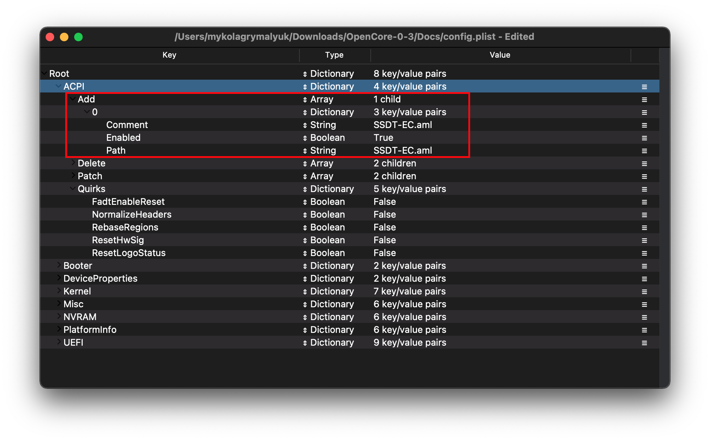
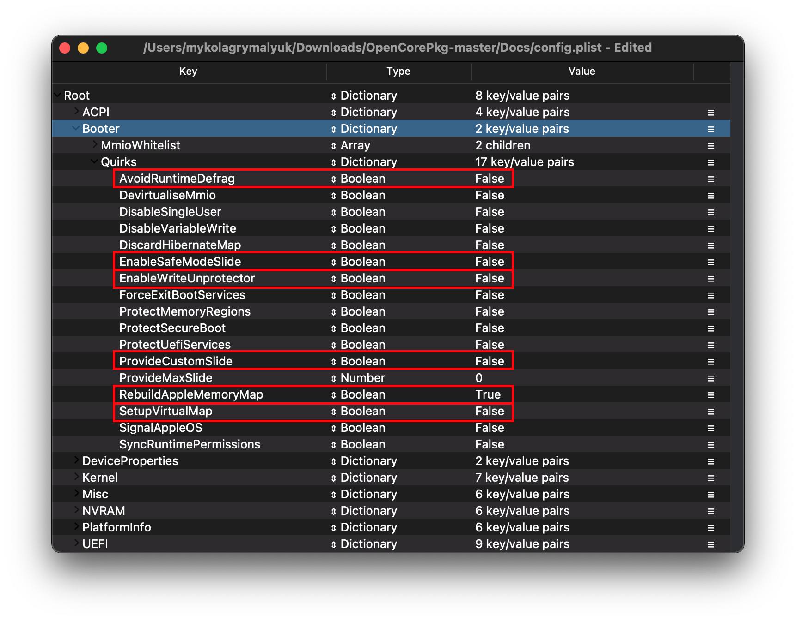
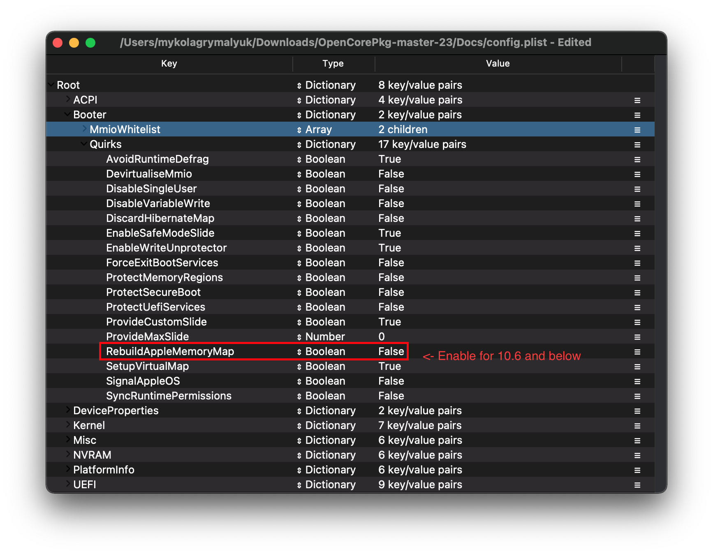
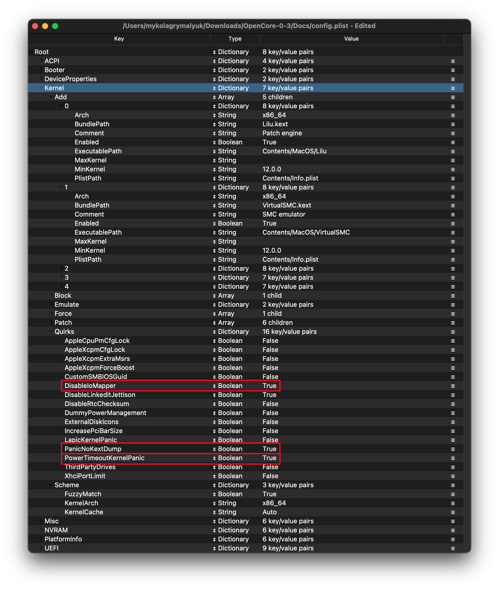
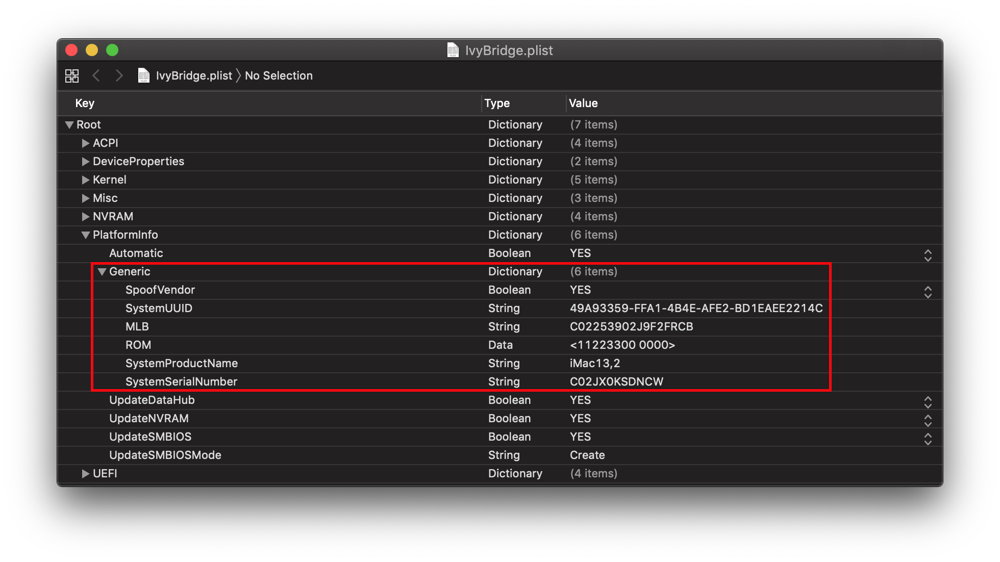
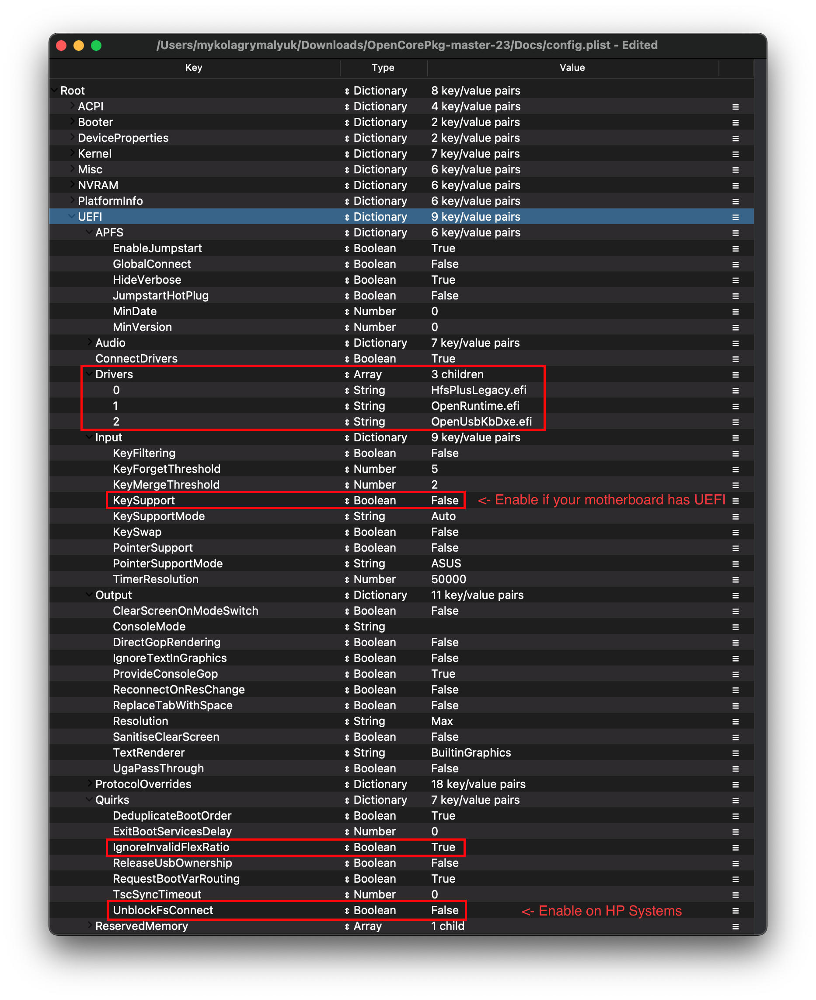

# Desktop Yonah, Conroe and Penryn

| Support | Version |
| :--- | :--- |
| Supported OpenCore version | 0.6.6 |
| Initial macOS Support: Penryn | OS X 10.4.10, Tiger |
| Last Supported OS: Penryn | macOS 10.13.6 High Sierra |
| Note | iGPU support will not be covered in this guide, see here: [GMA Patching](https://dortania.github.io/OpenCore-Post-Install/gpu-patching/)|
| Note 2 | SSE4 is required to boot macOS 10.12, Sierra and newer, so Conroe and older are unsupported |

## Starting Point

So making a config.plist may seem hard, it's not. It just takes some time but this guide will tell you how to configure everything, you won't be left in the cold. This also means if you have issues, review your config settings to make sure they're correct. Main things to note with OpenCore:

* **All properties must be defined**, there are no default OpenCore will fall back on so **do not delete sections unless told explicitly so**. If the guide doesn't mention the option, leave it at default.
* **The Sample.plist cannot be used As-Is**, you must configure it to your system
* **DO NOT USE CONFIGURATORS**, these rarely respect OpenCore's configuration and even some like Mackie's will add Clover properties and corrupt plists!

Now with all that, a quick reminder of the tools we need

* [ProperTree](https://github.com/corpnewt/ProperTree)
  * Universal plist editor
* [GenSMBIOS](https://github.com/corpnewt/GenSMBIOS)
  * For generating our SMBIOS data
* [Sample/config.plist](https://github.com/acidanthera/OpenCorePkg/releases)
  * See previous section on how to obtain: [config.plist Setup](../config.plist/README.md)

**And read this guide more than once before setting up OpenCore and make sure you have it set up correctly. Do note that images will not always be the most up-to-date so please read the text below them, if nothing's mentioned then leave as default.**

## ACPI



### Add

::: tip Info

This is where you'll add SSDTs for your system, these are very important to **booting macOS** and have many uses like [USB maps](https://dortania.github.io/OpenCore-Post-Install/usb/), [disabling unsupported GPUs](../extras/spoof.md) and such. And with our system, **it's even required to boot**. Guide on making them found here: [**Getting started with ACPI**](https://dortania.github.io/Getting-Started-With-ACPI/)

For us we'll need a couple of SSDTs to bring back functionality that Clover provided:

| Required_SSDTs | Description |
| :--- | :--- |
| **[SSDT-EC](https://dortania.github.io/Getting-Started-With-ACPI/)** | Fixes the embedded controller, see [Getting Started With ACPI Guide](https://dortania.github.io/Getting-Started-With-ACPI/) for more details. |

Note that you **should not** add your generated `DSDT.aml` here, it is already in your firmware. So if present, remove the entry for it in your `config.plist` and under EFI/OC/ACPI.

For those wanting a deeper dive into dumping your DSDT, how to make these SSDTs, and compiling them, please see the [**Getting started with ACPI**](https://dortania.github.io/Getting-Started-With-ACPI/) **page.** Compiled SSDTs have a **.aml** extension(Assembled) and will go into the `EFI/OC/ACPI` folder and **must** be specified in your config under `ACPI -> Add` as well.

:::

### Delete

This blocks certain ACPI tables from loading, for us we can ignore this.

### Patch

This section allows us to dynamically modify parts of the ACPI (DSDT, SSDT, etc.) via OpenCore. For us, our patches are handled by our SSDTs. This is a much cleaner solution as this will allow us to boot Windows and other OSes with OpenCore

### Quirks

Settings relating to ACPI, leave everything here as default as we have no use for these quirks.

## Booter

| Legacy | UEFI
| :--- | :--- |
|  |  |

This section is dedicated to quirks relating to boot.efi patching with OpenRuntime, the replacement for AptioMemoryFix.efi

### MmioWhitelist

This section is allowing spaces to be passthrough to macOS that are generally ignored, useful when paired with `DevirtualiseMmio`

### Quirks

::: tip Info
Settings relating to boot.efi patching and firmware fixes, depending where your board has UEFI, you have 2 options depending what your motherboard supports:

#### Legacy Settings

| Quirk | Enabled | Comment |
| :--- | :--- | :--- |
| AvoidRuntimeDefrag | No | Big Sur may require this quirk enabled |
| EnableSafeModeSlide | No | |
| EnableWriteUnprotector | No | |
| ProvideCustomSlide | No | |
| RebuildAppleMemoryMap | Yes | This is required to boot OS X 10.4 through 10.6 |
| SetupVirtualMap | No | |

#### UEFI Settings

| Quirk | Enabled | Comment |
| :--- | :--- | :--- |
| RebuildAppleMemoryMap | Yes | This is required to boot OS X 10.4 through 10.6 |

:::
::: details More in-depth Info

* **AvoidRuntimeDefrag**: NO
  * Fixes UEFI runtime services like date, time, NVRAM, power control;
  * macOS Big Sur however requires the APIC table present, otherwise causing early kernel panics so this quirk is recommended for those users.
* **EnableSafeModeSlide**: YES
  * Enables slide variables to be used in safe mode.
* **EnableWriteUnprotector**: NO
  * Needed to remove write protection from CR0 register on UEFI platforms.
* **ProvideCustomSlide**: YES
  * Used for Slide variable calculation. However the necessity of this quirk is determined by `OCABC: Only N/256 slide values are usable!` message in the debug log. If the message `OCABC: All slides are usable! You can disable ProvideCustomSlide!` is present in your log, you can disable `ProvideCustomSlide`.
* **RebuildAppleMemoryMap**: YES
  * Resolves early memory kernel panics on 10.6 and below.
* **SetupVirtualMap**: YES
  * Fixes SetVirtualAddresses calls to virtual addresses on UEFI boards.

:::

## DeviceProperties


### Add

Sets device properties from a map.

By default, the Sample.plist has this section set for iGPU and Audio. We won't be covering iGPU so PciRoot `PciRoot(0x0)/Pci(0x2,0x0)` can be removed from `Add` section. For audio we'll be setting the layout in the boot-args section, so removal of `PciRoot(0x0)/Pci(0x1b,0x0)` is also recommended from both `Add` and `Block` sections

TL;DR, delete all the PciRoot's here as we won't be using this section.

### Delete

Removes device properties from the map, for us we can ignore this

## Kernel



### Add

Here's where we specify which kexts to load, in what specific order to load, and what architectures each kext is meant for. By default we recommend leaving what ProperTree has done, however for 32-bit CPUs please see below:

::: details More in-depth Info

The main thing you need to keep in mind is:

* Load order
  * Remember that any plugins should load *after* its dependencies
  * This means kexts like Lilu **must** come before VirtualSMC, AppleALC, WhateverGreen, etc

A reminder that [ProperTree](https://github.com/corpnewt/ProperTree) users can run **Cmd/Ctrl + Shift + R** to add all their kexts in the correct order without manually typing each kext out.

* **Arch**
  * Architectures supported by this kext
  * Currently supported values are `Any`, `i386` (32-bit), and `x86_64` (64-bit)
* **BundlePath**
  * Name of the kext
  * ex: `Lilu.kext`
* **Enabled**
  * Self-explanatory, either enables or disables the kext
* **ExecutablePath**
  * Path to the actual executable is hidden within the kext, you can see what path your kext has by right-clicking and selecting `Show Package Contents`. Generally, they'll be `Contents/MacOS/Kext` but some have kexts hidden within under `Plugin` folder. Do note that plist only kexts do not need this filled in.
  * ex: `Contents/MacOS/Lilu`
* **MinKernel**
  * Lowest kernel version your kext will be injected into, see below table for possible values
  * ex. `12.00.00` for OS X 10.8
* **MaxKernel**
  * Highest kernel version your kext will be injected into, see below table for possible values
  * ex. `11.99.99` for OS X 10.7
* **PlistPath**
  * Path to the `info.plist` hidden within the kext
  * ex: `Contents/Info.plist`
  
::: details Kernel Support Table

| OS X Version | MinKernel | MaxKernel |
| :--- | :--- | :--- |
| 10.4 | 8.0.0 | 8.99.99 |
| 10.5 | 9.0.0 | 9.99.99 |
| 10.6 | 10.0.0 | 10.99.99 |
| 10.7 | 11.0.0 | 11.99.99 |
| 10.8 | 12.0.0 | 12.99.99 |
| 10.9 | 13.0.0 | 13.99.99 |
| 10.10 | 14.0.0 | 14.99.99 |
| 10.11 | 15.0.0 | 15.99.99 |
| 10.12 | 16.0.0 | 16.99.99 |
| 10.13 | 17.0.0 | 17.99.99 |
| 10.14 | 18.0.0 | 18.99.99 |
| 10.15 | 19.0.0 | 19.99.99 |
| 11 | 20.0.0 | 20.99.99 |

:::

### Emulate

Needed for spoofing unsupported CPUs like Pentiums and Celerons

* **CpuidMask**: Leave this blank
* **CpuidData**: Leave this blank

### Force

Used for loading kexts off system volume, only relevant for older operating systems where certain kexts are not present in the cache(ie. IONetworkingFamily in 10.6).

For us, we can ignore.

### Block

Blocks certain kexts from loading. Not relevant for us.

### Patch

Patches both the kernel and kexts.

### Quirks

::: tip Info

Settings relating to the kernel, for us we'll be enabling the following:

| Quirk | Enabled | Comment |
| :--- | :--- | :--- |
| DisableIOMapper | YES | Not needed if `VT-D` is disabled in the BIOS |
| LapicKernelPanic | NO | HP Machines will require this quirk |
| PanicNoKextDump | YES | Not required for 10.12 and older |
| PowerTimeoutKernelPanic | YES | Not required for 10.14 and older |

:::

::: details More in-depth Info

* **AppleCpuPmCfgLock**: NO
  * CFG-Lock is not present on Penryn so no need for this quirk
* **AppleXcpmCfgLock**: NO
  * CFG-Lock is not present on Penryn so no need for this quirk
* **CustomSMBIOSGuid**: NO
  * Performs GUID patching for UpdateSMBIOSMode set to `Custom`. Usually relevant for Dell laptops
  * Enabling this quirk with UpdateSMBIOSMode Custom mode can also disable SMBIOS injection into "non-Apple" OSes however we do not endorse this method as it breaks Bootcamp compatibility. Use at your own risk
* **DisableIoMapper**: YES
  * Needed to get around VT-D if either unable to disable in BIOS or needed for other operating systems, much better alternative to `dart=0` as SIP can stay on in Catalina
* **DisableLinkeditJettison**: YES
  * Allows Lilu and others to have more reliable performance without `keepsyms=1`
* **DisableRtcChecksum**: NO
  * Prevents AppleRTC from writing to primary checksum (0x58-0x59), required for users who either receive BIOS reset or are sent into Safe mode after reboot/shutdown
* **ExtendBTFeatureFlags** NO
  * Helpful for those having continuity issues with non-Apple/non-Fenvi cards
* **LapicKernelPanic**: NO
  * Disables kernel panic on AP core lapic interrupt, generally needed for HP systems. Clover equivalent is `Kernel LAPIC`
* **LegacyCommpage**: NO
  * Resolves SSSE3 requirement for 64 Bit CPUs in macOS, mainly relevant for 64-Bit Pentium 4 CPUs(ie. Prescott)
* **PanicNoKextDump**: YES
  * Allows for reading kernel panics logs when kernel panics occur
* **PowerTimeoutKernelPanic**: YES
  * Helps fix kernel panics relating to power changes with Apple drivers in macOS Catalina, most notably with digital audio.
* **SetApfsTrimTimeout**: `-1`
  * Sets trim timeout in microseconds for APFS filesystems on SSDs, only applicable for macOS 10.14 and newer with problematic SSDs.
* **XhciPortLimit**: NO
  * This is actually the 15 port limit patch, however only relevant for systems with XHCI controllers

:::

### Scheme

Settings related to legacy booting(ie. 10.4-10.6), for majority you can skip however for those planning to boot legacy OSes you can see below:

::: details More in-depth Info

* **FuzzyMatch**: True
  * Used for ignoring checksums with kernelcache, instead opting for the latest cache available. Can help improve boot performance on many machines in 10.6
* **KernelArch**: x86_64
  * Set the kernel's arch type, you can choose between `Auto`, `i386` (32-bit), and `x86_64` (64-bit).
  * If you're booting older OSes which require a 32-bit kernel(ie. 10.4 and 10.5) we recommend to set this to `Auto` and let macOS decide based on your SMBIOS. See below table for supported values:
    * 10.4-10.5 — `x86_64`, `i386` or `i386-user32`
      * `i386-user32` refers 32-bit userspace, so 32-bit CPUs must use this(or CPUs missing SSSE3)
      * `x86_64` will still have a 32-bit kernelspace however will ensure 64-bit userspace in 10.4/5
    * 10.6 — `i386`, `i386-user32`, or `x86_64`
    * 10.7 — `i386` or `x86_64`
    * 10.8 or newer — `x86_64`

* **KernelCache**: Auto
  * Set kernel cache type, mainly useful for debugging and so we recommend `Auto` for best support

:::

## Misc


### Boot

Settings for boot screen (Leave everything as default).

### Debug

::: tip Info

Helpful for debugging OpenCore boot issues(We'll be changing everything *but* `DisplayDelay`):

| Quirk | Enabled |
| :--- | :--- |
| AppleDebug | YES |
| ApplePanic | YES |
| DisableWatchDog | YES |
| Target | 67 |

:::

::: details More in-depth Info

* **AppleDebug**: YES
  * Enables boot.efi logging, useful for debugging. Note this is only supported on 10.15.4 and newer
* **ApplePanic**: YES
  * Attempts to log kernel panics to disk
* **DisableWatchDog**: YES
  * Disables the UEFI watchdog, can help with early boot issues
* **DisplayLevel**: `2147483650`
  * Shows even more debug information, requires debug version of OpenCore
* **SerialInit**: NO
  * Needed for setting up serial output with OpenCore
* **SysReport**: NO
  * Helpful for debugging such as dumping ACPI tables
  * Note that this is limited to DEBUG versions of OpenCore
* **Target**: `67`
  * Shows more debug information, requires debug version of OpenCore

These values are based of those calculated in [OpenCore debugging](../troubleshooting/debug.md)

:::

### Security

::: tip Info

Security is pretty self-explanatory, **do not skip**. We'll be changing the following:

| Quirk | Enabled | Comment |
| :--- | :--- | :--- |
| AllowNvramReset | YES | |
| AllowSetDefault | YES | |
| BlacklistAppleUpdate | YES | |
| ScanPolicy | 0 | |
| SecureBootModel | Default |  This is a word and is case-sensitive, set to `Disabled` if you do not want secure boot(ie. you require Nvidia's Web Drivers) |
| Vault | Optional | This is a word, it is not optional to omit this setting. You will regret it if you don't set it to Optional, note that it is case-sensitive |

:::

::: details More in-depth Info

* **AllowNvramReset**: YES
  * Allows for NVRAM reset both in the boot picker and when pressing `Cmd+Opt+P+R`
* **AllowSetDefault**: YES
  * Allow `CTRL+Enter` and `CTRL+Index` to set default boot device in the picker
* **ApECID**: 0
  * Used for netting personalized secure-boot identifiers, currently this quirk is unreliable due to a bug in the macOS installer so we highly encourage you to leave this as default.
* **AuthRestart**: NO
  * Enables Authenticated restart for FileVault 2 so password is not required on reboot. Can be considered a security risk so optional
* **BlacklistAppleUpdate**: YES
  * Used for blocking firmware updates, used as extra level of protection as macOS Big Sur no longer uses `run-efi-updater` variable

* **DmgLoading**: Signed
  * Ensures only signed DMGs load
* **ExposeSensitiveData**: `6`
  * Shows more debug information, requires debug version of OpenCore
* **Vault**: `Optional`
  * We won't be dealing vaulting so we can ignore, **you won't boot with this set to Secure**
  * This is a word, it is not optional to omit this setting. You will regret it if you don't set it to `Optional`, note that it is case-sensitive
* **ScanPolicy**: `0`
  * `0` allows you to see all drives available, please refer to [Security](https://dortania.github.io/OpenCore-Post-Install/universal/security.html) section for further details. **Will not boot USB devices with this set to default**
* **SecureBootModel**: Default
  * Enables Apple's secure boot functionality in macOS, please refer to [Security](https://dortania.github.io/OpenCore-Post-Install/universal/security.html) section for further details.
  * Note: Users may find upgrading OpenCore on an already installed system can result in early boot failures. To resolve this, see here: [Stuck on OCB: LoadImage failed - Security Violation](/troubleshooting/extended/kernel-issues.md#stuck-on-ocb-loadimage-failed-security-violation)

:::

### Tools

Used for running OC debugging tools like the shell, ProperTree's snapshot function will add these for you.

### Entries

Used for specifying irregular boot paths that can't be found naturally with OpenCore.

Won't be covered here, see 8.6 of [Configuration.pdf](https://github.com/acidanthera/OpenCorePkg/blob/master/Docs/Configuration.pdf) for more info

## NVRAM


### Add

::: tip 4D1EDE05-38C7-4A6A-9CC6-4BCCA8B38C14

Used for OpenCore's UI scaling, default will work for us. See in-depth section for more info

:::

::: details More in-depth Info

Booter Path, mainly used for UI Scaling

* **UIScale**:
  * `01`: Standard resolution
  * `02`: HiDPI (generally required for FileVault to function correctly on smaller displays)

* **DefaultBackgroundColor**: Background color used by boot.efi
  * `00000000`: Syrah Black
  * `BFBFBF00`: Light Gray

:::

::: tip 4D1FDA02-38C7-4A6A-9CC6-4BCCA8B30102

OpenCore's NVRAM GUID, mainly relevant for RTCMemoryFixup users

:::

::: details More in-depth Info

* **rtc-blacklist**: <>
  * To be used in conjunction with RTCMemoryFixup, see here for more info: [Fixing RTC write issues](https://dortania.github.io/OpenCore-Post-Install/misc/rtc.html#finding-our-bad-rtc-region)
  * Most users can ignore this section

:::

::: tip 7C436110-AB2A-4BBB-A880-FE41995C9F82

System Integrity Protection bitmask

* **General Purpose boot-args**:

| boot-args | Description |
| :--- | :--- |
| **-v** | This enables verbose mode, which shows all the behind-the-scenes text that scrolls by as you're booting instead of the Apple logo and progress bar. It's invaluable to any Hackintosher, as it gives you an inside look at the boot process, and can help you identify issues, problem kexts, etc. |
| **debug=0x100** | This disables macOS's watchdog which helps prevents a reboot on a kernel panic. That way you can *hopefully* glean some useful info and follow the breadcrumbs to get past the issues. |
| **keepsyms=1** | This is a companion setting to debug=0x100 that tells the OS to also print the symbols on a kernel panic. That can give some more helpful insight as to what's causing the panic itself. |
| **alcid=1** | Used for setting layout-id for AppleALC, see [supported codecs](https://github.com/acidanthera/applealc/wiki/supported-codecs) to figure out which layout to use for your specific system. More info on this is covered in the [Post-Install Page](https://dortania.github.io/OpenCore-Post-Install/) |

* **GPU-Specific boot-args**:

| boot-args | Description |
| :--- | :--- |
| **nvda_drv_vrl=1** | Used for enabling Nvidia's Web Drivers on Maxwell and Pascal cards in Sierra and High Sierra, Sierra and older can use `nvda_drv=1` |

* **csr-active-config**: `00000000`
  * Settings for 'System Integrity Protection' (SIP). It is generally recommended to change this with `csrutil` via the recovery partition.
  * csr-active-config by default is set to `00000000` which enables System Integrity Protection. You can choose a number of different values but overall we recommend keeping this enabled for best security practices. More info can be found in our troubleshooting page: [Disabling SIP](../troubleshooting/extended/post-issues.md#disabling-sip)

* **run-efi-updater**: `No`
  * This is used to prevent Apple's firmware update packages from installing and breaking boot order; this is important as these firmware updates (meant for Macs) will not work.

* **prev-lang:kbd**: <>
  * Needed for non-latin keyboards in the format of `lang-COUNTRY:keyboard`, recommended to keep blank though you can specify it(**Default in Sample config is Russian**):
  * American: `en-US:0`(`656e2d55533a30` in HEX)
  * Full list can be found in [AppleKeyboardLayouts.txt](https://github.com/acidanthera/OpenCorePkg/blob/master/Utilities/AppleKeyboardLayouts/AppleKeyboardLayouts.txt)
  * Hint: `prev-lang:kbd` can be changed into a String so you can input `en-US:0` directly instead of converting to HEX

| Key | Type | Value |
| :--- | :--- | :--- |
| prev-lang:kbd | String | en-US:0 |

:::

### Delete

::: tip Info

Forcibly rewrites NVRAM variables, do note that `Add` **will not overwrite** values already present in NVRAM so values like `boot-args` should be left alone. For us, we'll be changing the following:

| Quirk | Enabled |
| :--- | :--- |
| WriteFlash | YES |

:::

::: details More in-depth Info

* **LegacyEnable**: NO
  * Allows for NVRAM to be stored on nvram.plist, needed for systems without native NVRAM

* **LegacyOverwrite**: NO
  * Permits overwriting firmware variables from nvram.plist, only needed for systems without native NVRAM

* **LegacySchema**
  * Used for assigning NVRAM variables, used with LegacyEnable set to YES

* **WriteFlash**: YES
  * Enables writing to flash memory for all added variables.

:::

## PlatformInfo



::: tip Info

For setting up the SMBIOS info, we'll use CorpNewt's [GenSMBIOS](https://github.com/corpnewt/GenSMBIOS) application.

For this Penryn example, we'll chose the iMac10,1 SMBIOS - this is done intentionally for compatibility's sake. There are 4 main SMBIOS used for legacy hardware:

| SMBIOS | Hardware | OS Support |
| :--- | :--- | :--- |
| iMac4,1 | Yonah SMBIOS(32-bit) | 10.4 to 10.6.8 |
| iMac7,1 | Conroe SMBIOS(64-Bit, SSE3) | 10.4 to 10.11.6 |
| iMac10,1 | Penryn SMBIOS(64-Bit, SSE4) | 10.6 to 10.13.6 |
| MacPro6,1 | Mojave and newer SMBIOS | 10.9 to current |

* If you plan to later run macOS 10.14, Mojave or newer, MacPro6,1 will be the recommended SMBIOS. However please note you will need [telemetrap.kext](https://forums.macrumors.com/threads/mp3-1-others-sse-4-2-emulation-to-enable-amd-metal-driver.2206682/page-4?post=28447707#post-28447707) to resolve install issues

Run GenSMBIOS, pick option 1 for downloading MacSerial and Option 3 for selecting out SMBIOS.  This will give us an output similar to the following:

```sh
  #######################################################
 #               iMac10,1 SMBIOS Info                  #
#######################################################

Type:         iMac10,1
Serial:       C02KCYZLDNCW
Board Serial: C02309301QXF2FRJC
SmUUID:       A154B586-874B-4E57-A1FF-9D6E503E4580
```

The `Type` part gets copied to Generic -> SystemProductName.

The `Serial` part gets copied to Generic -> SystemSerialNumber.

The `Board Serial` part gets copied to Generic -> MLB.

The `SmUUID` part gets copied to Generic -> SystemUUID.

We set Generic -> ROM to either an Apple ROM (dumped from a real Mac), your NIC MAC address, or any random MAC address (could be just 6 random bytes, for this guide we'll use `11223300 0000`. After install follow the [Fixing iServices](https://dortania.github.io/OpenCore-Post-Install/universal/iservices.html) page on how to find your real MAC Address)

**Reminder that you want either an invalid serial or valid serial numbers but those not in use, you want to get a message back like: "Invalid Serial" or "Purchase Date not Validated"**

[Apple Check Coverage page](https://checkcoverage.apple.com)

**Automatic**: YES

* Generates PlatformInfo based on Generic section instead of DataHub, NVRAM, and SMBIOS sections

:::

### Generic

::: details More in-depth Info

* **AdviseWindows**: NO
  * Used for when the EFI partition isn't first on the Windows drive

* **MaxBIOSVersion**: NO
  * Sets BIOS version to Max to avoid firmware updates in Big Sur+, mainly applicable for genuine Macs.

* **ProcessorType**: `0`
  * Set to `0` for automatic type detection, however this value can be overridden if desired. See [AppleSmBios.h](https://github.com/acidanthera/OpenCorePkg/blob/master/Include/Apple/IndustryStandard/AppleSmBios.h) for possible values

* **SpoofVendor**: YES
  * Swaps vendor field for Acidanthera, generally not safe to use Apple as a vendor in most case

* **SystemMemoryStatus**: Auto
  * Sets whether memory is soldered or not in SMBIOS info, purely cosmetic and so we recommend `Auto`

* **UpdateDataHub**: YES
  * Update Data Hub fields

* **UpdateNVRAM**: YES
  * Update NVRAM fields

* **UpdateSMBIOS**: YES
  * Updates SMBIOS fields

* **UpdateSMBIOSMode**: Create
  * Replace the tables with newly allocated EfiReservedMemoryType, use `Custom` on Dell laptops requiring `CustomSMBIOSGuid` quirk
  * Setting to `Custom` with `CustomSMBIOSGuid` quirk enabled can also disable SMBIOS injection into "non-Apple" OSes however we do not endorse this method as it breaks Bootcamp compatibility. Use at your own risk

:::

## UEFI



**ConnectDrivers**: YES

* Forces .efi drivers, change to NO will automatically connect added UEFI drivers. This can make booting slightly faster, but not all drivers connect themselves. E.g. certain file system drivers may not load.

### Drivers

Add your .efi drivers here.

Only drivers present here should be:

* HfsPlusLegacy.efi
* OpenRuntime.efi
* OpenUsbKbDxe.efi(If your firmware does not support UEFI)

### APFS

Settings related to the APFS driver, leave everything here as default.

### Audio

Related to AudioDxe settings, for us we'll be ignoring(leave as default). This is unrelated to audio support in macOS.

* For further use of AudioDxe and the Audio section, please see the Post Install page: [Add GUI and Boot-chime](https://dortania.github.io/OpenCore-Post-Install/)

### Input

::: tip Info

Related to boot.efi keyboard passthrough used for FileVault and Hotkey support, leave everything here as default besides:

| Quirk | Value | Comment |
| :--- | :--- | :--- |
| KeySupport | NO | Enable if your BIOS supports UEFI |

:::

### Output

Relating to OpenCore's visual output,  leave everything here as default as we have no use for these quirks.

### ProtocolOverrides

Mainly relevant for Virtual machines, legacy macs and FileVault users. See here for more details: [Security and FileVault](https://dortania.github.io/OpenCore-Post-Install/)

### Quirks

::: tip Info
Relating to quirks with the UEFI environment, for us we'll be changing the following:

| Quirk | Enabled | Comment |
| :--- | :--- | :--- |
| IgnoreInvalidFlexRatio | NO | Enable this if you have a UEFI BIOS |
| UnblockFsConnect | NO | Needed mainly by HP motherboards |

:::

::: details More in-depth Info

* **IgnoreInvalidFlexRatio**: NO
  * Fix for when MSR_FLEX_RATIO (0x194) can't be disabled in the BIOS, required for all pre-Skylake based systems
  * Only relevant on UEFI BIOS

* **DisableSecurityPolicy**: NO
  * Disables platform security policy in firmware, recommended for buggy firmwares where disabling Secure Boot does not allow 3rd party firmware drivers to load.
  * If running a Microsoft Surface device, recommended to enable this option

* **RequestBootVarRouting**: YES
  * Redirects AptioMemoryFix from `EFI_GLOBAL_VARIABLE_GUID` to `OC_VENDOR_VARIABLE_GUID`. Needed for when firmware tries to delete boot entries and is recommended to be enabled on all systems for correct update installation, Startup Disk control panel functioning, etc.

* **UnblockFsConnect**: NO
  * Some firmware block partition handles by opening them in By Driver mode, which results in File System protocols being unable to install. Mainly relevant for HP systems when no drives are listed
  
:::

### ReservedMemory

Used for exempting certain memory regions from OSes to use, mainly relevant for Sandy Bridge iGPUs or systems with faulty memory. Use of this quirk is not covered in this guide

## Cleaning up

And now you're ready to save and place it into your EFI under EFI/OC.

For those having booting issues, please make sure to read the [Troubleshooting section](../troubleshooting/troubleshooting.md) first and if your questions are still unanswered we have plenty of resources at your disposal:

* [r/Hackintosh Subreddit](https://www.reddit.com/r/hackintosh/)
* [r/Hackintosh Discord](https://discord.gg/2QYd7ZT)

**Sanity check**:

So thanks to the efforts of Ramus, we also have an amazing tool to help verify your config for those who may have missed something:

* [**Sanity Checker**](https://opencore.slowgeek.com)

Note that this tool is neither made nor maintained by Dortania, any and all issues with this site should be sent here: [Sanity Checker Repo](https://github.com/rlerdorf/OCSanity)

## Intel BIOS settings

* Note: Most of these options may not be present in your firmware, we recommend matching up as closely as possible but don't be too concerned if many of these options are not available in your BIOS

### Disable

* Fast Boot
* Secure Boot
* Serial/COM Port
* Parallel Port
* VT-d (can be enabled if you set `DisableIoMapper` to YES)
* CSM
* Intel SGX
* Intel Platform Trust

### Enable

* VT-x
* Above 4G decoding
* Hyper-Threading
* Execute Disable Bit
* EHCI/XHCI Hand-off
* OS type: Windows 8.1/10 UEFI Mode
* DVMT Pre-Allocated(iGPU Memory): 32MB
* SATA Mode: AHCI

# Now with all this done, head to the [Installation Page](../installation/installation-process.md)
