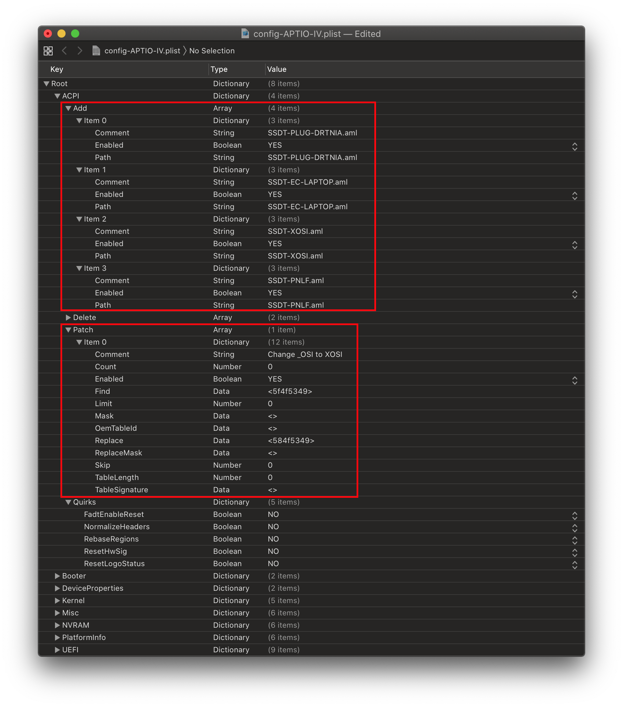
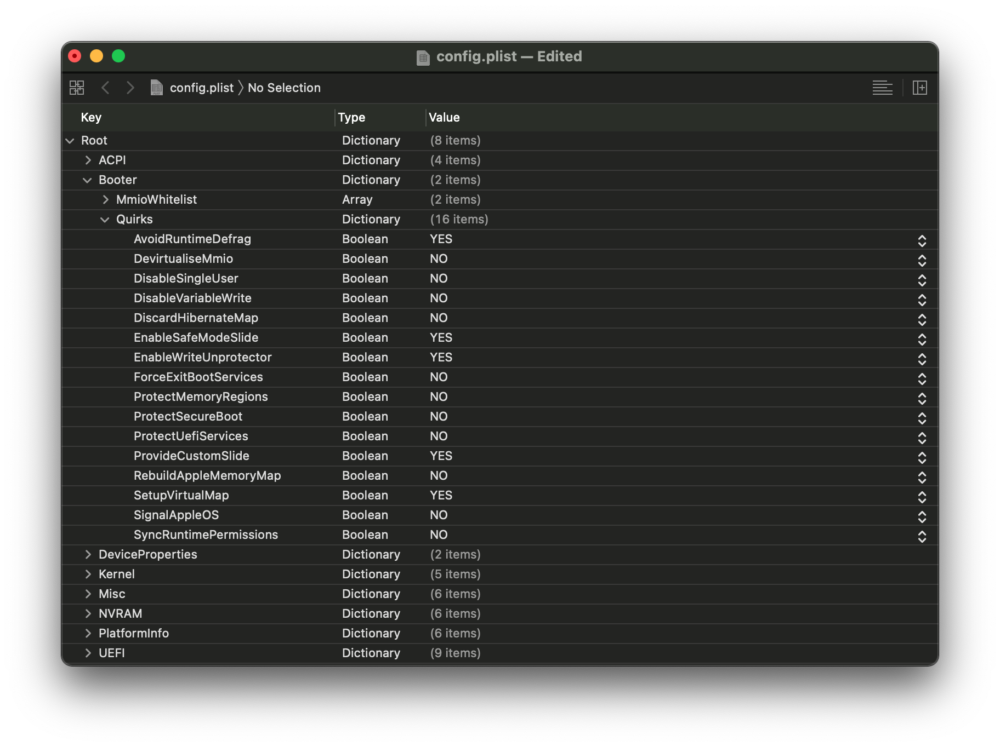
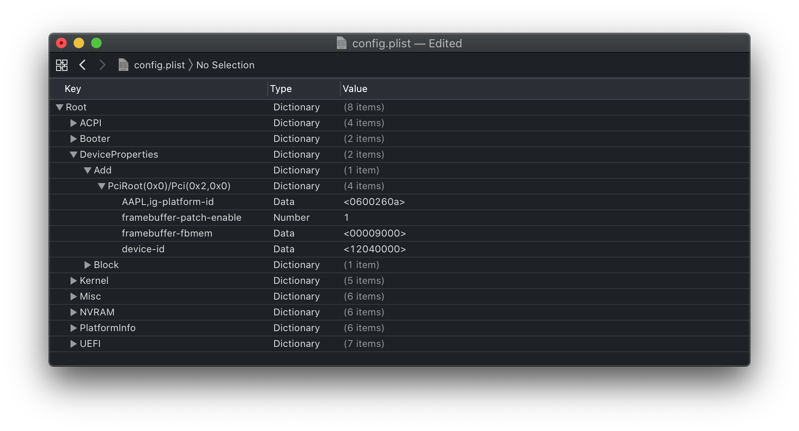
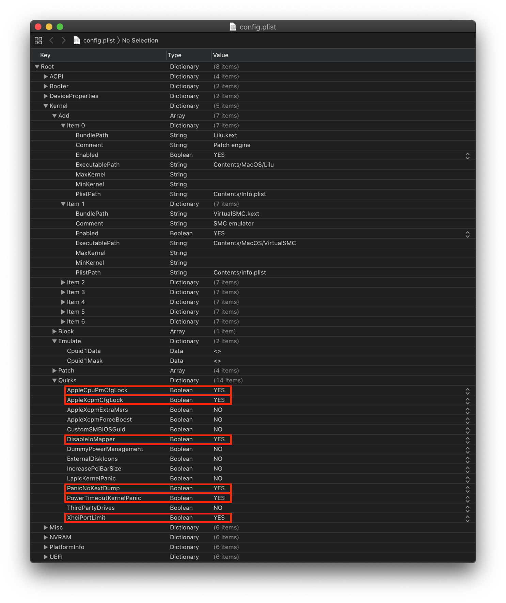
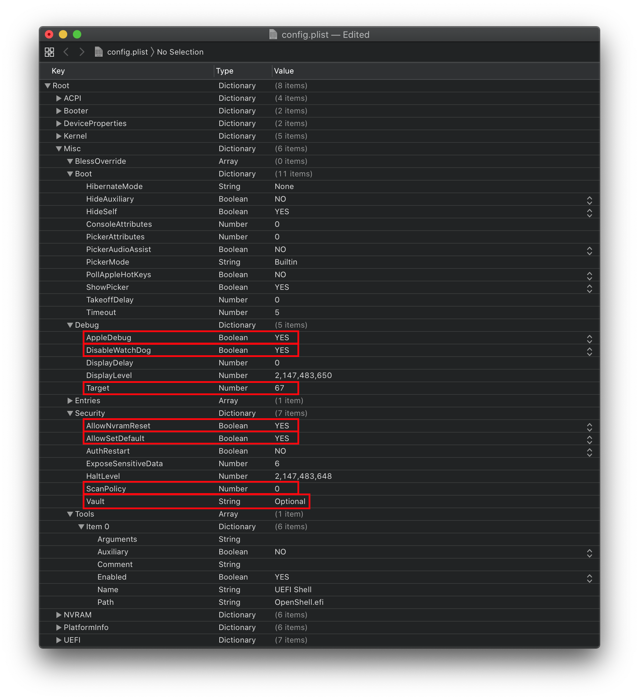
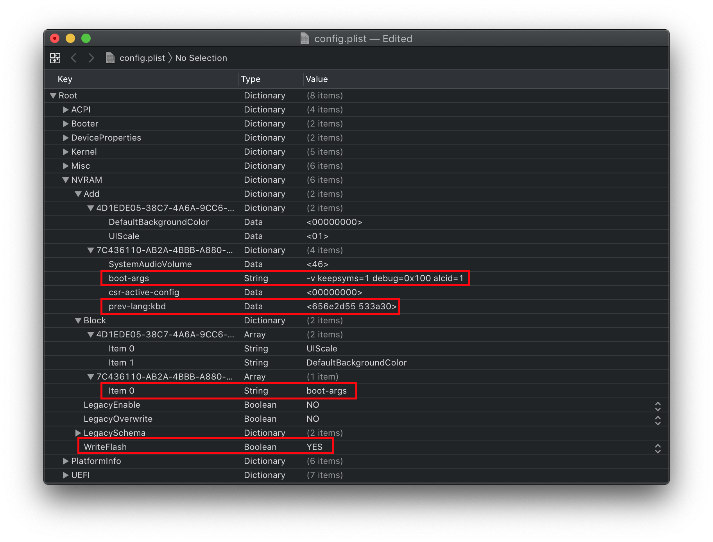
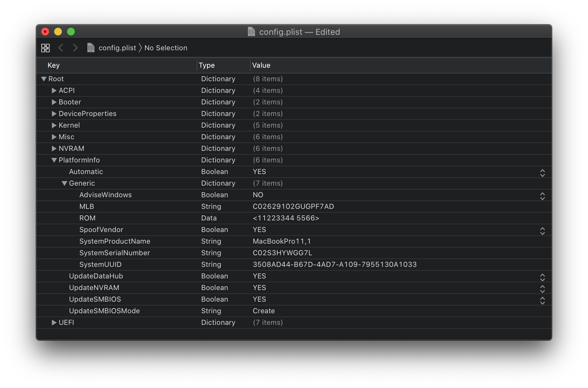
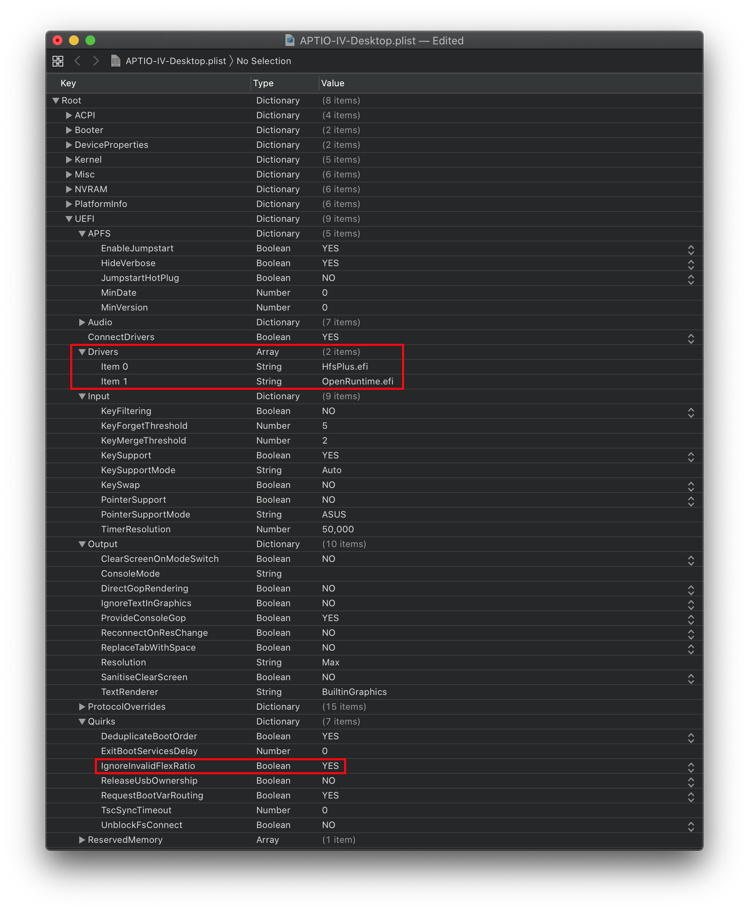

# Haswell

* Supported version: 0.5.9

<extoc></extoc>

## Starting Point

So making a config.plist may seem hard, its not. It just takes some time but this guide will tell you how to configure everything, you won't be left in the cold. This also means if you have issues, review your config settings to make sure they're correct. Main things to note with OpenCore:

* **All properties must be defined**, there are no default OpenCore will fall back on so **do not delete sections unless told explicitly so**. If the guide doesn't mention the option, leave it at default.
* **The Sample.plist cannot be used As-Is**, you must configure it to your system
* **DO NOT USE CONFIGURATORS**, these rarely respect OpenCore's configuration and even some like Mackie's will add Clover properties and corrupt plists!

Now with all that, we'll need some things to get started:

* [ProperTree](https://github.com/corpnewt/ProperTree): For editing our config, this editor has some super useful tools for OpenCore
* [GenSMBIOS](https://github.com/corpnewt/GenSMBIOS): For generating our SMBIOS
* [Sample.plist](https://github.com/acidanthera/OpenCorePkg/releases): This is found under the Docs folder of the release download

Now with those downloaded, we can get to really get started:

* Grab the **Sample.plist** and rename to **config.plist**
* Open your new config.plist in ProperTree
  * macOS: `ProperTree.command`
  * Windows: `ProperTree.bat`
* Run the Clean Snapshot function(**Cmd/Ctrl + Shift + R** and point it at your EFI/OC folder),
  * This will remove all the entries from the config.plist and then adds all your SSDTs, Kexts and Firmware drivers to the config
  * Cmd+R is another option that will add all your files as well but will leave entries disabled if they were set like that before, useful for when you're troubleshooting

**And read this guide more than once before setting up OpenCore and make sure you have it set up correctly. Do note that images will not always be the most up-to-date so please read the text below them, if nothing's mentioned then leave as default.**

## ACPI



### Add

This is where you'll add SSDTs for your system, these are very important to **booting macOS** and have many uses like [USB maps](https://dortania.github.io/USB-Map-Guide/), [disabling unsupported GPUs](/post-install/spoof.md) and such. And with our system, **its even required to boot**. Guide on making them found here: [**Getting started with ACPI**](https://dortania.github.io/Getting-Started-With-ACPI/)

For us we'll need a couple of SSDTs to bring back functionality that Clover provided:

| Required_SSDTs | Description |
| :--- | :--- |
| **[SSDT-PLUG](https://dortania.github.io/Getting-Started-With-ACPI/)** | Allows for native CPU power management on Haswell and newer, see [Getting Started With ACPI Guide](https://dortania.github.io/Getting-Started-With-ACPI/) for more details. |
| **[SSDT-EC](https://dortania.github.io/Getting-Started-With-ACPI/)** | Fixes the embedded controller, see [Getting Started With ACPI Guide](https://dortania.github.io/Getting-Started-With-ACPI/) for more details. |
| **[SSDT-GPIO](https://github.com/dortania/Getting-Started-With-ACPI/blob/master/extra-files/compiled/SSDT-GPI0.dsl)** | Creates a stub so VoodooI2C can connect, for those having troubles getting VoodooI2C working can try [SSDT-XOSI](https://github.com/dortania/Getting-Started-With-ACPI/blob/master/extra-files/compiled/SSDT-XOSI.aml) instead |
| **[SSDT-PNLF](https://dortania.github.io/Getting-Started-With-ACPI/)** | Fixes brightness control, see [Getting Started With ACPI Guide](https://dortania.github.io/Getting-Started-With-ACPI/) for more details. |

Note that you **should not** add your generated `DSDT.aml` here, it is already in your firmware. So if present, remove the entry for it in your `config.plist` and under EFI/OC/ACPI.

For those wanting a deeper dive into dumping your DSDT, how to make these SSDTs, and compiling them, please see the [**Getting started with ACPI**](https://dortania.github.io/Getting-Started-With-ACPI/) **page.** Compiled SSDTs have a **.aml** extension(Assembled) and will go into the `EFI/OC/ACPI` folder and **must** be specified in your config under `ACPI -> Add` as well.

### Delete

This blocks certain ACPI tables from loading, for us we can ignore this.

### Patch

This section allows us to dynamically modify parts of the ACPI (DSDT, SSDT, etc.) via OpenCore. For us, we'll need the following:

* OSI rename
  * This is required when using SSDT-XOSI as we redirect all OSI calls to this SSDT, **this is not needed if you're using SSDT-GPIO**

| Comment | String | Change _OSI to XOSI |
| :--- | :--- | :--- |
| Enabled | Boolean | YES |
| Count | Number | 0 |
| Limit | Number | 0 |
| Find | Data | 5f4f5349 |
| Replace | Data | 584f5349 |

### Quirks

Settings relating to ACPI, leave everything here as default as we have no use for these quirks.

## Booter



This section is dedicated to quirks relating to boot.efi patching with OpenRuntime, the replacement for AptioMemoryFix.efi

### MmioWhitelist

This section is allowing spaces to be pass-through to macOS that are generally ignored, useful when paired with `DevirtualiseMmio`

### Quirks

Settings relating to boot.efi patching and firmware fixes, one we need to change is `RebuildAppleMemoryMap`

* **AvoidRuntimeDefrag**: YES
  * Fixes UEFI runtime services like date, time, NVRAM, power control, etc
* **DevirtualiseMmio**: NO
  * Reduces Stolen Memory Footprint, expands options for `slide=N` values and generally useful especially on HEDT and Xeon systems

* **ForceExitBootServices**: NO
  * Ensures ExitBootServices calls succeeds even when the memory map has changed, don't use unless necessary
* **ProtectMemoryRegions**: NO
  * Needed for fixing artifacts and sleep-wake issues, generally only needed on very old firmwares

* **ProvideCustomSlide**: YES
  * If there's a conflicting slide value, this option forces macOS to use a pseudo-random value. Needed for those receiving `Only N/256 slide values are usable!` debug message
* **RebuildAppleMemoryMap**: YES
  * Generates Memory Map compatible with macOS, can break on some laptop OEM firmwares so if you receive early boot failures disable this
* **SetupVirtualMap**: YES
  * Fixes SetVirtualAddresses calls to virtual addresses
**SyncRuntimePermissions**: NO
  * Fixes alignment with MAT tables and required to boot Windows and Linux with MAT tables, also recommended for macOS. Mainly relevant for Skylake and newer

## DeviceProperties



### Add

Sets device properties from a map.

#### PciRoot(0x0)/Pci(0x2,0x0)

This section is set up via WhateverGreen's [Framebuffer Patching Guide](https://github.com/acidanthera/WhateverGreen/blob/master/Manual/FAQ.IntelHD.en.md) and is used for setting important iGPU properties.

When setting up your iGPU, the table below should help with finding the right values to set. Here is an explanation of some values:

* **Device-id**
  * The actual Device ID used by the graphics drivers to figure out if it's an iGPU. If your iGPU isn't natively supported, you can add `device-id` to fake it as a native iGPU  
* **AAPL,ig-platform-id**
  * This is used internally for setting up the iGPU
* **Stolen Memory**
  * The minimum amount of iGPU memory required for the framebuffer to work correctly
* **Port Count + Connectors**
  * The number of displays and what types are supported

Generally follow these steps when setting up your iGPU properties. Follow the configuration notes below the table if they say anything different:

1. When initially setting up your config.plist, only set AAPL,ig-platform-id - this is normally enough
2. If you boot and you get no graphics acceleration (7MB VRAM and solid background for dock), then you likely need to set device-id as well

Note that highlighted entries with a star(*) are the recommended entries to use:

| iGPU | device-id | AAPL,ig-platform-id | Port Count | Total Stolen Memory | Connectors |
| :--- | :--- | :--- | :--- | :--- | :--- |
| Intel HD Graphics 4400 | 0A160000 | 0C00160A | 3 | 99MB |  LVDSx1 DPx2 |
| **Intel HD Graphics 5000 <sup>1</sup>** * | 0A260000 | 0500260A | 3 | 52MB |  LVDSx1 DPx2 |
| **Intel HD Graphics 5000 <sup>2</sup>** * | 0A260000 | 0600260A | 3 | 52MB |  LVDSx1 DPx2 |
| Intel Iris Graphics 5100 | 0A2E0000 | 08002E0A | 3 | 99MB |  LVDSx1 DPx2 |
| Intel Iris Pro Graphics 5200 | 0D260000 | 0700260D | 4 | 99MB |  LVDSx1 DPx2 HDMIx1 |
| Intel Iris Pro Graphics 5200 | 0D260000 | 0900260D | 1 | 99MB |  LVDSx1 |
| Intel Iris Pro Graphics 5200 | 0D260000 | 0E00260D | 4 | 131MB |  LVDSx1 DPx2 HDMIx1 |
| Intel Iris Pro Graphics 5200 | 0D260000 | 0F00260D | 1 | 131MB |  LVDSx1 |

#### Configuration Notes

* <sup>1</sup>: to be used usually with HD5000, HD5100 and HD5200
  * The device-id of these devices *should* be supported already by the native macOS drivers.
* <sup>2</sup>: to be used usually with HD4200, HD4400 and HD4600.
  * You **must** use `device-id` = `12040000`
* It is **recommended** to set the cursor byte size for **all iGPUs** as many will experience graphical glitches otherwise:
  * `framebuffer-patch-enable` = `1` (as a Number)
  * `framebuffer-cursor` = `00009000` (as Data)
    * We change the cursor byte from 6MB (00006000) to 9MB because of some glitches.

#### PciRoot(0x0)/Pci(0x1b,0x0)

`layout-id`

* Applies AppleALC audio injection, you'll need to do your own research on which codec your motherboard has and match it with AppleALC's layout. [AppleALC Supported Codecs](https://github.com/acidanthera/AppleALC/wiki/Supported-codecs).
* You can delete this property outright as it's unused for us at this time

For us, we'll be using the boot argument `alcid=xxx` instead to accomplish this. `alcid` will override all other layout-IDs present. More info on this is covered in the [Post-Install Page](/post-install/README.md)

### Delete

Removes device properties from the map, for us we can ignore this

## Kernel



### Add

Here's where you specify which kexts to load, order matters here so make sure Lilu.kext is always first! Other higher priority kexts come after Lilu such as VirtualSMC, AppleALC, WhateverGreen, etc. A reminder that [ProperTree](https://github.com/corpnewt/ProperTree) users can run **Cmd/Ctrl + Shift + R** to add all their kexts in the correct order without manually typing each kext out.

* **BundlePath**
  * Name of the kext
  * ex: `Lilu.kext`
* **Enabled**
  * Self-explanatory, either enables or disables the kext
* **ExecutablePath**
  * Path to the actual executable is hidden within the kext, you can see what path your kext has by right-clicking and selecting `Show Package Contents`. Generally, they'll be `Contents/MacOS/Kext` but some have kexts hidden within under `Plugin` folder. Do note that plist only kexts do not need this filled in.
  * ex: `Contents/MacOS/Lilu`
* **PlistPath**
  * Path to the `info.plist` hidden within the kext
  * ex: `Contents/Info.plist`

### Emulate

Needed for spoofing unsupported CPUs like Pentiums and Celerons

* **CpuidMask**: Leave this blank
* **CpuidData**: Leave this blank

### Block

Blocks certain kexts from loading. Not relevant for us.

### Patch

Patches both the kernel and kexts.

### Quirks

Settings relating to the kernel, for us we'll be enabling `AppleCpuPmCfgLock`, `AppleXcpmCfgLock`, `DisableIOMapper`,  `PanicNoKextDump`, `PowerTimeoutKernelPanic` and `XhciPortLimit`. Everything else should be left as default

* **AppleCpuPmCfgLock**: YES
  * Only needed when CFG-Lock can't be disabled in BIOS, Clover counterpart would be AppleIntelCPUPM. **Please verify you can disable CFG-Lock, most systems won't boot with it on so requiring use of this quirk**
* **AppleXcpmCfgLock**: YES
  * Only needed when CFG-Lock can't be disabled in BIOS, Clover counterpart would be KernelPM. **Please verify you can disable CFG-Lock, most systems won't boot with it on so requiring use of this quirk**

* **CustomSMBIOSGuid**: NO
  * Performs GUID patching for UpdateSMBIOSMode Custom mode. Usually relevant for Dell laptops
* **DisableIoMapper**: YES
  * Needed to get around VT-D if either unable to disable in BIOS or needed for other operating systems, much better alternative to `dart=0` as SIP can stay on in Catalina
* **DisableRtcChecksum**: NO
  * Prevents AppleRTC from writing to primary checksum (0x58-0x59), required for users who either receive BIOS reset or are sent into Safe mode after reboot/shutdown

* **IncreasePciBarSize**: NO
  * Increases 32-bit PCI bar size in IOPCIFamily from 1 to 4 GB, enabling Above4GDecoding in the BIOS is a much cleaner and safer approach. Some X99 boards may require this, you'll generally experience a kernel panic on IOPCIFamily if you need this
* **LapicKernelPanic**: NO
  * Disables kernel panic on AP core lapic interrupt, generally needed for HP systems. Clover equivalent is `Kernel LAPIC`
* **PanicNoKextDump**: YES
  * Allows for reading kernel panics logs when kernel panics occur
* **PowerTimeoutKernelPanic**: YES
  * Helps fix kernel panics relating to power changes with Apple drivers in macOS Catalina, most notably with digital audio.

* **XhciPortLimit**: YES
  * This is actually the 15 port limit patch, don't rely on it as it's not a guaranteed solution for fixing USB. Please create a [USB map](https://dortania.github.io/USB-Map-Guide/) when possible.

The reason being is that UsbInjectAll reimplements builtin macOS functionality without proper current tuning. It is much cleaner to just describe your ports in a single plist-only kext, which will not waste runtime memory and such

## Misc



### Boot

Settings for boot screen (Leave everything as default).

### Debug

Helpful for debugging OpenCore boot issues(We'll be changing everything *but* `DisplayDelay`).

* **AppleDebug**: YES
  * Enables boot.efi logging, useful for debugging. Note this is only supported on 10.15.4 and newer
* **ApplePanic**: YES
  * Attempts to log kernel panics to disk
* **DisableWatchDog**: YES
  * Disables the UEFI watchdog, can help with early boot issues
* **Target**: `67`
  * Shows more debug information, requires debug version of OpenCore
* **DisplayLevel**: `2147483650`
  * Shows even more debug information, requires debug version of OpenCore

These values are based of those calculated in [OpenCore debugging](/troubleshooting/debug.md)

### Security

Security is pretty self-explanatory, **do not skip**.

We'll be changing `AllowNvramReset`, `AllowSetDefault`, `Vault` and `ScanPolicy`

* **AllowNvramReset**: YES
  * Allows for NVRAM reset both in the boot picker and when pressing `Cmd+Opt+P+R`
* **AllowSetDefault**: YES
  * Allow `CTRL+Enter` and `CTRL+Index` to set default boot device in the picker
* **AuthRestart**: NO
  * Enables Authenticated restart for FileVault 2 so password is not required on reboot. Can be considered a security risk so optional
* **BlacklistAppleUpdate**: True
  * Ignores Apple's firmware updater, recommended to enable as to avoid issues with installs and updates
* **BootProtect**: None
  * Allows the use of Bootstrap.efi inside EFI/OC/Bootstrap instead of BOOTx64.efi, useful for those wanting to either boot with rEFInd or avoid BOOTx64.efi overwrites from Windows. Proper use of this quirks is not be covered in this guide
* **ExposeSensitiveData**: `6`
  * Shows more debug information, requires debug version of OpenCore
* **Vault**: `Optional`
  * We won't be dealing vaulting so we can ignore, **you won't boot with this set to Secure**
  * This is a word, it is not optional to omit this setting. You will regret it if you don't set it to `Optional`, note that it is case-sensitive
* **ScanPolicy**: `0`
  * `0` allows you to see all drives available, please refer to the desktop guide's [Security](https://dortania.github.io/OpenCore-Desktop-Guide/post-install/security.html) section for further details. **Will not boot USB devices with this set to default**

### Tools

Used for running OC debugging tools like the shell, ProperTree's snapshot function will add these for you. For us, we won't be using any tools.

* **Name**
  * Name shown in OpenCore
* **Enabled**
  * Self-explanatory, enables or disables
* **Path**
  * Path to file after the `Tools` folder
  * ex: [OpenShell.efi](https://github.com/acidanthera/OpenCorePkg/releases)

### Entries

Used for specifying irregular boot paths that can't be found naturally with OpenCore.

Won't be covered here, see 8.6 of [Configuration.pdf](https://github.com/acidanthera/OpenCorePkg/blob/master/Docs/Configuration.pdf) for more info

## NVRAM



### Add

4D1EDE05-38C7-4A6A-9CC6-4BCCA8B38C14 (Booter Path, mainly used for UI Scaling)

* **UIScale**:
  * `01`: Standard resolution(Clover equivalent is `0x28`)
  * `02`: HiDPI (generally required for FileVault to function correctly on smaller displays, Clover equivalent is `0x2A`)

* **DefaultBackgroundColor**: Background color used by boot.efi
  * `00000000`: Syrah Black
  * `BFBFBF00`: Light Gray

7C436110-AB2A-4BBB-A880-FE41995C9F82 (System Integrity Protection bitmask)

* **General Purpose boot-args**:

| boot-args | Description |
| :--- | :--- |
| **-v** | This enables verbose mode, which shows all the behind-the-scenes text that scrolls by as you're booting instead of the Apple logo and progress bar. It's invaluable to any Hackintosher, as it gives you an inside look at the boot process, and can help you identify issues, problem kexts, etc. |
| **debug=0x100** | This disables macOS's watchdog which helps prevents a reboot on a kernel panic. That way you can *hopefully* glean some useful info and follow the breadcrumbs to get past the issues. |
| **keepsyms=1** | This is a companion setting to debug=0x100 that tells the OS to also print the symbols on a kernel panic. That can give some more helpful insight as to what's causing the panic itself. |
| **alcid=1** | Used for setting layout-id for AppleALC, see [supported codecs](https://github.com/acidanthera/applealc/wiki/supported-codecs) to figure out which layout to use for your specific system. More info on this is covered in the [Post-Install Page](/post-install/audio.md) |

* **GPU-Specific boot-args**:

| boot-args | Description |
| :--- | :--- |
| **-wegnoegpu** | Used for disabling all other GPUs than the integrated Intel iGPU, useful for those wanting to run newer versions of macOS where their dGPU isn't supported |

* **csr-active-config**: Settings for 'System Integrity Protection' (SIP). It is generally recommended to change this with `csrutil` via the recovery partition.

csr-active-config by default is set to `00000000` which enables System Integrity Protection. You can choose a number of different values but overall we recommend keeping this enabled for best security practices. More info can be found in our troubleshooting page: [Disabling SIP](https://dortania.github.io/OpenCore-Desktop-Guide/troubleshooting/troubleshooting.html#disabling-sip)

* **nvda\_drv**: &lt;>
  * For enabling Nvidia Web Drivers, set to 31 if running a [Maxwell or Pascal GPU](https://github.com/khronokernel/Catalina-GPU-Buyers-Guide/blob/master/README.md#Unsupported-nVidia-GPUs). This is the same as setting nvda\_drv=1 but instead we translate it from [text to hex](https://www.browserling.com/tools/hex-to-text), Clover equivalent is `NvidiaWeb`. **AMD, Intel and Kepler GPU users should delete this section.**
* **prev-lang:kbd**: &lt;>
  * Needed for non-latin keyboards in the format of `lang-COUNTRY:keyboard`, recommended to keep blank though you can specify it(**Default in Sample config is Russian**):
  * American: `en-US:0`(`656e2d55533a30` in HEX)
  * Full list can be found in [AppleKeyboardLayouts.txt](https://github.com/acidanthera/OpenCorePkg/blob/master/Utilities/AppleKeyboardLayouts/AppleKeyboardLayouts.txt)
  * Hint: `prev-lang:kbd` can be changed into a String so you can input `en-US:0` directly instead of converting to HEX

| Key | Type | Value |
| :--- | :--- | :--- |
| prev-lang:kbd | String | en-US:0 |

### Delete

Forcibly rewrites NVRAM variables, do note that `Add` **will not overwrite** values already present in NVRAM so values like `boot-args` should be left alone.

**LegacyEnable**: NO

* Allows for NVRAM to be stored on nvram.plist, needed for systems without native NVRAM

**LegacyOverwrite**: NO

* Permits overwriting firmware variables from nvram.plist, only needed for systems without native NVRAM

**LegacySchema**:

* Used for assigning NVRAM variables, used with LegacyEnable set to YES

**WriteFlash**: YES

* Enables writing to flash memory for all added variables.

## PlatformInfo



For setting up the SMBIOS info, we'll use CorpNewt's [GenSMBIOS](https://github.com/corpnewt/GenSMBIOS) application.

For this Haswell example, we chose the MacBookPro11,1 SMBIOS. The typical breakdown is as follows:

| SMBIOS | CPU Type | GPU Type | Display Size |
| :--- | :--- | :--- | :--- |
| MacBookAir6,1 | Dual Core 15w | iGPU: HD 5000 | 11" |
| MacBookAir6,2 | Dual Core 15w | iGPU: HD 5000 | 13" |
| MacBookPro11,1 | Dual Core 28w | iGPU: Iris 5100 | 13" |
| MacBookPro11,2 | Quad Core 45w | iGPU: Iris Pro 5200 | 15" |
| MacBookPro11,3 | Quad Core 45w | iGPU: Iris Pro 5200 + dGPU: GT750M | 15" |
| MacBookPro11,4 | Quad Core 45w | iGPU: Iris Pro 5200 | 15" |
| MacBookPro11,5 | Quad Core 45w | iGPU: Iris Pro 5200 + dGPU: R9 M370X | 15" |

**Note**: Mobile users should refer to the SMBIOS page on which to choose: [Mobile SMBIOS](https://github.com/dortania/Opencore-Desktop-Guide/blob/master/extras/smbios.md)

Run GenSMBIOS, pick option 1 for downloading MacSerial and Option 3 for selecting out SMBIOS.  This will give us an output similar to the following:

```text
  #######################################################
 #               MacBookPro11,1 SMBIOS Info                  #
#######################################################

Type:         MacBookPro11,1
Serial:       C02M9SYJFY10
Board Serial: C02408101J9G2Y7A8
SmUUID:       7B227BEC-660D-405F-8E60-411B3E4EF055
```

The `Type` part gets copied to Generic -> SystemProductName.

The `Serial` part gets copied to Generic -> SystemSerialNumber.

The `Board Serial` part gets copied to Generic -> MLB.

The `SmUUID` part gets copied to Generic -> SystemUUID.

We set Generic -> ROM to either an Apple ROM (dumped from a real Mac), your NIC MAC address, or any random MAC address (could be just 6 random bytes, for this guide we'll use `11223300 0000`. After install follow the [Fixing iServices](/post-install/iservices.md) page on how to find your real MAC Address)

##### Reminder that you want either an invalid serial or valid serial numbers but those not in use, you want to get a message back like: "Invalid Serial" or "Purchase Date not Validated"

[Apple Check Coverage page](https://checkcoverage.apple.com)

**Automatic**: YES

* Generates PlatformInfo based on Generic section instead of DataHub, NVRAM, and SMBIOS sections

### Generic

* **SpoofVendor**: YES
  * Swaps vendor field for Acidanthera, generally not safe to use Apple as a vendor in most case
* **AdviseWindows**: NO
  * Used for when the EFI partition isn't first on the Windows drive

**UpdateDataHub**: YES

* Update Data Hub fields

**UpdateNVRAM**: YES

* Update NVRAM fields

**UpdateSMBIOS**: YES

* Updates SMBIOS fields

**UpdateSMBIOSMode**: Create

* Replace the tables with newly allocated EfiReservedMemoryType, use Custom on Dell laptops requiring CustomSMBIOSGuid quirk

## UEFI



**ConnectDrivers**: YES

* Forces .efi drivers, change to NO will automatically connect added UEFI drivers. This can make booting slightly faster, but not all drivers connect themselves. E.g. certain file system drivers may not load.

### Drivers

Add your .efi drivers here.

Only drivers present here should be:

* HfsPlus.efi
* OpenRuntime.efi

### APFS

Settings related to the APFS driver, leave everything here as default.

### Audio

Related to AudioDxe settings, for us we'll be ignoring(leave as default). This is unrelated to audio support in macOS.

* For further use of AudioDxe and the Audio section, please see the Post Install page: [Add GUI and Boot-chime](/post-install/README.md)

### Input

Related to boot.efi keyboard pass-through used for FileVault and Hotkey support.

* **KeyFiltering**: NO
  * Verifies and discards uninitialized data, mainly prevalent on 7 series Gigabyte boards
* **KeyForgetThreshold**: `5`
  * The delay between each key input when holding a key down, for best results use `5` milliseconds
* **KeyMergeThreshold**: `2`
  * The length of time that a key will be registered before resetting, for best results use `2` milliseconds
* **KeySupport**: `YES`
  * Enables OpenCore's built in key support and **required for boot picker selection**, do not use with OpenUsbKbDxe.efi
* **KeySupportMode**: `Auto`
  * Keyboard translation for OpenCore
* **KeySwap**: `NO`
  * Swaps `Option` and `Cmd` key
* **PointerSupport**: `NO`
  * Used for fixing broken pointer support, commonly used for Z87 Asus boards
* **PointerSupportMode**:
  * Specifies OEM protocol, currently only supports Z87 and Z97 ASUS boards so leave blank
* **TimerResolution**: `50000`
  * Set architecture timer resolution, Asus Z87 boards use `60000` for the interface. Settings to `0` can also work for some

### Output

Relating to OpenCore's visual output,  leave everything here as default as we have no use for these quirks.

### ProtocolOverrides

Mainly relevant for Virtual machines, legacy macs and FileVault users. See here for more details: [Security and FileVault](/post-install/README.md)

### Quirks

* **DeduplicateBootOrder**: YES
  * Request fallback of some Boot prefixed variables from `OC_VENDOR_VARIABLE_GUID` to `EFI_GLOBAL_VARIABLE_GUID`. Used for fixing boot options.

* **IgnoreInvalidFlexRatio**: YES
  * Fix for when MSR\_FLEX\_RATIO (0x194) can't be disabled in the BIOS, required for all pre-Skylake based systems
* **ReleaseUsbOwnership**: YES
  * Releases USB controller from firmware driver, needed for when your firmware doesn't support EHCI/XHCI Handoff. Most laptops have garbage firmwares so we'll need this as well
* **RequestBootVarRouting**: YES
  * Redirects AptioMemoryFix from `EFI_GLOBAL_VARIABLE_GUID` to `OC\_VENDOR\_VARIABLE\_GUID`. Needed for when firmware tries to delete boot entries and is recommended to be enabled on all systems for correct update installation, Startup Disk control panel functioning, etc.

* **UnblockFsConnect**: NO
  * Some firmware block partition handles by opening them in By Driver mode, which results in File System protocols being unable to install. Mainly relevant for HP systems when no drives are listed

### ReservedMemory

Used for exempting certain memory regions from OSes to use, mainly relevant for Sandy Bridge iGPUs or systems with faulty memory. Use of this quirk is not covered in this guide

## Cleaning up

And now you're ready to save and place it into your EFI under EFI/OC.

For those having booting issues, please make sure to read the [Troubleshooting section](https://dortania.github.io/OpenCore-Desktop-Guide/troubleshooting/troubleshooting.html) first and if your questions are still unanswered we have plenty of resources at your disposal:

* [r/Hackintosh Subreddit](https://www.reddit.com/r/hackintosh/)
* [r/Hackintosh Discord](https://discord.gg/2QYd7ZT)

**Sanity check**:

So thanks to the efforts of Ramus, we also have an amazing tool to help verify your config for those who may have missed something:

### Config reminders

**HP Users**:

* Kernel -> Quirks -> LapicKernelPanic -> True
  * You will get a kernel panic on LAPIC otherwise
* UEFI -> Quirks -> UnblockFsConnect -> True

## Intel BIOS settings

### Disable

* Fast Boot
* Secure Boot
* VT-d (can be enabled if you set `DisableIoMapper` to YES)
* CSM
* Thunderbolt(For initial install, as Thunderbolt can cause issues if not setup correctly)
* Intel SGX
* Intel Platform Trust
* CFG Lock (MSR 0xE2 write protection)(**This must be off, if you can't find the option then enable both `AppleCpuPmCfgLock` and `AppleXcpmCfgLock` under Kernel -> Quirks. Your hack will not boot with CFG-Lock enabled**)

### Enable

* VT-x
* Above 4G decoding
* Hyper-Threading
* Execute Disable Bit
* EHCI/XHCI Hand-off
* OS type: Windows 8.1/10 UEFI Mode
* DVMT Pre-Allocated(iGPU Memory): 64MB

## [Post-install](/post-install/README.md)
