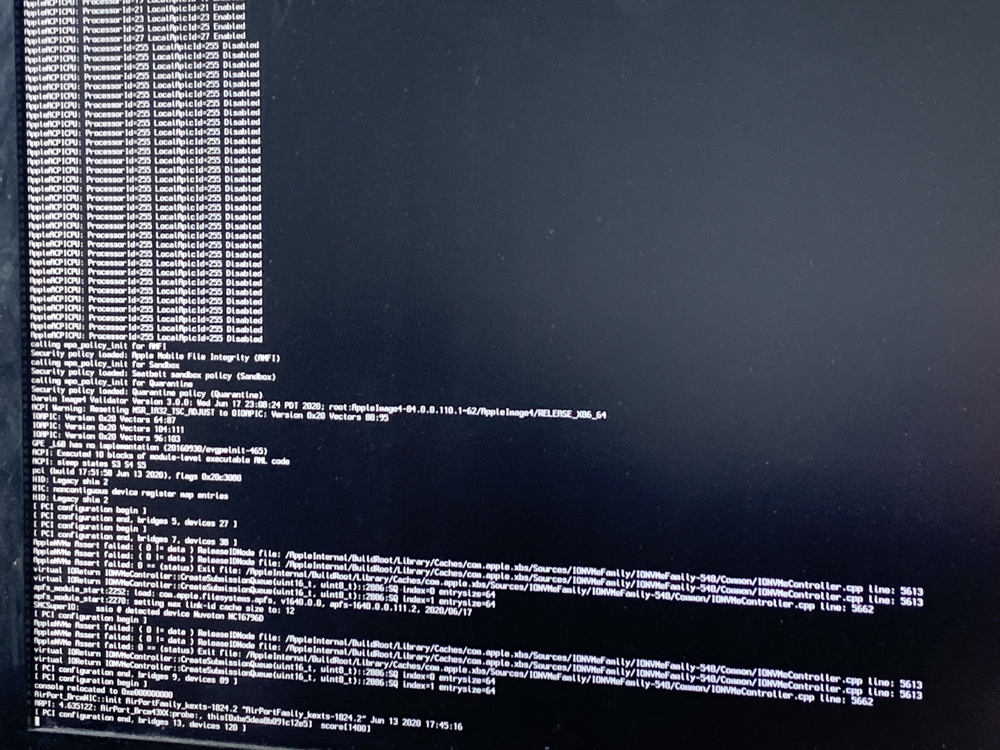
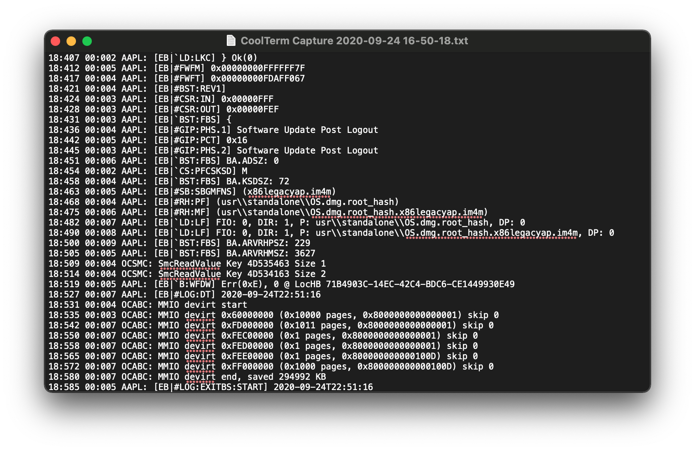
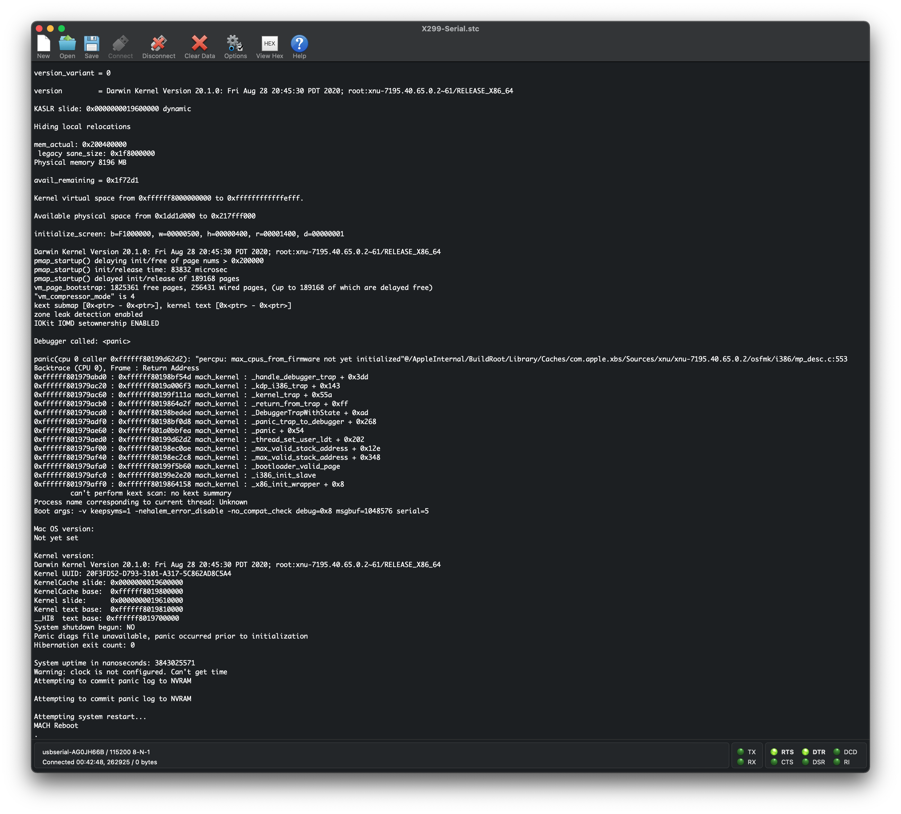

# OpenCore e macOS 11: Big Sur

È di nuovo quel periodo dell'anno e con esso una nuova beta di macOS è stata rilasciata. Ecco tutte le informazioni necessarie per iniziare.

::: suggerimento promemoria

**Questa pagina sarà una piccola discussione su esattamente ciò di cui hai bisogno per prepararti per Big Sur, uno sguardo più approfondito su ciò che è cambiato su Big Sur può essere trovato qui:**

* [Novità di macOS 11, Big Sur! (EN)](https://dortania.github.io/hackintosh/updates/2020/11/12/bigsur-new.html)

:::

## Sommario

  * [Prerequisiti](#prerequisiti)
  * [Un SMBIOS supportato](#un-smbios-supportato)
  * [Hardware supportato](#hardware-supportato)
  * [Kexts, bootloader e config.plist aggiornati](#Kexts-bootloader-e-config-plist-aggiornati)
  * [Problemi conosciuti](#problemi-conosciuti)
  * [Installazione](#installazione)
  * [Risoluzione dei problemi](#risoluzione-dei-problemi)
  * [Bloccato su Forcing CS_RUNTIME for entitlement](#bloccato-su-forcing-cs-runtime-for-entitlement)
  * [Bloccato su PCI Configuration Begins for Intel's X99 and X299 boards](#bloccato-su-pci-configuration-begins-for-intel-s-x99-and-x299-boards)
  * [Bloccato su ramrod(^^^^^^^^^^^^^)](#bloccato-su-ramrod)
  * [X79 e X99 Kernel Panic su IOPCIFamily](#x79-e-x99-kernel-panic-su-iopcifamily)
  * [Inserimento DeviceProperties non riuscito](#Inserimento-DeviceProperties-non-riuscito)
  * [Tastiera e mouse non funzionano](#tastiera-e-mouse-non-funzionano)
  * [Kernel Panic troppo presto su max_cpus_from_firmware non ancora inizializzato](#kernel-panic-troppo-presto-su-max-cpus-from-firmware-non-ancora-inizializzato)
  * [Impossibile eseguire l'aggiornamento a versioni più recenti di Big Sur](#impossibile-eseguire-l-aggiornamento-a-versioni-più-recenti-di-Big-Sur)
  * [Kernel Panic su Rooting from the live fs](#kernel-panic-su-rooting-from-the-live-fs)
  * [Asus Z97 e HEDT (es X99 e X299) non riescono a installare la fase 2](#asus-z97-e-hedt-es-x99-e-x299-non-riescono-a-installare-la-fase-2)
  * [Laptops che vanno in kernel panic su `cannot perform kext scan`](#laptops-che-vanno-in-kernel-panic-su-cannot-perform-kext-scan)

## Prerequisiti

Prima di poter saltare direttamente all'installazione di Big Sur, dobbiamo esaminare alcune cose:

### Un SMBIOS supportato

Big Sur ha perso il supporto ad alcuni SMBIOS basati su Ivy Bridge e Haswell, quindi vedi qua sotto che il tuo non sia fra quelli abbandonti:

* iMac14,3 and older
  * Note iMac14,4 is still supported
* MacPro5,1 and older
* MacMini6,x and older
* MacBook7,1 and older
* MacBookAir5,x and older
* MacBookPro10,x and older

Se il tuo SMBIOS era supportato in Catalina e non è incluso sopra, sei a posto lo stesso!

::: dettagli SMBIOS supportati

SMBIOS ancora supportato in macOS Big Sur:

* iMac14,4 and newer
* MacPro6,1 and newer
* iMacPro1,1 and newer
* MacMini7,1 and newer
* MacBook8,1 and newer
* MacBookAir6,x and newer
* MacBookPro11,x and newer

Per l'elenco completo degli SMBIOS supportati, incluso il supporto del sistema operativo, vedere qui: [Scelta dell'SMBIOS corretto](../smbios-support.md)

:::

Per coloro che desiderano una traduzione semplice per le loro macchine:

* iMac13,1 should transition over to using iMac14,4
* iMac13,2 should transition over to using iMac15,1
* iMac14,2 and iMac14,3 should transition over to using iMac15,1
  * Note: AMD CPU users with Nvidia GPUs may find MacPro7,1 more suitable
* iMac14,1 should transition over to iMac14,4

### Hardware supportato

Non è stato abbandonato molto hardware, anche se i pochi che hanno: 

* CPU ufficiali Ivy Bridge U, H e S.
  * Queste CPU si avviano ancora senza troppi problemi, ma tieni presente che nessun Mac è supportato con il consumer Ivy Bridge a Big Sur.
  * Le CPU Ivy Bridge-E sono ancora supportate grazie al fatto di essere in MacPro6,1
* IGPU Ivy Bridge in programma per la rimozione
  * HD 4000 e HD 2500, tuttavia attualmente questi driver sono ancora presenti nella 11.0.1
* Schede WiFi basate su BCM4331 e BCM43224.
  * Consulta la [Guida per gli acquirenti wireless](https://dortania.github.io/Wireless-Buyers-Guide/) per le potenziali schede a cui aggiornare.
  * La potenziale soluzione è inserire una IO80211Family patchata, vedere qui per maggiori dettagli: [IO80211 Patches](https://github.com/khronokernel/IO80211-Patches)
* Alcuni controller SATA sono caduti
  * Per qualche motivo, Apple ha rimosso la classe AppleIntelPchSeriesAHCI da AppleAHCIPort.kext. A causa della rimozione definitiva della classe, il tentativo di falsificare un altro ID (generalmente eseguito da SATA-unsupported.kext) può fallire per molti e creare instabilità per altri.
  * Una correzione parziale consiste nell'iniettare la versione di Catalina con eventuali simboli in conflitto che vengono patchati. Puoi trovare un esempio di kext qui: [AppleAHCIPort.kext patchato di Catalina](https://github.com/dortania/OpenCore-Install-Guide/blob/master/extra-files/CtlnaAHCIPort.kext.zip)
  * Si consiglia di impostare il valore MinKernel su 20.0.0 per kext `CtlnaAHCIPort.kext` per evitare potenziali conflitti. In questo modo, funzionerà sia in Catalina che in Big Sur, quindi puoi rimuovere SATA non supportato se lo desideri.

Altre modifiche notevoli:

* Gli utenti MSI Navi non richiedono più la patch `ATY, rom` /` -wegnoegpu` per avviare il programma di installazione
* Installazione fase 2 che richiede NVRAM funzionante
   * Serie Asus 9: per maggiori informazioni, vedere qui: [Haswell ASUS Z97 Big Sur Update Thread](https://www.reddit.com/r/hackintosh/comments/jw7qf1/haswell_asus_z97_big_sur_update_and_installation/)
   * Gli utenti X99 e X299 con NVRAM rotta dovranno eseguire l'installazione su un'altra macchina e spostare l'SSD al termine

### Kexts, bootloader e config.plist aggiornati

Assicurati di avere l'ultima versione di OpenCore, kexts e config.plist in modo da non avere problemi di compatibilità dispari. Puoi semplicemente scaricare e aggiornare OpenCore e kexts come menzionato qui:

* [Aggiornamento di OpenCore e macOS (EN)](https://dortania.github.io/OpenCore-Post-Install/universal/update.html)

Se non sei sicuro di quale versione di OpenCore stai utilizzando, puoi eseguire quanto segue nel terminale:

```sh
nvram 4D1FDA02-38C7-4A6A-9CC6-4BCCA8B30102:opencore-version
```

* Nota: il comando about richiederà di includere il bit "0x2" in `Misc -> Security -> ExposeSensitiveData`, i valori consigliati per ExposeSensitiveData sono "0x6" che include i bit "0x2" e "0x4".

#### AMD Nota

**Promemoria per gli utenti AMD**: Non dimenticare di aggiornare le patch del tuo kernel con quelle fornite da AMD OS X, altrimenti non sarai in grado di avviare Big Sur:

* [Patch AMD OSX](https://github.com/AMD-OSX/AMD_Vanilla/)

#### Intel HEDT Nota

Per gli utenti X79, X99 e X299, prestare molta attenzione a quanto segue. Big Sur ha aggiunto nuovi requisiti per ACPI, quindi dovrai prendere alcuni nuovi SSDT:

* X79
   * [SSDT-UNC](https://github.com/acidanthera/OpenCorePkg/tree/master/Docs/AcpiSamples/Source/SSDT-UNC.dsl)
* X99
   * [SSDT-UNC](https://github.com/acidanthera/OpenCorePkg/tree/master/Docs/AcpiSamples/Source/SSDT-UNC.dsl)
   * [SSDT-RTC0-RANGE](https://github.com/acidanthera/OpenCorePkg/tree/master/Docs/AcpiSamples/Source/SSDT-RTC0-RANGE.dsl)
* X299
   * [SSDT-RTC0-RANGE](https://github.com/acidanthera/OpenCorePkg/tree/master/Docs/AcpiSamples/Source/SSDT-RTC0-RANGE.dsl)

Per coloro che desiderano file precompilati, vedere qui:

* [Guida introduttiva ad ACPI: SSDT prefabbricati (EN)](https://dortania.github.io/Getting-Started-With-ACPI/ssdt-methods/ssdt-prebuilt.html)

### Problemi conosciuti

Con Big Sur, un bel po di cose hanno smesso di funzionare. Principalmente le seguenti:

* Lilu
  * Principalmente le patch per lo spazio utente sono state gravemente danneggiate, il che significa che alcune funzionalità potrebbero essersi interrotte
  * Questi includono:
    * DiskArbitrationFixup
    * MacProMemoryNotificationDisabler
    * SidecarEnabler
    * SystemProfilerMemoryFixup
    * NoTouchID
    * Patch DRM e -cdfon di WutelyGreen
* AirportBrcmFixup
  * Forzare il caricamento di un driver specifico con `brcmfx-driver =` può aiutare
    * Gli utenti BCM94352Z, ad esempio, potrebbero aver bisogno di `brcmfx-driver = 2` in boot-args per risolvere questo problema, altri chipset avranno bisogno di altre variabili.
  * L'impostazione di MaxKernel su 19.9.9 per AirPortBrcm4360_Injector.kext può aiutare. Maggiori informazioni [dalla repo](https://github.com/acidanthera/AirportBrcmFixup/blob/master/README.md#please-pay-attention)
* Supporto SATA rotto
  * A causa del fatto che Apple ha abbandonato la classe AppleIntelPchSeriesAHCI in AppleAHCIPort.kext
  * Per risolvere, aggiungi [AppleAHCIPort.kext patchato di Catalina (EN)](https://github.com/dortania/OpenCore-Install-Guide/blob/master/extra-files/CtlnaAHCIPort.kext.zip) con MinKernel impostato su 20.0. 0

E sebbene non sia un problema, SIP ha ora guadagnato un nuovo bit quindi per disabilitare correttamente SIP è necessario impostare `csr-active-config` su` FF0F0000`. Vedi qui per maggiori informazioni: [Disabilitare SIP](../../troubleshooting/extended/post-issues.md#disabling-sip)

##Installazione

Le guide sono state aggiornate per adattarsi a Big Sur, vedere l'ambiente del sistema operativo applicabile per te:

* [utenti macOS](../../ installer-guide / mac-install.md)
* [Utenti Windows](../../ installer-guide / winblows-install.md)
* [Utenti Linux](../../installer-guide /linux-install.md)

## Risoluzione dei problemi

### Bloccato su `Forcing CS_RUNTIME for entitlement`

! [Ringraziamo Stompy per l'immagine](../../images/extras/big-sur/readme/cs-stuck.jpg)

Questa è in realtà la parte in cui macOS sigillerà il volume di sistema e dove potrebbe sembrare che macOS si sia bloccato. **NON RIAVVIARE** pensando di essere bloccato, il completamento dell'operazione richiederà un po 'di tempo, altrimenti si interromperà l'installazione.

### Bloccato su `PCI Configuration Begins` for Intel's X99 and X299 boards



Come accennato in precedenza, le schede madri Intel HEDT potrebbero avere alcuni problemi che ruotano attorno al loro dispositivo RTC in ACPI. Per risolvere il problema, dovrai guardare il tuo dispositivo RTC e vedere quali regioni mancano. Per ulteriori informazioni, vedere qui: [SSDT-RTC0-RANGE.dsl](https://github.com/acidanthera/OpenCorePkg/tree/master/Docs/AcpiSamples/Source/SSDT-RTC0-RANGE.dsl)

### Bloccato su `ramrod`(^^^^^^^^^^^^^)

! [Ringraziamo Notiflux per l'immagine](../../images/extras/big-sur/readme/ramrod.jpg)

Se rimani bloccato nella sezione `ramrod` (in particolare, si avvia, avviene questo errore e si riavvia di nuovo, causando un loop), questo suggerisce che il tuo emulatore SMC è rotto. Per risolvere questo problema, hai 2 opzioni:

* Assicurati di utilizzare le ultime build di VirtualSMC e Lilu, con `vsmcgen = 1` boot-arg
* Passa a [Rehabman's FakeSMC](https://bitbucket.org/RehabMan/os-x-fakesmc-kozlek/downloads/) (puoi usare il trucco `MinKernel` /` MaxKernel` menzionato sopra per limitare FakeSMC a Big Sur e oltre)

E quando cambi kext, assicurati di non avere sia FakeSMC che VirtualSMC abilitati nel tuo config.plist, poiché ciò causerà un conflitto.

### X79 e X99 Kernel Panic su IOPCIFamily

Ciò è dovuto a un bridge PCI uncore inutilizzato abilitato in ACPI, e quindi IOPCIFamily creerà un panico del kernel durante il sondaggio di dispositivi sconosciuti. Per risolvere, dovrai aggiungere [SSDT-UNC](https://github.com/acidanthera/OpenCorePkg/tree/master/Docs/AcpiSamples/Source/SSDT-UNC.dsl) al tuo sistema

### Inserimento DeviceProperties non riuscito

Con Big Sur, macOS è diventato molto più esigente con i dispositivi presenti in ACPI. Soprattutto se stai iniettando proprietà importanti per WutelyGreen o AppleALC, potresti scoprire che non si applicano più. Per verificare se il tuo ACPI definisce il tuo hardware, controlla la proprietà `acpi-path` in [IORegistryExplorer](https://github.com/khronokernel/IORegistryClone/blob/master/ioreg-210.zip):

! [](../../ images / extras / big-sur / readme / acpi-path.png)

Se non viene trovata alcuna proprietà, sarà necessario creare un SSDT che fornisca il percorso completo poiché probabilmente si dispone di un bridge PCI non documentato nelle tabelle ACPI. Un esempio di questo può essere trovato qui: [SSDT-BRG0](https://github.com/acidanthera/OpenCorePkg/tree/master/Docs/AcpiSamples/Source/SSDT-BRG0.dsl)

* **Nota**: questo problema potrebbe verificarsi anche nelle versioni precedenti di macOS, tuttavia è molto probabile che Big Sur abbia problemi.

### Tastiera e mouse non funzionano

Per alcuni sistemi legacy, potresti notare che mentre le porte USB funzionano i tuoi dispositivi basati su HID come la tastiera e il mouse potrebbero essere rotti. Per risolvere questo problema, aggiungi la seguente patch:

::: dettagli Patch IOHIDFamily

config.plist -> Kernel -> Patch:

| Key | Type | Value |
| :--- | :--- | :--- |
| Base | String | _isSingleUser |
| Count | Integer | 1 |
| Enabled | Boolean | True |
| Find | Data | |
| Identifier | String | com.apple.iokit.IOHIDFamily |
| Limit | Integer | 0 |
| Mask | Data | |
| MaxKernel | String | |
| MinKernel | String | 20.0.0 |
| Replace | Data | B801000000C3 |
| ReplaceMask | Data | |
| Skip | Integer | 0 |

[Source](https://applelife.ru/threads/ustanovka-macos-big-sur-11-0-beta-na-intel-pc-old.2944999/page-81#post-884400)

:::

###Kernel Panic troppo presto su max_cpus_from_firmware non ancora inizializzato

Se ricevi un anticipato kernel panic su `max_cpus_from_firmware non ancora inizializzato`, ciò è dovuto al nuovo metodo` acpi_count_enabled_logical_processors` aggiunto nel kernel di macOS Big Sur. Per risolvere il problema, assicurati di essere su OpenCore 0.6.0 o più recente con il Quirk `AvoidRuntimeDefrag` abilitato.

* **Nota**: A causa di quanto presto si verifica questo panico del kernel, potresti essere in grado di registrarlo solo tramite seriale o riavviando in un'installazione funzionante nota di macOS e controllando il tuo panico registrato nella NVRAM.
   * La maggior parte degli utenti vedrà questo panico semplicemente come `[EB | #LOG: EXITBS: START]`

::: dettagli Esempio Kernel Panic

Sullo schermo:



Tramite Log seriale o NVRAM:



:::

::: dettagli Legacy Edge Case

Su alcuni hardware, principalmente l'HP DC7900, il kernel non è ancora in grado di determinare esattamente quanti thread supporta l'hardware. Ciò si tradurrà nel suddetto kernel panic e quindi è necessario codificare in modo rigido il valore del core della CPU.

Per fare ciò, aggiungi la seguente patch (sostituendo la 04 da B8 ** 04 ** 00 00 00 C3 con la quantità di thread della CPU supportati dal tuo hardware):

| Key | Type | Value |
| :--- | :--- | :--- |
| Base | String | _acpi_count_enabled_logical_processors |
| Count | Integer | 1 |
| Enabled | Boolean | True |
| Find | Data | |
| Identifier | String | Kernel |
| Limit | Integer | 0 |
| Mask | Data | |
| MaxKernel | String | |
| MinKernel | String | 20.0.0 |
| Replace | Data | B804000000C3 |
| ReplaceMask | Data | |
| Skip | Integer | 0 |

:::

### Impossibile eseguire l'aggiornamento a versioni più recenti di Big Sur

Generalmente ci sono 2 principali colpevoli:

* [Broken Update Utility](# broken-update-utility)
   * Errore più comune se si esegue una beta, provare prima questo
* [Broken Seal](# broken-seal)

#### Utilità di aggiornamento non funzionante

Generalmente visto con ogni ciclo beta, è sufficiente annullare l'iscrizione e iscriversi di nuovo:

```sh
# Annulla l'iscrizione al catalogo beta
sudo /System/Library/PrivateFrameworks/Seeding.framework/Resources/seedutil unenroll
#Iscriviti di nuovo
sudo /System/Library/PrivateFrameworks/Seeding.framework/Resources/seedutil enroll DeveloperSeed
```

Quindi ricontrolla con le impostazioni e dovrebbe apparire. In caso contrario, eseguire quanto segue:

```sh
# Elenca gli aggiornamenti software tramite terminale
softwareupdate -l
```

Questo dovrebbe aiutare a riavviare l'utilità di aggiornamento. Se i problemi persistono, controlla la sezione [Broken Seal](#broken-seal).

#### Sigillo rotto

Con il nuovo snapshot di Apple per l'unità di sistema, ora dipendono fortemente da questo affinché gli aggiornamenti del sistema operativo vengano applicati correttamente. Quindi, quando il sigillo di una guida è rotto, macOS rifiuterà di aggiornare l'unità.

Per verificare te stesso, controlla che "Snapshot Sealed" ritorni come SÌ:

```bash
# Elenca tutti i volumi APFS
diskutil apfs list

# Cerca il volume del tuo sistema
Volume disk1s8 A604D636-3C54-4CAA-9A31-5E1A460DC5C0
        ---------------------------------------------------
        APFS Volume Disk (Role):   disk1s8 (System)
        Name:                      Big Sur HD (Case-insensitive)
        Mount Point:               Not Mounted
        Capacity Consumed:         15113809920 B (15.1 GB)
        Sealed:                    Broken
        FileVault:                 No
        |
        Snapshot:                  4202EBE5-288B-4701-BA1E-B6EC8AD6397D
        Snapshot Disk:             disk1s8s1
        Snapshot Mount Point:      /
        Snapshot Sealed:           Yes
```

Se restituisce "Snapshot Sealed: Broken", ti consigliamo di eseguire quanto segue:

* Aggiorna a OpenCore 0.6.4 o più recente
   * È richiesto il commit specifico [ba10b5d](https://github.com/acidanthera/OpenCorePkg/commit/1b0041493d4693f9505aa6415d93079ea59f7ab0) o una versione successiva
* Ripristina le vecchie istantanee
   * Principalmente per coloro che hanno manomesso il volume del sistema
   * Vedi qui come ripristinare: [Rollback degli snapshot APFS](../../troubleshooting/extended/post-issues.md#rolling-back-apfs-snapshot)

### Kernel Panic su Rooting from the live fs

Errore completo:

```
Il rooting dal live fs di un volume sealed non è consentito in una build RELEASE
```

Ciò è dovuto a problemi relativi all'avvio di Secure Boot abilitato nella Beta 10 con versioni precedenti di OpenCore. Aggiorna semplicemente alla 0.6.4 per risolvere

* È richiesto il commit specifico [ba10b5d](https://github.com/acidanthera/OpenCorePkg/commit/1b0041493d4693f9505aa6415d93079ea59f7ab0) o una versione successiva

### Asus Z97 e HEDT (es X99 e X299) non riescono a installare la fase 2

Con Big Sur, c'è una maggiore dipendenza dalla NVRAM nativa per l'installazione, altrimenti il programma di installazione si bloccherà in un ciclo di riavvio. Per risolvere questo problema dovrai:

* Installa Big Sur su un'altra macchina, quindi trasferisci l'unità
* Correggi la NVRAM della scheda madre
   * applicabile principalmente con la serie Z97 di Asus

Per quest'ultimo, vedere qui: [Haswell ASUS Z97 Big Sur Update Thread](https://www.reddit.com/r/hackintosh/comments/jw7qf1/haswell_asus_z97_big_sur_update_and_installation/)

### Laptops che vanno in kernel panic su `cannot perform kext scan`

Ciò è dovuto al fatto che più copie dello stesso kext si trovano nella cache del kernel e, per essere più specifici, avere più copie di VoodooInput. Controlla il tuo `Kernel -> Aggiungi` e verifica di avere solo una copia di VoodooInput abilitata.

* Nota: sia VoodooI2C che VoodooPS2 hanno una copia in bundle di VoodooInput, quello che disabiliti dipende dalle preferenze personali
