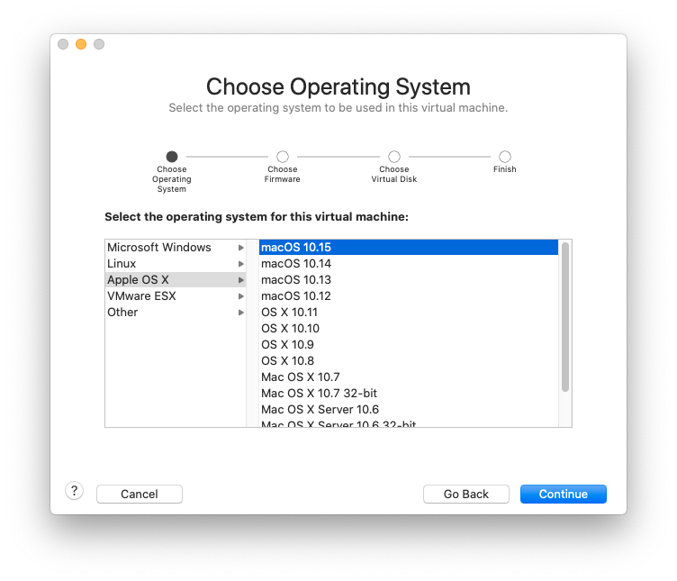
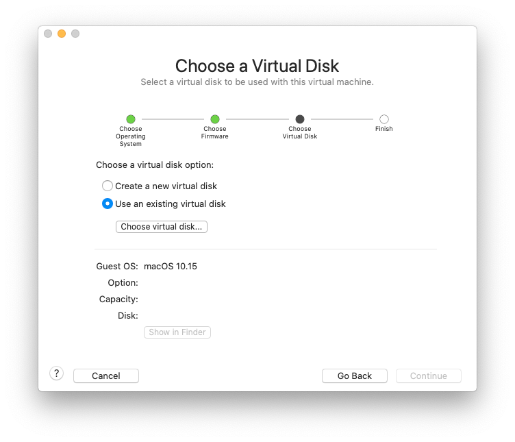
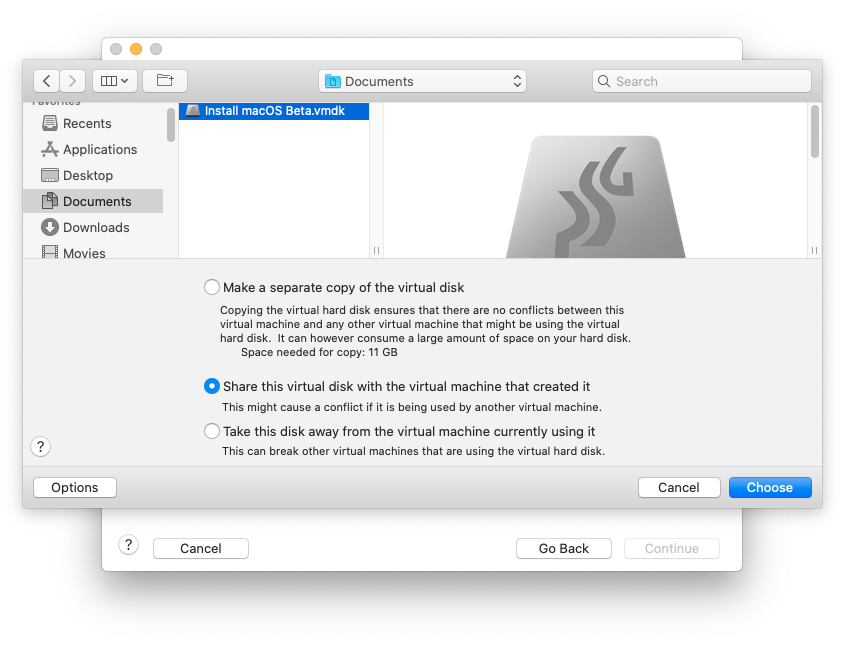
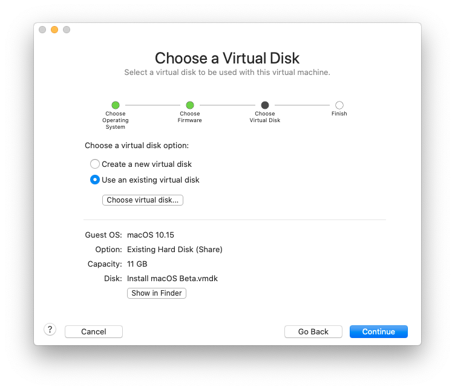
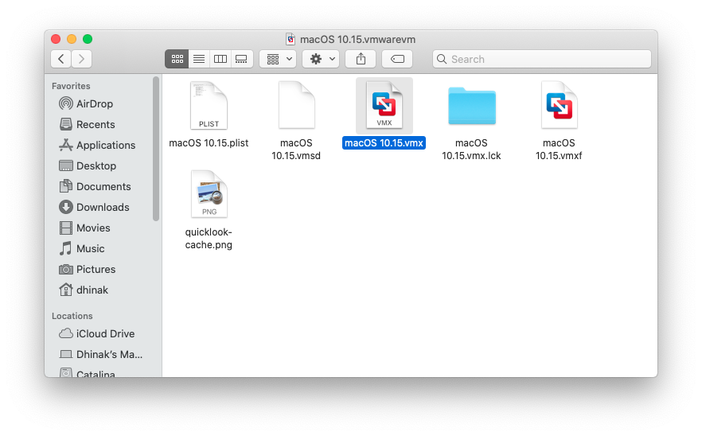
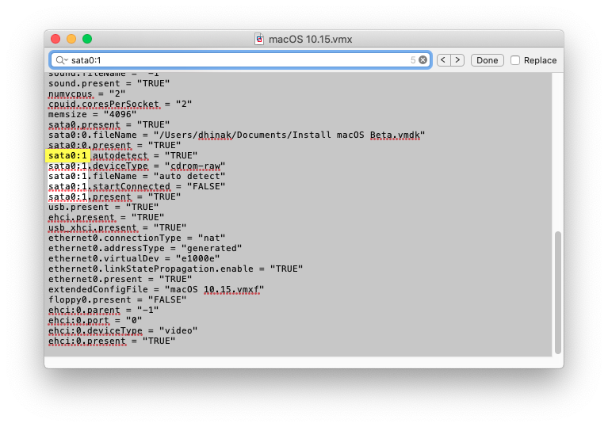
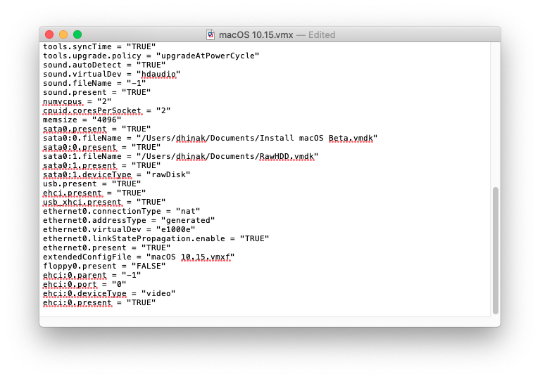
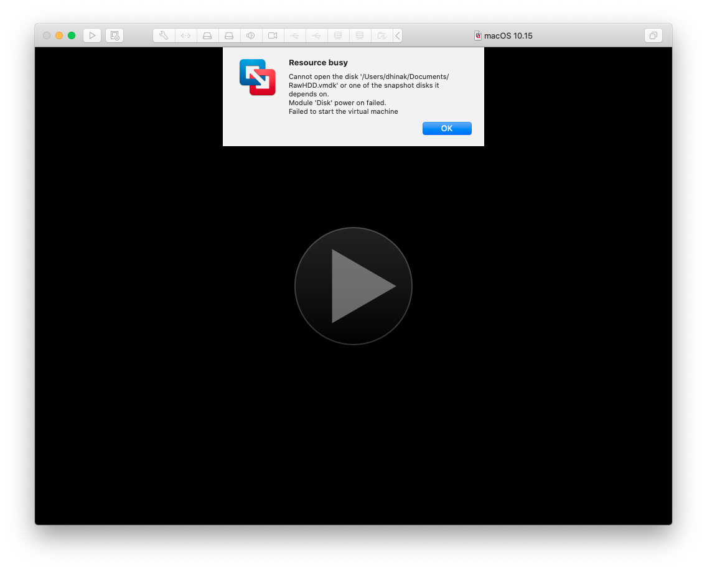
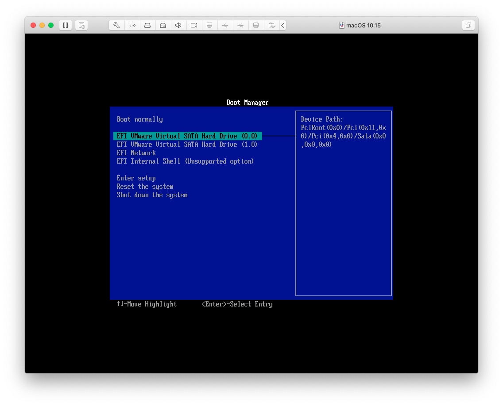

# VMware Fusion

## Requisiti

* VMware Fusion
* Java (funzionano sia JRE che JDK)
* Un computer con macOS
* Il software di installazione di macOS desiderato installato in / Applicazioni
* Un disco rigido o SSD collegato tramite USB o un disco interno che può essere passato interamente

## Conversione dei supporti di installazione

VMware non può utilizzare direttamente un'immagine disco non elaborata, quindi creeremo un VMDK collegato, che ti consentirà di utilizzarlo come disco rigido virtuale in VMware Fusion.

Scarica raw2vmdk da [here](../../extra-files/raw2vmdk.jar), e metterlo nella stessa directory del file `.img`. Quindi, esegui il seguente comando:

```bash
### Cambia "Installa macOS Big Sur Beta" se il nome del file .img è diverso
java -jar raw2vmdk.jar "Install macOS Big Sur Beta.img" "Install macOS Big Sur Beta.vmdk"
```

Questo creerà un VMDK che fa riferimento al file `.img` (l'immagine del disco grezzo) per VMware da utilizzare. Se hai intenzione di spostare questo vmdk o trasferirlo su un altro computer, devi spostare il file img insieme ad esso.

## Installazione di macOS Big Sur in VMware Fusion

Hai due opzioni qui: passare attraverso un disco grezzo o passare attraverso un intero dispositivo USB. I passaggi non sono così diversi per entrambi, quindi verranno combinati qui.

1. (Salta questo se stai eseguendo il passthrough USB) Per il passthrough del disco grezzo, collega il disco che è la destinazione per l'installazione di macOS e crea un disco rigido virtuale che fa riferimento ad esso da utilizzare con Fusion.

     Nota: potrebbe essere necessario rimuovere le partizioni del disco prima di utilizzarlo.

    ```bash
    diskutil list
    # individuare il disco esterno che corrisponde e sostituire / dev / disk3 di seguito con il percorso del dispositivo.
    sudo /Applications/VMware\ Fusion.app/Contents/Library/vmware-rawdiskCreator create /dev/disk3 fullDevice RawHDD ide
    ```

2. Quindi, avvia VMware Fusion. Dovresti vedere la home page. In caso contrario, chiudere qualsiasi finestra che si è aperta e selezionare `File` > `New` dalla barra dei menu.
    
3. Seleziona l'opzione "Crea una macchina virtuale personalizzata" e seleziona macOS 10.15 (poiché 10.16 / 11 non è disponibile).
    
4. Seleziona "Usa un disco virtuale esistente" nella schermata sottostante.
    
5. Quindi, fai clic su "Scegli disco virtuale" e seleziona `Install macOS Beta.vmdk` vmdk che abbiamo creato in precedenza. Se vuoi assicurarti che VMware non copi il disco nella posizione in cui memorizzerai la VM (ad esempio, se hai poco spazio), seleziona "Condividi questo disco virtuale con la macchina virtuale che lo ha creato".
    
    Una volta fatto, dovrebbe assomigliare a questo.
    
6. Premi Continua, quindi fai clic su "Personalizza impostazioni". Assicurati di salvare la VM in un posto diverso dal disco che stai attraversando.

    Una volta terminato, dovresti arrivare a una schermata simile a questa.
    
7. Per prima cosa, seleziona "Processori e memoria" e imposta la memoria su almeno 4096 MB.
8. (Se stai eseguendo il passthrough del disco grezzo, salta questo passaggio) Seleziona "Mostra tutto" e fai clic su "USB e Bluetooth". Collega il tuo dispositivo USB e in "Plug In Action", cambialo da "Chiedi cosa fare" a "Connetti alla VM". Dovrebbe essere simile a questo una volta terminato. (In questo caso, "VIA AmazonBasics Hard Drive Enclos" è il mio dispositivo.)
    
    Quindi chiudi la finestra.
9. (Se si esegue il passthrough USB, saltare i passaggi da 9 a 13) Chiudere la finestra e chiudere VMware Fusion. Individua la cartella "macOS 10.15.vmwarevm" (o qualunque cosa tu abbia chiamato durante il salvataggio) nel Finder e fai clic con il pulsante destro del mouse> "Mostra contenuto pacchetto".

     Il risultato dovrebbe essere simile all'immagine qui sotto.
    
10. Apri il file vmx (non la cartella vmxf o vmx.lck) in TextEdit. Dovrebbe assomigliare a qualcosa di simile a questo:
    
11. Trova le righe che iniziano con `sata0: 1`:
    
12. Sostituisci tutte le righe che iniziano con `sata0: 1` con le seguenti. Sostituisci `<path/to/vmdk>` con il percorso completo di RawHDD.vmdk, creato in precedenza.

    Suggerimento: trovalo nel Finder, quindi fai clic con il pulsante destro del mouse, tieni premuta l'opzione e seleziona "Copia" RawHDD.vmdk "come percorso" per ottenere facilmente il percorso completo.

    ```
    sata0:1.fileName = "<path/to/vmdk>"
    sata0:1.present = "TRUE"
    sata0:1.deviceType = "rawDisk"
    ```

    Al termine, dovrebbe assomigliare al seguente.
    
13. Salva ed esci da TextEdit e riapri VMware Fusion. La tua VM dovrebbe aprirsi automaticamente, ma in caso contrario, aprila dalla libreria della macchina virtuale.

14. Selezionare "Virtual Machine"> "Power On To Firmware" dalla barra dei menu, in modo da poter avviare il BIOS della VM.

     * (Per il passthrough del disco grezzo) Se ti viene richiesta la password quando lo fai, inseriscila. Anche se il prompt menziona i dischi Boot Camp, funziona ancora normalmente.

     * Se ricevi un errore che la risorsa è occupata come di seguito, esegui quanto segue in Terminale e riprova:

    ```bash
    diskutil list
    # sostituire /dev/disk3 di seguito con il percorso del dispositivo corretto per il passthrough del disco grezzo che è stato trovato prima
    sudo diskutil unmountDisk /dev/disk3
    ```

    
15. Dovresti accedere a VM Boot Manager, come mostrato di seguito. Selezionare il primo disco rigido ("EFI VMware Virtual SATA Hard Drive (0.0)). La VM dovrebbe avviare l'avvio del programma di installazione di Big Sur.
    
16. Completa l'installazione come faresti su qualsiasi altro dispositivo.
     l'installazione è completa e ti trovi nella schermata di benvenuto, seleziona "Macchina virtuale"> "Spegni" dalla barra dei menu.

     Se necessario, aggiungi il tuo EFI preparato alla partizione EFI sul dispositivo, quindi espellilo.

     Riposiziona l'unità nel tuo hack e avvia normalmente. Ora hai Big Sur!
