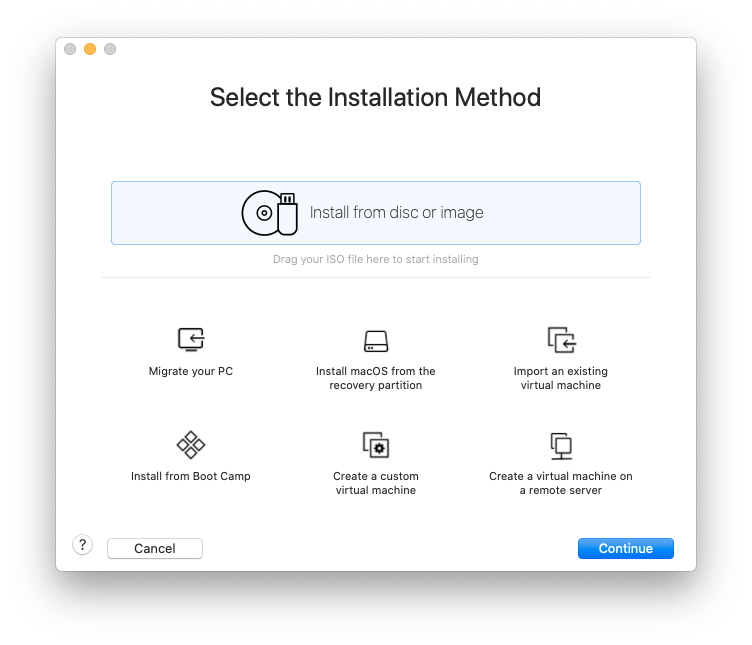
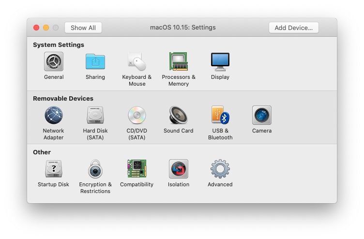

# VMware Fusion

## Requirements

* VMware Fusion (on genuine mac/Hackintosh)
* qemu-img
  * You can grab it from your qemu installation (`brew install qemu`). To install it, you have to install [brew](https://brew.sh)

## Download the Installation Media

You can use [macrecovery](https://github.com/acidanthera/OpenCorePkg/tree/master/Utilities/macrecovery) (see this [guide](../installer-guide/winblows-install.md#downloading-macos)) to optain the basesystem.dmg file.

## Converting Installation Media

VMware cannot directly use a dmg disk image, so we'll create a vmdk file, which will allow you to use it as a virtual disk drive in VMware Fusion.
With some convertions, we can create our disk image:

```bash
### Change "BaseSystem" if the name of the .dmg file differs
qemu-img convert BaseSystem.dmg -O vmdk BaseSystem.vmdk
```

This command converts our dmg disk image to the vmdk disk.

## Installing macOS Big Sur in VMware Fusion

1. Next, start VMware Fusion. You should see the homepage. If not, close any window that opened and select `File` > `New` from the menu bar.
    
2. Select the "Create a custom virtual machine" option, and select macOS 10.15 (as 10.16/11 isn't available).
    
3. Select "Use an existing virtual disk" at the screen below.
    
4. Then, click "Choose virtual disk" and select the `BaseSystem.vmdk` vmdk we made earlier. If you want to make sure VMware does not copy the disk to where you will be storing the VM (for example, if you are low on space), select "Share this virtual disk with the virtual machine that created it".
    
    Once done, it should look like this.
    
5. Hit Continue, then click "Customize Settings". Make sure to save the VM to somewhere that's not the disk you are passing through.
    Once done, you should arrive at a screen that looks like this.
    
6. First, select "Processors & Memory", and set the memory to at least 4096 MB.
7. Add a second Hard Disk (minimum of 100 GB) where you will install macOS.
8. Open the vmx (not vmxf or vmx.lck folder) file in TextEdit. It should look something like this:
    
9. You should get to the VM Boot Manager, as shown below. Select the first hard drive ("EFI VMware Virtual SATA Hard Drive (0.0)). The VM should start booting the Big Sur installer.
    
10. Complete the installation as you would on any other device.
    The installation is complete, and you are at the Welcome screen, select "Virtual Machine" > "Shut Down" from the menu bar.
    If needed, add your prepared EFI to the EFI partition on the device, then eject it.
    Place the drive back in your hack and boot normally. You now have Big Sur!

## Adding Video Patches

In some cases you see that you have not graphic acceleration. We can fix this only on macOS 11.0, Big Sur:

* Close VMware Fusion. Locate the "macOS 10.15.vmwarevm" (or whatever you named the machine it when saving) folder in Finder, and right click > "Show Package Contents".
  The result should look like the image below.
  
* Open the vmx (not vmxf or vmx.lck folder) file in TextEdit. It should look something like this:
  
* Add the following lines to it ([based on](https://kb.vmware.com/s/article/81657)):

  ```
  appleGPU0.present = "True"
  svga.present = "FALSE"
  ```

* Don't touch anything else and reboot. Now the video should work.
