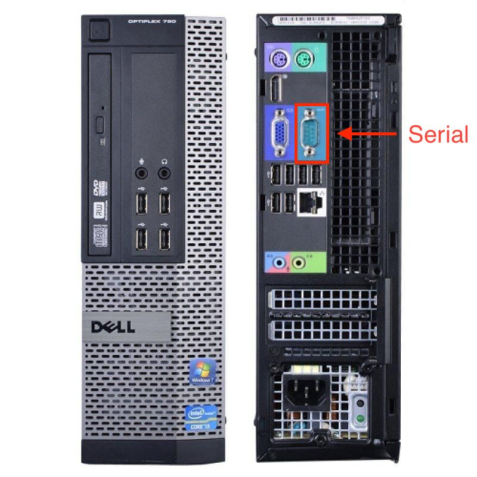
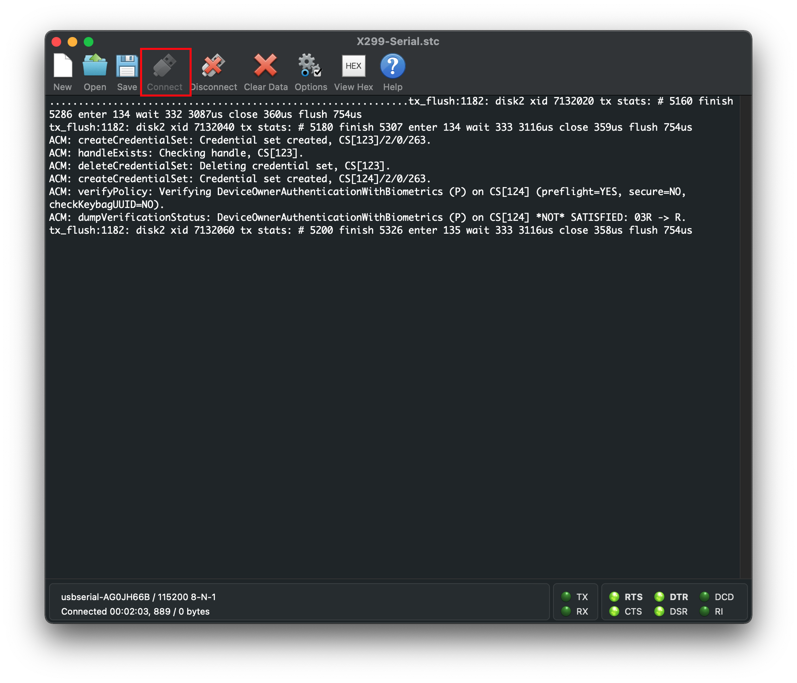
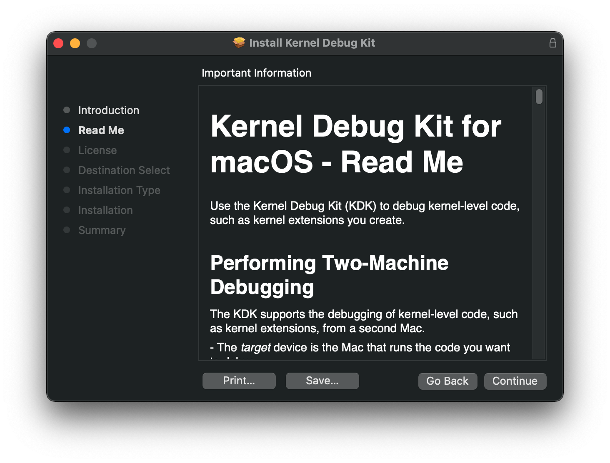
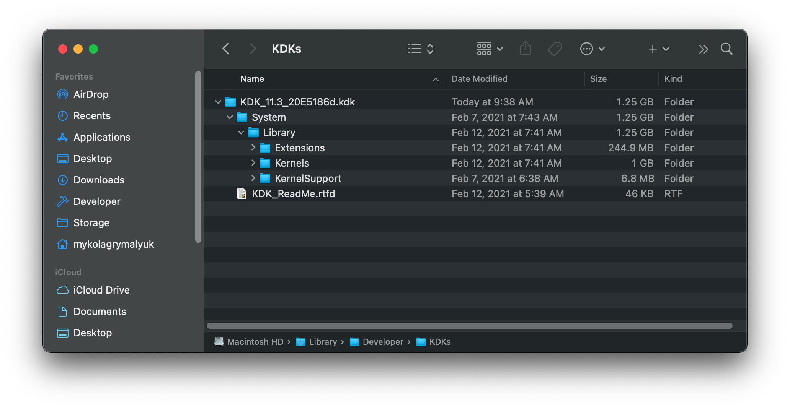

# Debug del sistema: approfondito

Questa sezione andrà un po 'più in profondità nella risoluzione dei problemi, concentrandosi in particolare su un debug di livello più basso con un output di debug appropriato e una configurazione seriale opzionale.

**Note**: Il 99% degli utenti non ha bisogno di questo livello di debug, questo è solo per casi estremi o estremi.

[[toc]]

## EFI Setup

Per la maggior parte, sono necessarie modifiche abbastanza minime. Le cose principali che consigliamo sono la versione DEBUG di **OpenCore** e di tutti i tuoi **kexts**. Questo può aiutarti a ottenere tutti i dati necessari, vedi qui per maggiori dettagli sul debug di OpenCore: [OpenCore debugging](./debug.md)

Oltre a utilizzare solo le varianti DEBUG di OpenCore e kexts, anche questi strumenti possono essere di grande aiuto:

* [DebugEnhancer.kext](https://github.com/acidanthera/DebugEnhancer/releases)
  * Aiuta molto con il debug del kernel mentre si applica anche la patch [kern.msgbuf to 10485760](https://github.com/acidanthera/DebugEnhancer/blob/4495911971011a1a7a0ffe8605d6ca4b341f67d9/DebugEnhancer/kern_dbgenhancer.cpp#L131) e consentendo un registro del kernel molto più grande.
  * Nota che questo kext non si può caricare con l'inizializzazione del kernel, quindi i primi log non vengono aggiornati finché il kext non viene caricato subito prima della fase di configurazione PCI
  
* [SSDT-DBG](https://gist.github.com/al3xtjames/39ebea4d615c8aed829109a9ea2cd0b5)
  * Abilita le istruzioni di debug dalle tabelle ACPI, aiutando per il debug degli eventi ACPI nel sistema operativo
  * Nota che dovrai anche  [compilare l'SSDT](/Getting-Started-With-ACPI/Manual/compile.html)
  
## Configurazione Config.plist

Per la configurazione seriale, OpenCore lo rende in realtà abbastanza semplice.

### Misc

* **SerialInit**: YES
  * Esegue l'inizializzazione della porta seriale
* **Target**: `67`
  * Abilita l'output di debug con OpenCore
  * Target=75 aggiunge il flag di output seriale aggiuntivo (0x08) se [prevedi di utilizzare seriale](#configurazione-del-seriale-opzionale)
  * Puoi calcolare il tuo valore qui: [OpenCore debugging](./debug.md)
  
### NVRAM

#### Argomenti di avvio

Qui possiamo impostare alcune variabili che ci aiuteranno con l'output di debug, per noi utilizzeremo i seguenti argomenti di avvio:

```
-v keepsyms=1 debug=0x12a msgbuf=1048576
```

Ora vediamo cosa fa ogni argomento:

* **-v**
  * Abilita l'output dettagliato
* **keepsyms=1**
  * Assicura che i simboli vengano conservati durante i kernel panic, che sono molto utili per la risoluzione dei problemi
* **debug=0x12a**
  * Combinazione di `DB_KPRT`(0x8), `DB_KDP_BP_DIS`(0x32), `DB_KDP_GETC_ENA(0x200)`
  * Un elenco completo dei valori può essere trovato qui: [debug.h](https://github.com/apple/darwin-xnu/blob/master/osfmk/kern/debug.h#L419L447)
* **msgbuf=1048576**
  * Imposta la dimensione del buffer dei messaggi del kernel, questo aiuta a ottenere i log corretti durante l'avvio
  * 1048576 is 1MB(/1024^2), può essere più grande se necessario
  * Nota non richiesta con DebugEnhancer.kext, tuttavia per i primi log del kernel è ancora richiesta

**Altri utili Argomenti di avvio**:

A seconda di cosa stai eseguendo il debug, potresti trovare anche questi argomenti di avvio estremamente utili:

* **-liludbgall**
  * Abilita il debug su Lilu e qualsiasi altro plugin, tieni presente che anche questo richiede versioni DEBUG di kexts
* **io=0xff**
  * Abilita il debug di IOKit, con un output maggiore. Tieni presente che la quantità di registrazione di questo parametro sarà enorme e rallenterà il sistema. Soprattutto durante l'avvio.
* **igdebug=0xff**
  * Abilita il debug relativo a iGPU, utile quando si lavora con i sistemi iGPU
* **serial=5**
  * Reindirizza l'output a seriale se si [prevede di utilizzare il seriale](#configurazione-del-seriale-opzionale)
  * Consigliato per l'output iniziale del kernel prima della configurazione PCI
* **acpi_layer=0x8**
  * Abilita il debug di `ACPI_TABLES`, vedi [acoutput.h](https://github.com/acpica/acpica/blob/master/source/include/acoutput.h) per maggiori informazioni
  * `0xFFFFFFFF` in alternativa abilita tutti i livelli
* **acpi_level=0x2**
  * Imposta il debug di `ACPI_LV_DEBUG_OBJECT`, vedi [acoutput.h](https://github.com/acpica/acpica/blob/master/source/include/acoutput.h) per maggiori informazioni
  * `0xFFFF5F` in alternativa implica "ACPI_ALL_COMPONENTS"

## Configurazione del seriale (Opzionale)

* [Hardware Setup](#hardware-setup)
* [EFI Setup](#efi-setup)
* [Configurazione Config.plist](#configurazione-configplist)

Sebbene facoltativo, il seriale può essere molto utile per acquisire tutte le informazioni importanti che invadono il tuo PC. È anche l'unico modo per registrare correttamente i primi kernel panic (come le cose subito dopo `[EB | #LOG: EXITBS: START]`)

Per questa configurazione, avrai bisogno di alcune cose:

* Una porta seriale sulla macchina che si testa
* Un cavo da seriale a seriale o da seriale a USB
* Una seconda macchina per ricevere la registrazione seriale (con seriale o USB)
* Software per monitorare l'uscita seriale
  * Per questa guida, utilizzeremo [CoolTerm](https://freeware.the-meiers.org) poiché supporta macOS, Linux, Windows e persino Raspberry Pi
    * Anche `screen` e altri metodi sono supportati.

### Hardware Setup

Per questo esempio, utilizzeremo una scheda Asus X299-E Strix che ha una porta seriale. Per verificare se la tua scheda ne ha una, controlla il manuale utente o di servizio e cerca la porta seriale/COM:


Come puoi vedere, abbiamo una porta COM nella parte inferiore della nostra scheda madre e cè anche un diagramma per collegare manualmente i nostri pin seriali se non stai utilizzando un connettore seriale 9/10 pin per l'adattatore DB9.

In alternativa, alcune macchine sono dotate di porte seriali DB9 proprio sull'IO posteriore come questo Dell Optiplex 780 SFF (si noti che VGA e seriale **non** sono lo stesso connettore):



Per la mia configurazione X299, sto usando un semplice file [Serial header to DB9](https://www.amazon.ca/gp/product/B001Y1F0HW/ref=ppx_yo_dt_b_asin_title_o00_s00?ie=UTF8&psc=1), e un [DB9 to USB  RS 232 adapter](https://www.amazon.ca/gp/product/B075YGKFC1/ref=ppx_yo_dt_b_asin_title_o00_s01?ie=UTF8&psc=1) che alla fine termina sul mio laptop:

| Serial header to DB9 | DB9 to USB  RS 232 adapter |
| :--- | :--- |
|  |  |

Il manuale OpenCore generalmente consiglia dispositivi UART basati su CP21202:

> Per ottenere il log durante l'avvio è possibile utilizzare il debug della porta seriale. Il debug della porta seriale è abilitato in Target, ad es. 0xB per sullo schermo con seriale. OpenCore utilizza una velocità di trasmissione di 115200, 8 bit di dati, nessuna parità e 1 bit di stop. Per macOS la scelta migliore sono i dispositivi UART basati su CP2102. Collega la scheda madre TX a USB UART RX e la scheda madre GND a USB UART GND. Utilizzare l'utilità dello schermo per ottenere l'output o scaricare il software GUI, come CoolTerm.
> Nota: su diverse schede madri (e possibilmente su dongle USB UART) la denominazione del PIN potrebbe non essere corretta. È molto comune avere GND scambiato con RX, quindi è necessario collegare la scheda madre "TX" a USB UART GND e la scheda madre "GND" a USB UART RX.

**Promemoria importante**: non dimenticare di abilitare anche la porta seriale nel BIOS, la maggior parte delle schede madri la disabilita per impostazione predefinita

### CoolTerm Setup

Ora avvia [CoolTerm](https://freeware.the-meiers.org) e imposta alcune opzioni. Quando apri CoolTerm, verrai probabilmente accolto con una semplice finestra. Qui seleziona la voce Opzioni:


Qui ci vengono fornite alcune opzioni, ma quelle principali a cui teniamo sono:

* Port: Assicurati che corrisponda al tuo controller seriale.
* Baudrate = 115200
* Data Bits = 8
* Parity = none
* Stop Bit = 1

Quindi salvare queste impostazioni e selezionare la voce Connetti. Questo ti fornirà un registro in tempo reale da seriale:



Per registrare, vai semplicemente su `Connections -> Capture to Text/Binary File -> Start...(Cmd+R)`:


## Kernel Debug Kits (Opzionale)

* [KDK su un sistema operativo installato](#kdk-su-un-sistema-operativo-installato)
* [Disinstallazione di KDK](#disinstallazione-di-kdk)

I kit di debug del kernel (KDK) sono un ottimo modo per ottenere ancora più informazioni di registrazione dal kernel e dai kext principali, in particolare i KDK sono versioni di debug delle fondamenta di base di macOS fornite da Apple stessa. Includono sia più registrazione che ASSERT che ti consentono di vedere più direttamente i problemi con la tua configurazione. Nota tuttavia non discuteremo del debug con bridge o dell'utilizzo di "lldb".

<span style="color:red"> CAUTION: </span> L'installazione di KDK su macchine da lavoro può portare a problemi con gli aggiornamenti del sistema operativo e corrompere le installazioni. Eseguire il debug su installazioni macOS dedicate per evitare la perdita di dati

Per iniziare, avremo come minimo bisogno di un [account sviluppatore gratuito](https://developer.apple.com/support/compare-memberships/) da Apple. Dopo esserti registrato come minimo ad un livello gratuito, ora puoi accedere ai KDK da [More Downloads page](https://developer.apple.com/download/more/):

* Nota: i livelli gratuiti saranno limitati al rilascio di KDK, beta beta di KDKs sono fornite solo ad [account sviluppatore a pagamento](https://developer.apple.com/support/compare-memberships/)
* Nota 2: Apple ospita KDK fin da OS X 10.5, Leopard, quindi non preoccuparti che il tuo sistema operativo non sia supportato.


Per determinare quale build KDK ti serve con le build beta, esegui quanto segue nel terminale:

```sh
sw_vers | grep BuildVersion
```

Per questo, scaricherò il kit di debug del kernel 11.3 build 20E5186d. Una volta scaricato, monta l'immagine del disco e troverai il programma di installazione di KDK. Per impostazione predefinita, il KDK si installerà solo per "Esecuzione del debug su due macchine" e non fornirà alcun vantaggio aggiuntivo sulla macchina host per il debug del kernel per impostazione predefinita.

### KDK su un sistema operativo installato

Per abilitare il debug sulla macchina host, dovrai eseguire le seguenti operazioni:

1. Eseguire KDK Install pkg
2. Disabilitare SIP(OS X 10.11+)
3. Montare la partizione di root come scrivibile(macOS 10.15+)
4. Installa il kernel di debug e kexts
5. Aggiorna Argomenti di avvio
6. Riavvia e controlla il tuo lavoro

#### 1. Esegui KDK Install pkg

Esegui semplicemente il pkg come di consueto:



Una volta installati, troverai i componenti KDK come il kernel di debug in `/Library/Developer/KDKs`:



#### 2. Disabilitare SIP

* Applicabile a OS X 10.11, El Capitan e più recenti

Per disabilitare SIP, gli utenti hanno 2 scelte:

* Disabilitare tramite Recovery

* [Disabilitare tramite config.plist](./extended/post-issues.md#disabling-sip)

In genere consigliamo vivamente di usare la Recovery per ripristinare più facilmente tramite il reset NVRAM, tuttavia ad alcuni utenti potrebbe essere richiesto che SIP venga disabilitato anche per effettuare il reset.

Per il primo metodo, riavvia semplicemente in macOS Recovery, apri il terminale ed esegui quanto segue:

```sh
csrutil disable
csrutil authenticated-root disable # Big Sur+
```

Riavvia e SIP sarà stato regolato di conseguenza. Puoi eseguire `csrutil status` nel terminale per verificare che abbia funzionato.

* <span style="color:red"> ATTENZIONE: </span> Per gli utenti che fanno affidamento sulla [funzionalità ApECID di OpenCore](/OpenCore-Post-Install/universal/security/applesecureboot.html#apecid), tieni presente che **deve** essere disabilitato per utilizzare KDK.

#### 3. Montare la partizione di root come scrivibile

* Applicabile for macOS 10.15, Catalina e più recenti

Mounting the root volume as writable is easy, however the process is a bit long:

```bash
# Big Sur+
# Innanzitutto, crea un mount point per la tua unità
mkdir ~/livemount

# Quindi, trova il tuo volume di sistema
diskutil list

# Dall'elenco sottostante, possiamo vedere che il nostro volume di sistema è disk5s5
/dev/disk5 (synthesized):
   #:                       TYPE NAME                    SIZE       IDENTIFIER
   0:      APFS Container Scheme -                      +255.7 GB   disk5
                                 Physical Store disk4s2
   1:                APFS Volume ⁨Big Sur HD - Data⁩       122.5 GB   disk5s1
   2:                APFS Volume ⁨Preboot⁩                 309.4 MB   disk5s2
   3:                APFS Volume ⁨Recovery⁩                887.8 MB   disk5s3
   4:                APFS Volume ⁨VM⁩                      1.1 MB     disk5s4
   5:                APFS Volume ⁨Big Sur HD⁩              16.2 GB    disk5s5
   6:              APFS Snapshot ⁨com.apple.os.update-...⁩ 16.2 GB    disk5s5s

# Montare l'unità (es. Disk5s5)
sudo mount -o nobrowse -t apfs  /dev/disk5s5 ~/livemount

# Ora puoi apportare liberamente qualsiasi modifica al volume di sistema
```

```bash
# Solo Catalina
sudo mount -uw /
```

#### 4. Installa il kernel di debug e kexts

Ora installiamo il nostro KDK nel sistema:

```bash
# Installa KDK nel volume di sistema
# Assicurati di sostituire <KDK Version>
# Per 10.15 e versioni precedenti, scambia livemount con /Volumes/<Target Volume>
sudo ditto /Library/Developer/KDKs/<KDK Version>/System ~/livemount/System

# Ricostruisci la cache del kernel (Big Sur e versioni successive)
sudo kmutil install --volume-root ~/livemount --update-all

# Ricostruisci la cache del kernel (Catalina e versioni precedenti)
sudo kextcache -invalidate /Volumes/<Target Volume>

# Infine, una volta terminata la modifica del volume di sistema
# vorremo creare un nuovo snapshot (Big Sur e più recenti)
sudo bless --folder ~/livemount/System/Library/CoreServices --bootefi --create-snapshot
```

#### 5. Aggiornare Argomenti di avvio

Ora che hai finito di configurare KDK e di averlo installato, dobbiamo dire a boot.efi quale kernel usare. Hai 2 opzioni tra cui scegliere:

* `kcsuffix=debug` (removed with Big Sur)
* `kcsuffix=development`
* `kcsuffix=kasan`

`development` arg imposterà il nuovo kernel di debug predefinito in Big Sur, mentre `kasan` è un kernel molto più intensivo di registrazione che incorpora [AddressSanitizer](https://github.com/google/sanitizers/wiki/AddressSanitizer).

Una volta deciso quale kernel è l'ideale per te, aggiungi l'argomento kcsuffix ai tuoi argomenti di avvio nel tuo config.plist

#### 6. Riavvia e controlla il tuo lavoro

Supponendo che tutto sia stato fatto correttamente, ora vorrai riavviare e verificare che sia stato avviato il kernel corretto:

```sh
sysctl kern.osbuildconfig
 kern.osbuildconfig: kasan
```

E come possiamo vedere, stiamo avviando con successo un kernel KASAN.

### Disinstallazione di KDK

La disinstallazione del KDK è abbastanza semplice, tuttavia può essere un po 'distruttiva se non si presta attenzione.

1. Montare la partizione root come scrivibile (macOS 10.15+)
2. Rimuovi il kernel di debug e kexts
3. Riattiva SIP
4. Ripulire Argomenti di avvio
5. Riavvia e controlla il tuo lavoro

Steps:

#### 1. Montare la partizione root come scrivibile (macOS 10.15+)

```bash
# Big Sur+
# Innanzitutto, crea un mount point per la tua unità
# Salta se ancora presente il volume di montaggio dell'ultima volta
mkdir ~/livemount

# Quindi, trova il tuo volume di sistema
diskutil list

# Dall'elenco sottostante, possiamo vedere che il nostro volume di sistema è disk5s5
/dev/disk5 (synthesized):
   #:                       TYPE NAME                    SIZE       IDENTIFIER
   0:      APFS Container Scheme -                      +255.7 GB   disk5
                                 Physical Store disk4s2
   1:                APFS Volume ⁨Big Sur HD - Data⁩       122.5 GB   disk5s1
   2:                APFS Volume ⁨Preboot⁩                 309.4 MB   disk5s2
   3:                APFS Volume ⁨Recovery⁩                887.8 MB   disk5s3
   4:                APFS Volume ⁨VM⁩                      1.1 MB     disk5s4
   5:                APFS Volume ⁨Big Sur HD⁩              16.2 GB    disk5s5
   6:              APFS Snapshot ⁨com.apple.os.update-...⁩ 16.2 GB    disk5s5s

# Montare l'unità (es. Disk5s5)
sudo mount -o nobrowse -t apfs  /dev/disk5s5 ~/livemount
```

```bash
# Solo Catalina
sudo mount -uw /
```

#### 2. Rimuovi il kernel di debug e kexts

```bash
# Ripristina il precedente snapshot (Big Sur)
sudo bless --mount ~/livemount --bootefi --last-sealed-snapshot
```

```bash
# Reset kernel cache (Catalina e versioni precedenti)
sudo rm /System/Library/Caches/com.apple.kext.caches/Startup/kernelcache.de*
sudo rm /System/Library/PrelinkedKernels/prelinkedkernel.de*
sudo kextcache -invalidate /
```

#### 3. Riabilitare SIP

* Comandi da usare in Recovery (se precedentemente modificati tramite Recovery):

```sh
csrutil enable
csrutil authenticated-root enable # Big Sur+
```

* Modifiche al config.plist (se precedentemente modificato):
  * [Abilitare tramite config.plist](./extended/post-issues.md#disabilitare-sip)
  
#### 4. Ripulire le Argomenti di avvio

Non dimenticare di rimuovere `kcsuffix =` dalle Argomenti di avvio

#### 5. Riavvia e controlla il tuo lavoro

Supponendo che tutto sia stato fatto correttamente, ora devi riavviare e verificare che sia stato avviato il kernel corretto:

```sh
sysctl kern.osbuildconfig
 kern.osbuildconfig: release
```

E come possiamo vedere, stiamo avviando con successo un kernel KASAN.
