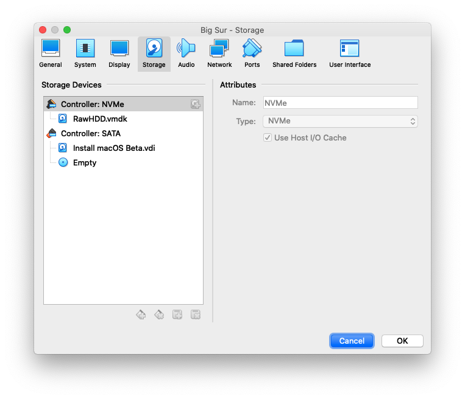

# VirtualBox

## Requisiti

* VirtualBox

## Scaricare il File di installazione

Puoi usare [macrecovery](https://github.com/acidanthera/OpenCorePkg/tree/master/Utilities/macrecovery): ecco la [guida](../installer-guide/winblows-install.md#scaricare-macos)) per ottenere il file .dmg (il file .chunklist non ci servirà).

## Convertire il File di Installazione

Virtualbox non può leggere una immagine disco dmg, perciò dovremo convertirla come `VDI`.

```bash
### Cambia "BaseSystem" se il nome del .dmg differisce
VBoxManage convertdd "BaseSystem.dmg" "BaseSystem.vdi"
```

## Installing macOS in VirtualBox

La guida verrà riaggiunta fra poco, per il momento la teniamo in sospeso!

<!--Next, start VirtualBox as root and create a new macOS virtual machine.

```bash
sudo VirtualBox
```

* Name: Big Sur
* Type: MacOS 64bit

* 2-4 CPU cores
* 4-8 GB RAM
* Create one virtual disk (we will install macOS in)

Attach the disks that you've created in previous steps as shown:



Now, close VirtualBox and add the following properties to the VM to allow it to boot.

```bash
sudo VBoxManage modifyvm "Big Sur" --cpuidset 00000001 000306a9 04100800 7fbae3ff bfebfbff

sudo VBoxManage setextradata "Big Sur" "VBoxInternal/Devices/efi/0/Config/DmiSystemProduct" "iMacPro1,1"

sudo VBoxManage setextradata "Big Sur" "VBoxInternal/Devices/efi/0/Config/DmiSystemVersion" "1.0"

sudo VBoxManage setextradata "Big Sur" "VBoxInternal/Devices/efi/0/Config/DmiBoardProduct" "Mac-7BA5B2D9E42DDD94"

sudo VBoxManage setextradata "Big Sur" "VBoxInternal/Devices/smc/0/Config/DeviceKey" "ourhardworkbythesewordsguardedpleasedontsteal(c)AppleComputerInc"

sudo VBoxManage setextradata "Big Sur" "VBoxInternal/Devices/smc/0/Config/GetKeyFromRealSMC" 1
```

Start VirtualBox as root, and start the VM. The installer should begin to boot. Complete the installation as you would on any other device.

```bash
sudo VirtualBox
```
-->