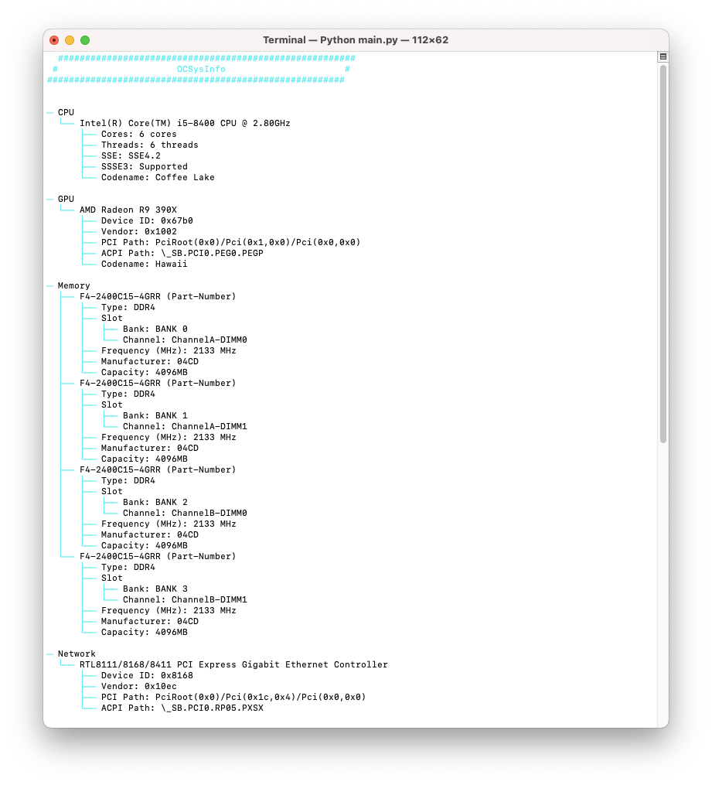
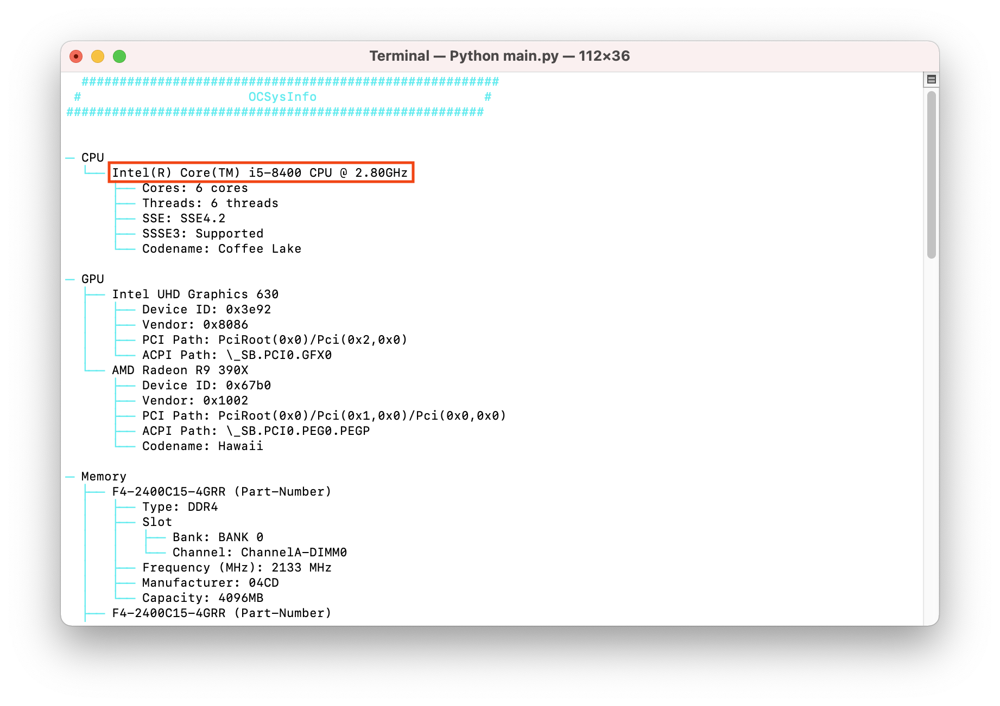
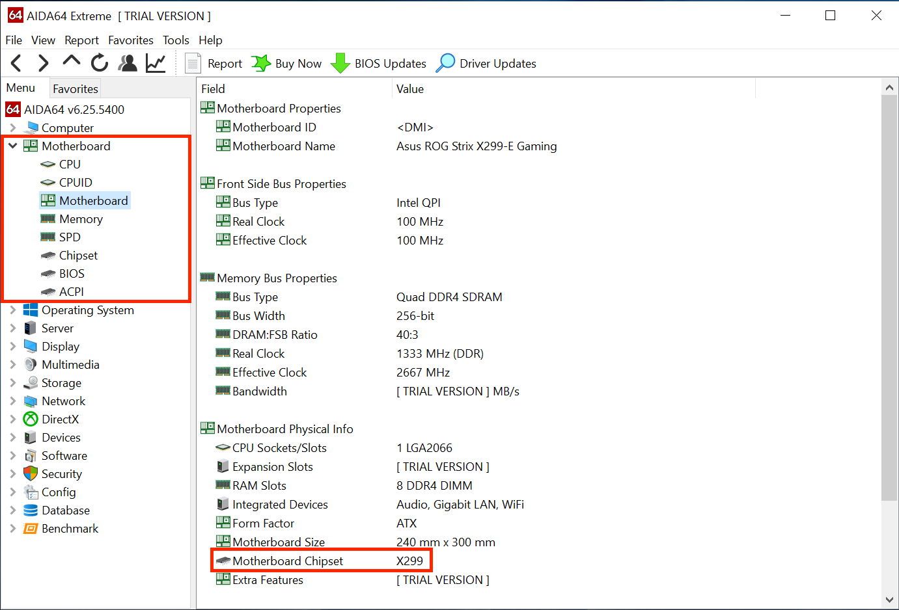
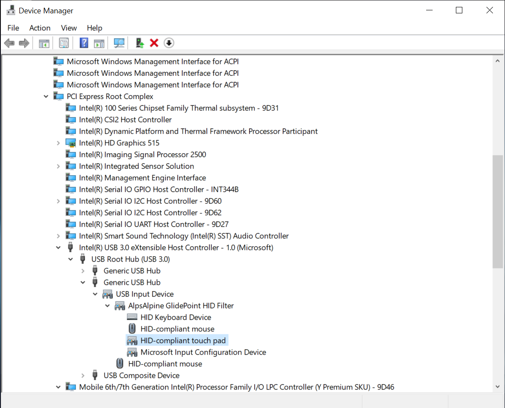
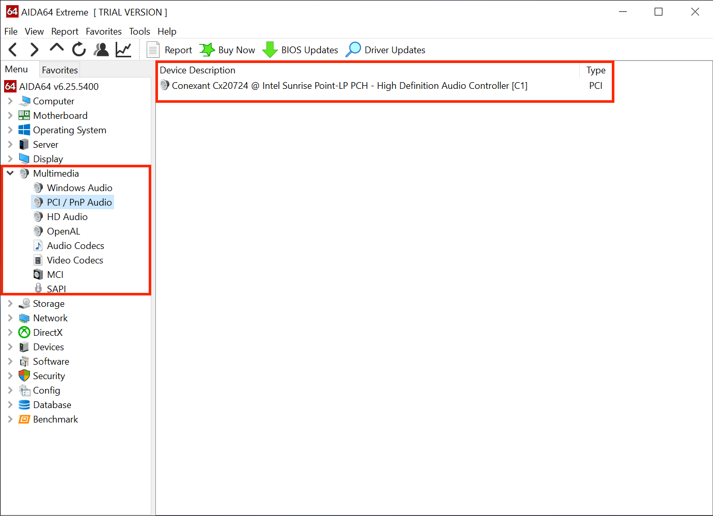

# Trovare il tuo Hardware

Questa sezione è una mini-guida che spiega come trovare il tuo hardware corrente; questo è rilevante per laptop e preassemblati, poiché l'hardware è un po' più difficile da comprendere. Se conosci il tuo hardware, puoi proseguire direttamente a [Creare l'Installer](/installer-guide/).

| **Sistema Operativo** | Windows | Windows (AIDA64) | Linux | OCSysInfo (Windows, macOS, Linux ) |
|-----------------------|---------|--------|-------|------|
| **Programmi richiesti** | Gestione Dispositivi integrato di Windows | [AIDA64](https://www.aida64.com/downloads), per avere un'interfaccia più semplice | Strumenti integrati in una distro Linux (`cat` `pciutils` `dmidecode`) | [OCSysInfo](https://github.com/KernelWanderers/OCSysInfo/releases), strumento CLI di facile utilizzo |

::: tip Nota
A causa degli OEM che mostrano nomi vaghi, l'informazione più dettagliata che puoi ottenere da Gestione Dispositivi è tramite il PCI ID (es. `PCI\VEN_14E4&DEV_43A0`, ossia un vendor ID uguale a `14E4` e un device ID uguale a `43A0`). Questo ti obbliga a cercare su Google l'ID per capire quale ti serve, tuttavia AIDA64 può presentarti il nome correttamente, facilitando la procedura all'utente finale.
:::

::: details Finding Hardware using OCSysInfo

Dopo aver scaricato e aperto l'applicazione, dovrebbe apparire la seguente schermata:


Da qui, premi `d` e `INVIO`/`RETURN`/`ENTER`, e dovresti trovare questa schermata di resoconto:


:::

## CPU

| AIDA64 | Gestione Dispositivi| OCSysInfo |
| :--- | :--- | :--- |
|  |  |  |

```sh
cat /proc/cpuinfo | grep -i "model name"
```

## GPU

| AIDA64 | Gestione Dispositivi| OCSysInfo |
:--- | :--- | :--- |
|  |  |  |

```sh
lspci | grep -i --color "vga\|3d\|2d"
```

## Chipset

| AIDA64 | Gestione Dispositivi|
:--- | :--- |
|  |  |

::: tip Nota
CPU basate su Intel SOC avranno il loro chipset e altre funzionalità sullo stesso chip invece di avere chip dedicati. Questo rende più difficile trovare il tipo esatto di chipset.
:::

```sh
dmidecode -t baseboard
```

## Tastiera, Trackpad e Touchscreen

| Gestione Dispositivi | OCSysInfo |
| :--- | :--- |
|  |  Credit for providing image: [Mahas](https://github.com/Mahas1) |

AIDA64 sfortunatamente non fornisce informazioni utili riguardanti questi dispositivi, perciò vi raccomandiamo di usare OCSysInfo o Gestione Dispositivi.

::: details Gestione dispositivi
Puoi trovare i dispositivi in queste sezioni:

* `Human Interface Devices (HID)`
* `Tastiere`
* `Mouse e altri dispositivi di puntatamento`

Per vedere il tipo esatto di connettore, seleziona il tuo mouse e dopo `Visualizza -> Dispositivi per connettore`. Questo chiarirà se è un dispositivo PS2, I2C, SMBus, USB, etc

In dipendenza dal dispositivo, potresti trovare molti nomi e connettori. Distingui i seguenti casi:
  
* SMBus

Questi si mostreranno come dispositivo PCI come

* `Synaptics SMBus Driver`
* `ELAN SMBus Driver`

Dispositivi Synaptics si mostreranno sia in PS2 come `Synaptics PS2 device`/`Synaptics Pointing Device` e in PCI come `Synaptics SMBus Driver`


Come vedi, abbiamo ottenuto due dispositivi Synaptics nell'immagine a sinistra, tuttavia se guardiamo meglio vediamo che il dispositivo più alto è il PS2, mentre quello più basso è il SMBus. Mentre puoi usare il trackpad nell'altro modo, SMBus generalmente provvede maggiore supporto nei gesti e più precisione.

* USB
| Dispositivi per tipo | Dispositivi per connettore |
:--- | :--- | :--- |
|  |  |

Questo si mostrerà come `PS2 Compliant Trackpad`, e sotto USB quando ci spostiamo in `Dispositivi per connettore`

* I2C


Questi saranno quasi sempre mostrati come dispositivi Microsoft HID, anche se possono apparire anche come altri trackpad. Saranno sempre sotto I2C.
:::

```sh
dmesg | grep -i input
```
  
## Codec Audio

| AIDA64 | Gestione Dispositivi| OCSysInfo |
:--- | :--- | :--- |
|  |  |  |

```sh
aplay -l
```

## Controller di Rete

| AIDA64 | Gestione Dispositivi| OCSysInfo |
:--- | :--- | :--- |
|  |  |  |

Informazioni di base:

```sh
lspci | grep -i network
```

Informazioni dettagliate:

```sh
lshw -class network
```

## Disco

| AIDA64 | Gestione Dispositivi| OCSysInfo |
:--- | :--- | :--- |
|  |  |  |

```sh
lshw -class disk -class storage
```
