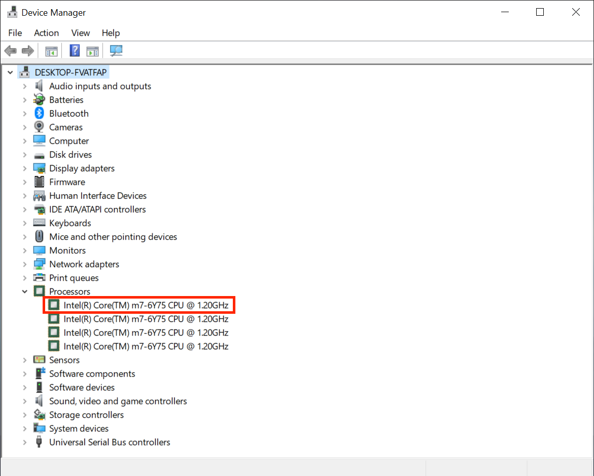
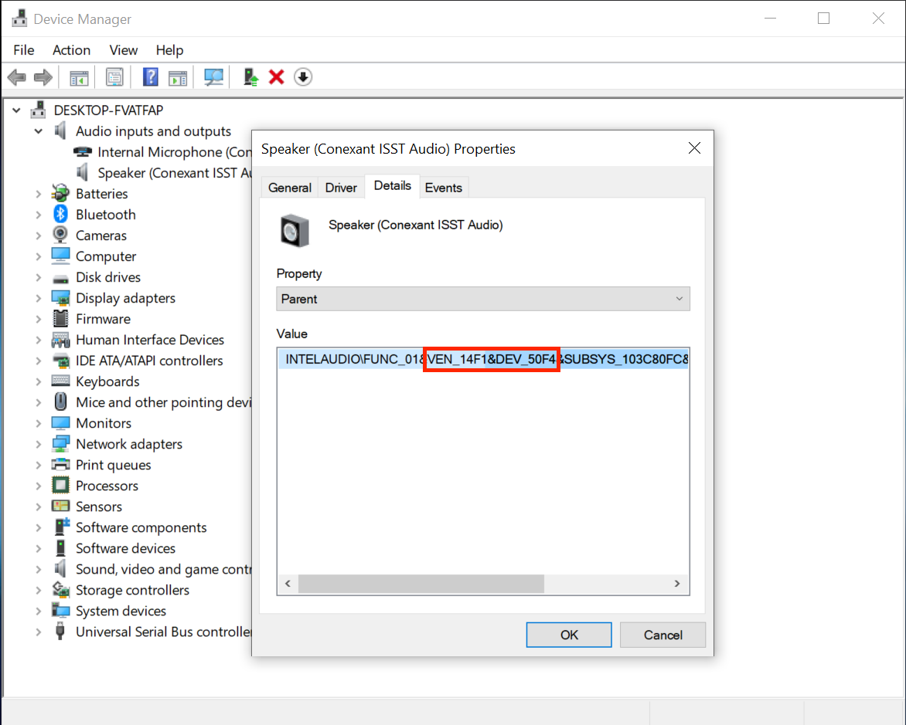

# Trovare il tuo Hardware

Questa sezione è una mini-guida che spiega come trovare il tuo hardware corrente; questo è rilevante per laptop e utenti prebuilt dato che l'hardware è un po' più difficile da comprendere. Puoi saltare questa sezione e andare a [Creare la USB](/installer-guide/) se conosci già l'hardware che possiedi.

Perciò, assumeremo che hai Windows o Linux installato:

[[toc]]

## Trovare hardware usando Windows

Per questo avremmo due opzioni:

* Il Gestione Dispositivi integrato di Windows
* [AIDA64](https://www.aida64.com/downloads)

A causa di un'interfaccia più semplice, raccomandiamo di scaricare AIDA64 e avviarlo per ottenere molto più facilmente le specifiche. Tuttavia mostreremo entrambi i metodi per ottenere le specifiche hardware.

### Modello CPU

| AIDA64 | Gestione Dispositivi|
| :--- | :--- |
|  |  |

### Modello GPU

| AIDA64 | Gestione Dispositivi|
| :--- | :--- |
|  |  |

### Modello Chipset

| AIDA64 | Gestione Dispositivi|
| :--- | :--- |
|  |  |

* Nota: CPU basate su Intel SOC avranno il loro chipset e altre funzionalità sullo stesso chip invece di avere chip dedicati. Questo rende più difficile trovare il tipo esatto di chipset.

### Tastiera, Trackpad e Touchscreen per tipo di connettore

| Gestione Dispositivi |
| :--- |
|  |

AIDA64 sfortunatamente non fornisce informazioni utili riguardanti questi dispositivi, perciò vi raccomandiamo di usare Gestione Dispositivi per questo.

* Puoi trovare i dispositivi in queste sezioni:
  * `Human Interface Devices (HID)`
  * `Tastiere`
  * `Mouse e altri dispositivi di puntatamento`

* Per vedere il tipo esatto di connettore, seleziona il tuo mouse e dopo `Visualizza -> Dispositivi per connettore`. Questo chiarirà se è un dispositivo PS2, I2C, SMBus, USB, etc

In dipendenza dal dispositivo, potresti trovare molti nomi e connettori. Distingui i seguenti casi:
  
::: details SMBus
  
Questi si mostreranno come dispositivo PCI come `Synaptics SMBus Driver` o `ELAN SMBus Driver`

* Dispositivi Synaptics si mostreranno sia in PS2 come `Synaptics PS2 device`/`Synaptics Pointing Device` e in PCI come `Synaptics SMBus Driver`


Come vedi, abbiamo ottenuto due dispositivi Synaptics nell'immagine a sinistra, tuttavia se guardiamo meglio vediamo che il dispositivo più alto è il PS2, mentre quello più basso è il SMBus. Mentre puoi usare il trackpad nell'altro modo, SMBus generalmente provvede maggiore supporto nei gesti e più precisione.

:::

::: details USB

| Dispositivi per tipo | Dispositivi per connettore |
| :--- | :--- |
|  | 

Questo si mostrerà come `PS2 Compliant Trackpad`, e sotto USB quando ci spostiamo in `Dispositivi per connettore`

:::

::: details I2C


Questi saranno quasi sempre mostrati come dispositivi Microsoft HID, anche se possono apparire anche come altri trackpad. Saranno sempre sotto I2C.

:::
  
### Codec Audio

| AIDA64 | Gestione Dispositivi|
| :--- | :--- |
|  |  |

A causa degli OEM che mostrano nomi vaghi, l'informazione più dettagliata che puoi ottenere da Gestione Dispositivi è tramite il PCI ID (es. pci 14F1,50F4). Questo ti obbliga a cercare su Google l'ID per capire quale ti serve, tuttavia AIDA64 può presentarti il nome correttamente, facilitando la procedura all'utente finale.

### Modello del Controller di Rete

| AIDA64 | Gestione Dispositivi|
| :--- | :--- |
|  |  |

A causa degli OEM che mostrano nomi vaghi, l'informazione più dettagliata che puoi ottenere da Gestione Dispositivi è tramite il PCI ID (es. `PCI\VEN_14E4&DEV_43A0`, ossia un vendor ID uguale a `14E4` e un device ID uguale a `43A0`). Questo ti obbliga a cercare su Google l'ID per capire quale ti serve, tuttavia AIDA64 può presentarti il nome correttamente, facilitando la procedura all'utente finale.

### Modello del disco

| AIDA64 | Gestione Dispositivi|
| :--- | :--- |
|  |  |

A causa degli OEM che presentano nomi vaghi, sarai costretto a cercare su Google il tuo modello.

## Trovare hardware usando Linux

Per trovare gli hardware usando linux, useremo i seguenti strumenti:

* `cat`
* `pciutils`
* `dmidecode`

Sotto troverai una lista di comandi da usare nel terminale (bisogna ringraziare il fatto che le distro Linux arrivano già pronte con i tool installati). Se no, dovrai cercarli nel gestore pacchetti della tua distro.

### Modello CPU

```sh
cat /proc/cpuinfo | grep -i "model name"
```

### Modello GPU

```sh
lspci | grep -i --color "vga\|3d\|2d"
```

### Modello Chipset

```sh
dmidecode -t baseboard
```

### Tastiera, Trackpad e Touchscreen per tipo di connettore

```sh
dmesg | grep -i input
```

### Codec Audio

```sh
aplay -l
```

### Modello del Controller di Rete

Informazioni di base:

```sh
lspci | grep -i network
```

Informazioni dettagliate:

```sh
lshw -class network
```

### Modello del disco

```sh
lshw -class disk -class storage
```
