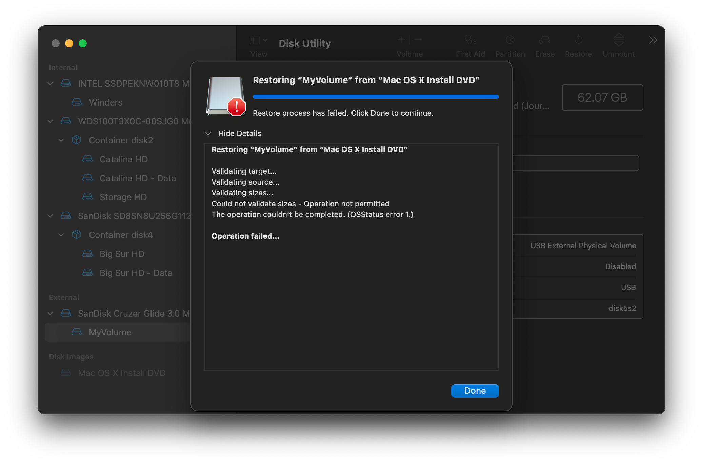

# Legacy macOS: Immagine Disco

Questo metodo usa immagini tenute da Apple o da Acidanthera, e che vengono ripristinate sul tuo disco.

## Immagini Acidanthera

Gli installer qua sotto sono stati caricati da recovery con Mac genuini e senza SMBIOS, i contenuti di OS X non sono stati modificati in nessuna maniera.

* [OS X 10.4.10(8R4088)](https://archive.org/details/10.4.10-8-r-4088-acdt)[MEGA Mirror](https://mega.nz/folder/D3ASzLzA#7sjYXE2X09f6aGjol_C7dg)

* [OS X 10.5.7(9J3050)](https://archive.org/details/10.5.7-9-j-3050)[MEGA Mirror](https://mega.nz/folder/inRBTarD#zanf7fUbviwz3WHBU5xpCg)

* [OS X 10.6.7(10J4139)](https://archive.org/details/10.6.7-10j3250-disk-images)[MEGA Mirror](https://mega.nz/folder/z5YUhYTb#gA_IRY5KMuYpnNCg7kR3ug/file/ioQkTagI)

## Immagini Apple

Nota che queste immagini richiedono che tu abbia accesso ad un account Apple Developer.

* [OS X 10.5.0 Golden Master(9a581)](https://download.developer.apple.com/Mac_OS_X/mac_os_x_v10.5_leopard_9a581/leopard_9a581_userdvd.dmg)

* [OS X 10.6.0 Golden Master(10a432)](https://download.developer.apple.com/Mac_OS_X/mac_os_x_version_10.6_snow_leopard_build_10a432/mac_os_x_v10.6_build_10a432_user_dvd.dmg)

## Applicarle su un disco

Ora arriva la parte divertente, per prima cosa dovrai aprire il dmg scaricato e averlo montato. Ora apri Utility Disco e formatta il disco come macOS Esteso (HFS+) con una mappa partizioni GUID:


Ora hai due opzioni per procedere:

* [ASR Restore](#asr)(Apple Software Restore)
  * Basato su terminale, funziona col SIP abilitato
* [Ripristino Disk Utility](#disk-utility)
  * Potrebbe richiedere di disabilitare il SIP in sistemi recenti
  
## ASR

Qui semplicemente copia e incolla il comando in una finestra di terminale:

```sh
sudo asr restore -source /Volumes/Mac\ OS\ X\ Install\ DVD  -target /Volumes/MyVolume -erase -noverify
```

* **Note**: Questo non è il tuo setup, per favore cambia le impostazioni in maniera simile:
  * Cambia `/Volumes/Mac\ OS\ X\ Install\ DVD` a come il dmg montato si chiamerà
  * Cambia `/Volumes/MyVolume` a come la USB si chiamerà

### Quando hai finito, puoi passare a [Impostare l'ambiente EFI di OpenCore](#impostare-l'ambiente-efi-di-opencore)
  
## Disk Utility

A causa di alcuni problemi stranissimi con Utility Disco, alcuni ripristini possono fallire se il SIP è abilitato. Se hai problemi ti consigliamo di usare il [Metodo ASR](#asr) oppure disabilitare il SIP.

Per iniziare, apri Utility Disco e dovresti vedere sia la tua USB e l'Immagine Disco sulla barra laterale. Da qui, seleziona Ripristina


::: details Risoluzione dei problemi

Se ottieni questo tipo di errore durante il ripristino:



Questo significa che il SIP deve essere disabilitato, invece raccomandiamo l'uso del [Metodo ASR](#asr).

:::

### Quando hai finito, puoi passare a [Impostare l'ambiente EFI di OpenCore](#impostare-l'ambiente-efi-di-opencore)
