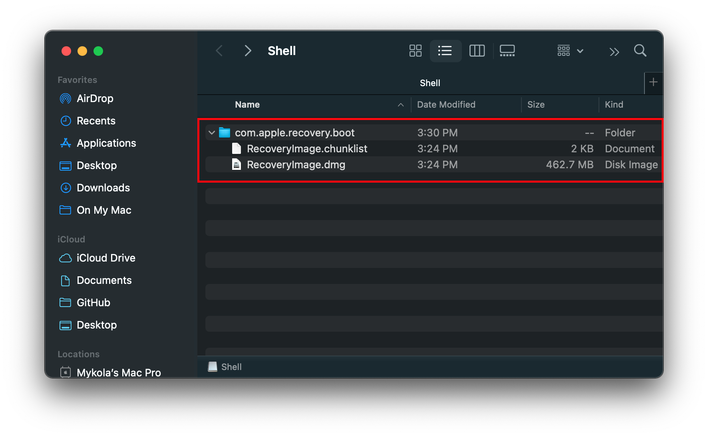

# Legacy macOS: metodo Online

Questo metodo ci permette di scaricare vecchie versioni di macOS da 10.7 a quella attuale, tuttavia sono solo recovery installer che richiedono una connessione internet nell'installer stesso

Per iniziare, dovrai usare macrecovery.py. Questo tool è incluso con OpenCorePkg:


Le istruzioni per avviarlo sono abbastanza semplici, scegli quella corretta per il tuo sistema operativo da sotto:

```sh
# Lion(10.7):
python ./macrecovery.py -b Mac-2E6FAB96566FE58C -m 00000000000F25Y00 download
python ./macrecovery.py -b Mac-C3EC7CD22292981F -m 00000000000F0HM00 download

# Mountain Lion(10.8):
python ./macrecovery.py -b Mac-7DF2A3B5E5D671ED -m 00000000000F65100 download

# Mavericks(10.9):
python ./macrecovery.py -b Mac-F60DEB81FF30ACF6 -m 00000000000FNN100 download

# Yosemite(10.10):
python ./macrecovery.py -b Mac-E43C1C25D4880AD6 -m 00000000000GDVW00 download

# El Capitan(10.11):
python ./macrecovery.py -b Mac-FFE5EF870D7BA81A -m 00000000000GQRX00 download

# Sierra(10.12):
python ./macrecovery.py -b Mac-77F17D7DA9285301 -m 00000000000J0DX00 download

# High Sierra(10.13)
python ./macrecovery.py -b Mac-7BA5B2D9E42DDD94 -m 00000000000J80300 download
python ./macrecovery.py -b Mac-BE088AF8C5EB4FA2 -m 00000000000J80300 download

# Mojave(10.14)
python ./macrecovery.py -b Mac-7BA5B2DFE22DDD8C -m 00000000000KXPG00 download

# Catalina(10.15)
python ./macrecovery.py -b Mac-00BE6ED71E35EB86 -m 00000000000000000 download

# Latest version
# ie. Big Sur(11)
python ./macrecovery.py -b Mac-E43C1C25D4880AD6 -m 00000000000000000 download
```

Da qui, avvia uno di questi comandi nel terminale e una volta finito otterrai un output simile a questo:


Quando hai fatto, inizializza la tua USB con FAT32 e Mappa Partizioni GUID:


Infine, crea una cartella nella root della tua chiavetta e chiamala `com.apple.recovery.boot`; mettici dentro i file scaricati BaseSystem/RecoveryImage:



## Quando hai finito, puoi passare a [Impostare l'ambiente EFI di OpenCore](#impostare-l'ambiente-efi-di-opencore)
