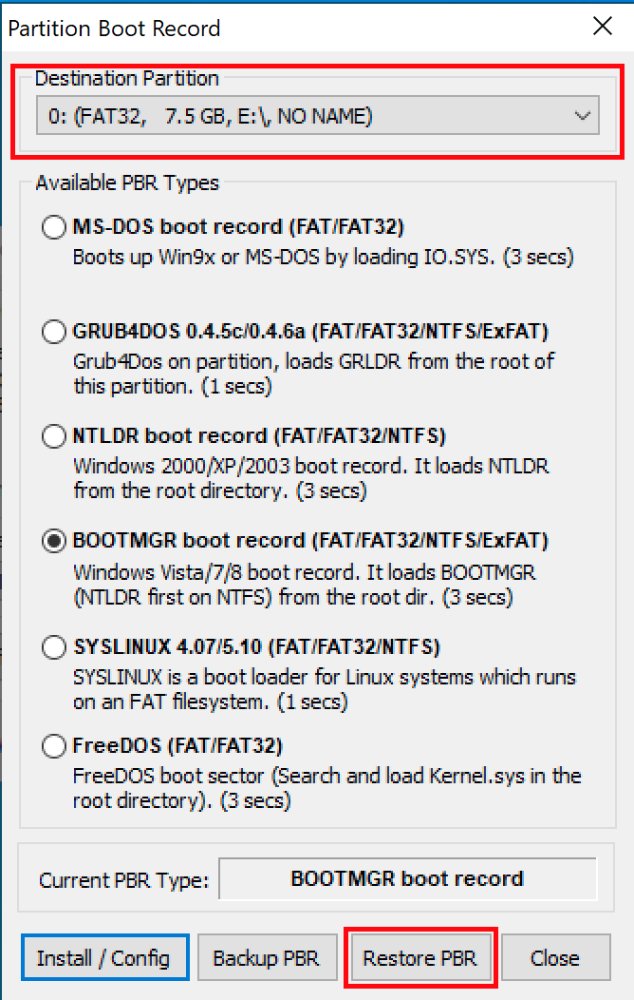
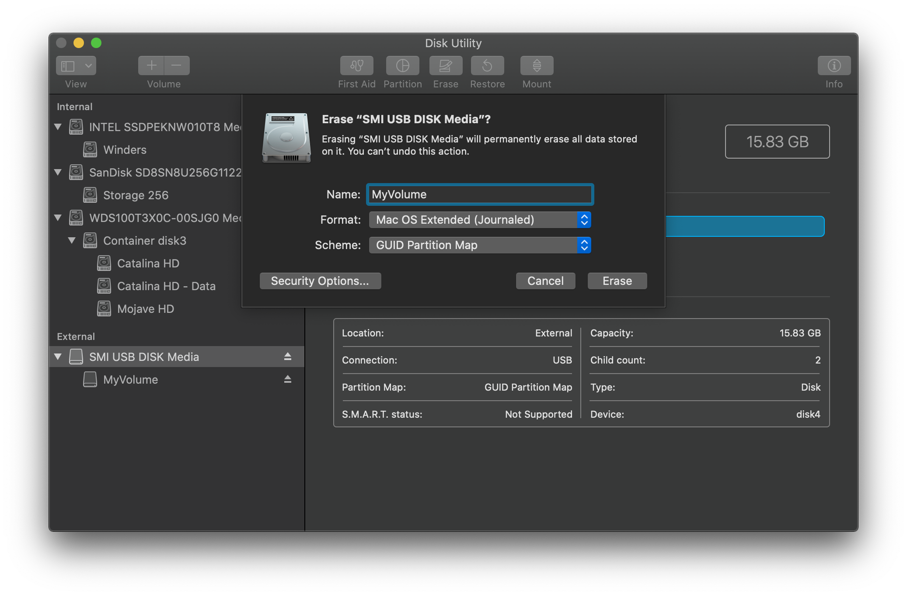
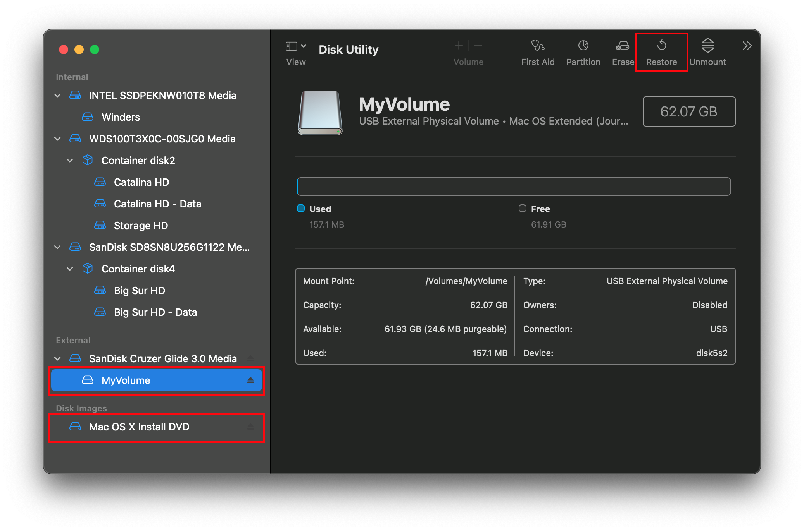
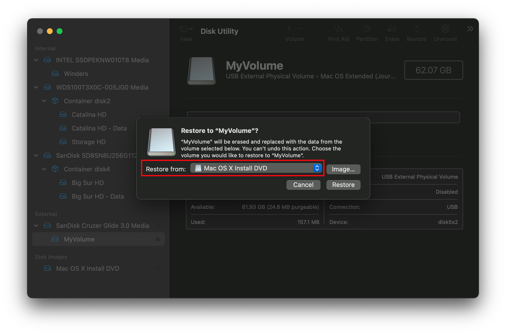

# Scaricare macOS: Metodo Recovery

> Versioni supportate: macOS 10.7 e sucessivi
>
> > [Per il supporto 10.4-10.6](./mac-install-dmg.md)
>
> Sistemi supportati: Qualsiasi sistema supporti Python

## Iniziamo

Per iniziare avrai bisogno di:

* USB da 4GB **VUOTA!**
* [Python](https://www.python.org/downloads/)
  * Su Windows devi ricordarti di aggiungerlo alla path. Se non sai come farlo, ti consiglio di scaricarlo dal Microsoft Store.
* macrecovery, incluso con [OpenCorePkg](https://github.com/acidanthera/OpenCorePkg/releases/latest) nella cartella Utilities/macrecovery/macrecovery.py:


* Ricordarsi di essere nella stessa cartella (directory) di `macrecovery.py` prima di eseguire un comando elencato al punto successivo.

## Scaricare macOS

Le istruzioni per avviarlo sono abbastanza semplici, entra in una qualsiasi shell e scegli il comando a seconda del sistema operativo:

```sh
# Lion (10.7):
python3 ./macrecovery.py -b Mac-2E6FAB96566FE58C -m 00000000000F25Y00 download
python3 ./macrecovery.py -b Mac-C3EC7CD22292981F -m 00000000000F0HM00 download

# Mountain Lion (10.8):
python3 ./macrecovery.py -b Mac-7DF2A3B5E5D671ED -m 00000000000F65100 download

# Mavericks (10.9):
python3 ./macrecovery.py -b Mac-F60DEB81FF30ACF6 -m 00000000000FNN100 download

# Yosemite (10.10):
python3 ./macrecovery.py -b Mac-E43C1C25D4880AD6 -m 00000000000GDVW00 download

# El Capitan (10.11):
python3 ./macrecovery.py -b Mac-FFE5EF870D7BA81A -m 00000000000GQRX00 download

# Sierra (10.12):
python3 ./macrecovery.py -b Mac-77F17D7DA9285301 -m 00000000000J0DX00 download

# High Sierra (10.13)
python3 ./macrecovery.py -b Mac-7BA5B2D9E42DDD94 -m 00000000000J80300 download
python3 ./macrecovery.py -b Mac-BE088AF8C5EB4FA2 -m 00000000000J80300 download

# Mojave (10.14)
python3 ./macrecovery.py -b Mac-7BA5B2DFE22DDD8C -m 00000000000KXPG00 download

# Catalina (10.15)
python3 ./macrecovery.py -b Mac-00BE6ED71E35EB86 -m 00000000000000000 download

# Big Sur (11)
python3 ./macrecovery.py -b Mac-42FD25EABCABB274 -m 00000000000000000 download

# Ultima versione version
# cioè Monterey (12)
python3 ./macrecovery.py -b Mac-E43C1C25D4880AD6 -m 00000000000000000 download
```

Da qui, avvia uno di questi comandi nel terminale e una volta finito otterrai un output simile a questo:


## Formattare la chiavetta USB

Quando hai fatto, formatta (inizializza) la tua USB con FAT32 e Mappa Partizioni GPT, se non sai come fare alleghiamo le seguenti guide specifiche per ogni sistema:

* [Windows](#windows)
* [macOS](#macos)
* [Linux](#linux)

### macOS


### Windows

* [Metodo Gestione Disco](#metodo-gestione-disco)
  * Basato su interfaccia grafica, metodo più semplice
  * Solo sistemi UEFI supportati (2012+)
* [Metodo diskpart](#metodo-diskpart)
  * Basato su linea di comando, più lavoro da fare
  * Richiesto per sistemi legacy (non-UEFI, prima del 2012)

#### Metodo Gestione Disco

Semplicemente apri Gestione Disco e formatta la USB come FAT32:

1. Click destro sul pulsante Start sulla barra delle applicazioni e seleziona Gestione Disco.
2. Dovresti vedere tutte le tue partizioni e i dischi. Sulla metà bassa, ci sono i tuoi dispositivi. Trova la tua USB.
3. Formattala in modo da avere una partizione in FAT32.

* Se hai più partizioni nella USB, fai un click destro su ogni partizione e seleziona Cancella Volume (Questo rimuoverà tutti i dati, assicurati di aver fatto un backup e di rimuovere solo le partizioni della tua USB)
  * Fai un click destro sullo spazio non allocato e crea un volume semplice. Assicurati che sia formattata in FAT32 e falla grande almeno un gigabyte or due. Chiamala "EFI".
* Se non è il caso, fai un click destro sulla partizione della USB e clicca su Formatta e impostala in FAT32.


#### Metodo diskpart

Premi Windows + R e digita `diskpart`.

Ora usa i seguenti comandi:

```sh
# List available disks
list disk
# Select your disk(ie. disk 1)
sel disk 1
# Format the drive
clean
# Convert to GPT
# Due to an odd bug with BOOTICE and DuetPkg, MBR disks will fail to boot
convert gpt
# Create a new partition
create part primary
# Select your partition
# Running clean ensures we only have 1 partition so it will be "partition 1"
sel part 1
# Format the drive as FAT32
format fs fat32 quick
# Assign a drive letter(ie. Drive E, ensure it's not currently in use)
assign letter e
```

::: details Setup Installer Legacy

Se il tuo firmware non supporta UEFI, vedi la sezione qua sotto:

Per iniziare, abbiamo bisogno di:

* [7-Zip](https://www.7-zip.org/)
* [BOOTICE](https://www.majorgeeks.com/files/details/bootice_64_bit.html)
* [OpenCorePkg](https://github.com/acidanthera/OpenCorePkg/releases)

Dopo, apri BOOTICE e assicurati che sia selezionato il disco corretto.


Dopo, seleziona "Process MBR" e dopo "Restore MBR" e seleziona il file **boot0** da `Utilities/LegacyBoot/` nel OpenCorePkg:

| Ripristino MBR | Ripristino file boot0 |
| :--- | :--- |
|  |  |

Dopo torna alla schermata principale e seleziona "Process PBR", dopo "Restore PBR". Da qui, scegli il file **boot1f32** da `Utilities/LegacyBoot/` sempre nel OpenCorePkg:

| Ripristino PBR | Ripristino file boot1f32 |
| :--- | :--- |
|  |  |

Una volta finito, torna alla tua USB e fai un'ultima cosa. Trascina il file **bootx64** (CPU a 64 Bit) o **bootia32** (CPU a 32 Bit) da `Utilities/LegacyBoot/` e piazzalo nella radice della USB. **Rinominalo come boot** per assicurarti che DuetPkg funzioni correttamente:


:::

## Copiare i file scaricati

Crea una cartella nella root della tua chiavetta e chiamala `com.apple.recovery.boot`, mettici dentro i file scaricati BaseSystem/RecoveryImage:


In alternativa, potresti voler ripristinare l'immagine disco, anche se non è consigliato nè attendibile. Allego la guida per macOS.

> Seguire poi la guida per l'installer Offline per quanto riguarda la configurazione dell'EFI

::: details macOS
Ora arriva la parte divertente, per prima cosa dovrai aprire il dmg scaricato e averlo montato. Ora apri Utility Disco e formatta il disco come macOS Esteso (HFS+) con una mappa partizioni GUID:


<!--
Ora hai due opzioni per procedere:

* [ASR Restore](#asr) (Apple Software Restore)
  * Basato su terminale, funziona col SIP abilitato
* [Ripristino dall'Utility Disco](#utility-disco)
  * Potrebbe richiedere di disabilitare il SIP in sistemi recenti

### Utility Disco

A causa di alcuni problemi stranissimi con Utility Disco, alcuni ripristini possono fallire se il SIP è abilitato. Se hai problemi ti consigliamo di usare il [Metodo ASR](#asr) oppure disabilitare il SIP.-->

Per iniziare, apri Utility Disco e dovresti vedere sia la tua USB e l'Immagine Disco sulla barra laterale. Da qui, seleziona Ripristina



:::
<!--
### ASR

Qui semplicemente copia e incolla il comando in una finestra di terminale:

```sh
sudo asr restore -source /Volumes/Mac\ OS\ X\ Install\ DVD  -target /Volumes/MyVolume -erase -noverify
```

* **Note**: Questo non è il tuo setup, per favore cambia le impostazioni in maniera simile:
  * Cambia `/Volumes/Mac\ OS\ X\ Install\ DVD` a come il dmg montato si chiamerà
  * Cambia `/Volumes/MyVolume` a come la USB si chiamerà

> Quando hai finito, puoi passare a [Impostare l'ambiente EFI di OpenCore](#impostare-l'ambiente-efi-di-opencore)

::: details Linux

```sh
# Ringraziamo midi1996 (https://github.com/midi1996) per il suo lavoro riguardo alla Internet Install Guide (https://midi1996.github.io/hackintosh-internet-install-gitbook/) sulla quale è basata questa.

lsblk
# Determina l'identificatore della USB (nell'esempio /dev/sdd)

sudo gdisk /dev/sdd
# Se ti viene chiesto quale tabella delle partizioni usare, seleziona GPT

o
# Pulisci la tabella delle partizioni e crei un nuovo GPT

n
# partition number: tieni vuoto (sceglie automagicamente)
# first sector: tieni vuoto (sceglie automagicamente)
# last sector: `+200M` per creare una partizione da 200MB (partizione EFI)
# Hex code or GUID: `0700` per la partizione di tipo Microsoft Basic Data (oppure anche ef00 per riconoscerla come EFI, però alcuni file manager potrebbero rifiutarsi di aprirla per questioni di sicurezza)

n
# partition number: tieni vuoto (sceglie automagicamente)
# first sector: tieni vuoto (sceglie automagicamente)
# last sector: tieni vuoto (sceglie automagicamente)
# Hex code or GUID: `af00` per la partizione di tipo Apple HFS/HFS+

w
# Scrive tutto sul disco: conferma con y

q
# chiude gdisk

lsblk
# Determina i nuovi identificatori delle partizioni EFI e HFS+ (Nell'esempio sarebbero /dev/sdd1 e /dev/sdd2)

sudo mkfs.vfat -F 32 /dev/sdd1
# Formattare la partizione /dev/sdd1 come FAT32

sudo dd if=/home/tu/Documenti/Utilities/macrecovery/basesystem.dmg of=/dev/sdd2
# Flash con dd della partizione la partizione /dev/sdd2, con file system HFS+

```-->

:::

## Impostare ambiente efi di OpenCore

Impostare l'ambiente EFI di OpenCore è molto semplice in questo caso: EFI sfrutta le partizioni FAT32 per funzionare e noi abbiamo creato una partizione di quel tipo non per caso: infatti sfrutteremo l'intera chiavetta come partizione FAT32.

> Ora che tutto questo è fatto, vai a [Configurare la EFI](/opencore-efi.md) per finire il tuo lavoro
