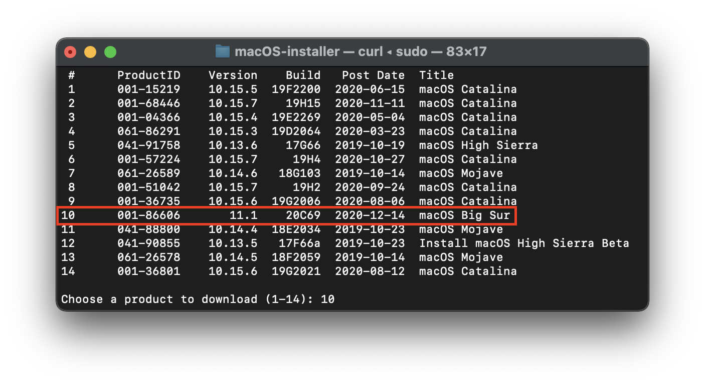
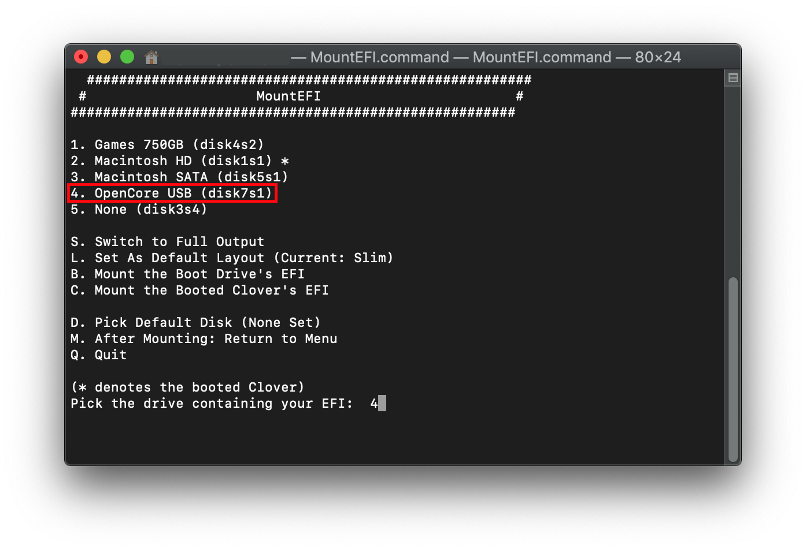

# Creazione dell'installer in macOS

Siccome spesso hai bisogno di un'installazione pulita, anche senza OpenCore, alcuni utenti preferirebbero un'aggiornamento su come scaricare gli aggiornamenti di macOS.

## Scaricare macOS: Sistemi Moderni

* Questo metodo ti permette di scaricare macOS 10.13 e più recenti, per 10.12 o meno recenti vedi [Scaricare macOS: Sistemi più vecchi](#scaricare-macos-sistemi-piu-vecchi)

Da una macchina macOS che supera i requisiti del sistema operativo che vuoi installare, vai direttamente nell'App Store e scarica il sistema operativo desiderato e continua alla sezione [**Configurare l'installer**](#configurare-l'installer).

Per macchine che richiedono una versione specifica o che non possono scaricare dall'App Store, puoi usare l'utility InstallInstallMacOS by Munki.

Per avviarlo, semplicemente copia e incolla il comando qua sotto in una finestra terminale:

```sh
mkdir -p ~/macOS-installer && cd ~/macOS-installer && curl https://raw.githubusercontent.com/munki/macadmin-scripts/main/installinstallmacos.py > installinstallmacos.py && sudo python installinstallmacos.py
```



Come vedi, otterrai una lista di 10 installer di macOS. Se hai bisogno di una particolare versione di macOS, selezionala digitando il numero accanto ad essa. Nell'esempio sceglieremo il 10:


* **Nota su macOS 11, Big Sur**: Dato che questo sistema è parecchio nuovo, ci sono ancora dei problemi in certi sistemi che non si possono risolvere. Per maggiori informazioni, guarda qui: [OpenCore e macOS 11: Big Sur](/extras/big-sur.md)
  * Per gli utenti le prime volte raccomandiamo macOS 10.15, Catalina
* **Nota sulle GPU Nvidia**: Ricordati di verificare se il tuo hardware supporta sistemi nuovi, vedi [Limitazioni Hardware](/macos-limits.md)
* <span style="color:red">ATTENZIONE:</span> Da macOS 11.3, [XhciPortLimit non funziona e causa dei bootloop](https://github.com/dortania/bugtracker/issues/162). Suggeriamo di usare sistemi meno recenti (come 10.15) o un installer di Big Sur 11.2.3 o meno recenti
  * Per scopi educativi, provvediamo una copia qui: [macOS 11.2.1 20D75 Recovery Image](https://archive.org/details/base-system_202102)
  * Se hai già [mappato le tue porte USB](/OpenCore-Post-Install/usb/) e disabilitato `XhciPortLimit`, puoi avviare 11.3+ senza altri problemi

Questo ci metterà un po', deve scaricare l'installer di 8GB+, perciò è altamente raccomandato leggere il resto della guida intanto che attendi.

Una volta finito, troverai nella cartella `~/macOS-Installer/` un DMG contenente l'installer di macOS, chiamato `Install_macOS_11.1-20C69.dmg`, per esempio. Montalo e troverai l'applicazione installer.

* Nota: Ti raccomandiamo di muovere Install macOS.app nella cartella `/Applications`, dato che lo eseguiremo da là.
* Nota 2: Usando Cmd+Shift+G nel Finder ti permetterà facilmente di andare alla cartella `~/macOS-installer`


Da qui, passa a [Configurare l'installer](#configurare-l'installer) per finire il tuo lavoro.

## Scaricare macOS: Sistemi più vecchi

* Questi metodi ti permetteranno di scaricare versioni meno recenti di macOS, correntemente supportano ogni versione Intel di OS X (da 10.4 ad attuale)

  * [Legacy macOS: metodo Offline](/installer-guide/mac-install-pkg.md)
    * 10.10-10.12 Supportati
  * [Legacy macOS: metodo Online (10.7-10.15 Supportati)](/installer-guide/mac-install-recovery.md)
    * 10.7-11 Supportati
  * [Legacy macOS: Immagine Disco](/installer-guide/mac-install-dmg.md)
    * 10.4-10.6 Supportati

## Configurare l'installer

Ora inizializzeremo la USB per prepararla sia per l'installer di macOS che per OpenCore. Useremo il formato macOS Esteso (HFS+) con una mappa partizioni GUID. Questo creerà due partizioni: quella principale `MioVolume` e una seconda chiamata `EFI` che viene usata come partizione di avvio quando il firmware controlla i file di avvio.

* Nota: Di default, Utility Disco mostra solo le partizioni – premi Cmd/Win+2 per mostrare tutti i dischi (alternativamente puoi usare il pulsante Vista)
* Nota 2: Utenti che seguono il metodo "Legacy macOS: metodo Online" possono saltare la zona [Impostare l'ambiente EFI di OpenCore](#impostare-l'ambiente-efi-di-opencore)


Dopo avvia il comando `createinstallmedia` concesso da [Apple](https://support.apple.com/en-us/HT201372). Nota che il comando è stato fatto per una usb inizializzata col nome `MyVolume`:

```sh
sudo /Applications/Install\ macOS\ Big\ Sur.app/Contents/Resources/createinstallmedia --volume /Volumes/MyVolume
```

Anche questo userà un po' del tuo tempo, quindi potresti farti un caffè o continuare a leggere la guida (per essere corretti non dovresti seguire la guida step per step senza averla letta tutta prima).

Puoi anche rimpiazzare il percorso di `createinstallmedia` con quello del percorso del percorso del tuo installer (stessa idea con il nome del disco).

::: details Vecchi Comandi createinstallmedia

Copiati dal sito della Apple: [Come creare un programma di installazione avviabile per macOS](https://support.apple.com/it-it/HT201372)

```sh
# Big Sur
sudo /Applications/Install\ macOS\ Big\ Sur.app/Contents/Resources/createinstallmedia --volume /Volumes/MyVolume

# Catalina
sudo /Applications/Install\ macOS\ Catalina.app/Contents/Resources/createinstallmedia --volume /Volumes/MyVolume

# Mojave
sudo /Applications/Install\ macOS\ Mojave.app/Contents/Resources/createinstallmedia --volume /Volumes/MyVolume

# High Sierra
sudo /Applications/Install\ macOS\ High\ Sierra.app/Contents/Resources/createinstallmedia --volume /Volumes/MyVolume

# Sierra
sudo /Applications/Install\ macOS\ Sierra.app/Contents/Resources/createinstallmedia --volume /Volumes/MyVolume --applicationpath /Applications/Install\ macOS\ Sierra.app

# El Capitan
sudo /Applications/Install\ OS\ X\ El\ Capitan.app/Contents/Resources/createinstallmedia --volume /Volumes/MyVolume --applicationpath /Applications/Install\ OS\ X\ El\ Capitan.app

# Yosemite
sudo /Applications/Install\ OS\ X\ Yosemite.app/Contents/Resources/createinstallmedia --volume /Volumes/MyVolume --applicationpath /Applications/Install\ OS\ X\ Yosemite.app

# Mavericks
sudo /Applications/Install\ OS\ X\ Mavericks.app/Contents/Resources/createinstallmedia --volume /Volumes/MyVolume --applicationpath /Applications/Install\ OS\ X\ Mavericks.app --nointeraction
```

:::

## Setup Legacy

Per sistemi che non supportano l'avvio UEFI, vedi sotto:

::: details Impostare il boot Legacy

Per iniziare, hai bisogno di questo:

* BootInstall_IA32.tool o BootInstall_X64.tool
  * Si può trovare nell'OpenCorePkg nel percorso `/Utilties/LegacyBoot/`
* Una USB con l'Installer (Creato come sopra)

Con la tua cartella di avvio di OpenCore, vai a `Utilities/LegacyBoot`. Qui troverai un file chiamato `BootInstall_ARCH.tool`. Quello che fa è installare DuetPkg nel disco desiderato.


Ora usa lo strumento nel terminale **usando sudo** (Questo strumento fallirà se non lo metti):

```sh
# Replace X64 with IA32 if you have a 32-Bit CPU
sudo ~/Downloads/OpenCore/Utilities/legacyBoot/BootInstall_X64.tool
```


Questo ci darà la lista dei dischi disponibili, scegli il tuo e verrà scritta una nuova MBR. Conferma con yes `[y]` e finisci la procedura.


Questo ti provvederà una partizione EFI con anche un file **bootia32** o **bootx64**

:::

## Impostare l'ambiente EFI di OpenCore

Impostare l'ambiente EFI di OpenCore è semplice – quello di cui hai bisogno è di montare la partizione EFI di sistema. Essa viene fatta automaticamente quando inizializziamo la chiavetta in GUID, ma di default non viene montata, e quindi ora è il momento in cui il nostro amico [MountEFI](https://github.com/corpnewt/MountEFI) entra nella scena:



Noterai che quando apriamo la partizione EFI, essa è vuota. Qua inizia il divertimento.


## Ora che tutto questo è fatto, vai a [Configurare la EFI](./opencore-efi.md) per finire il tuo lavoro
