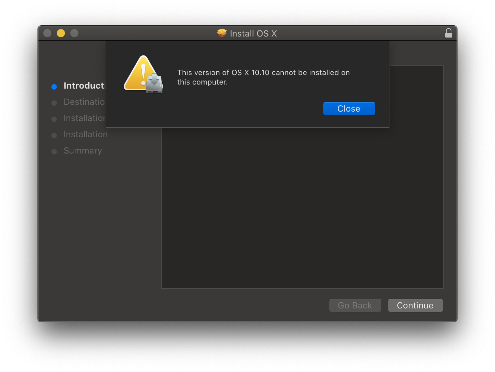
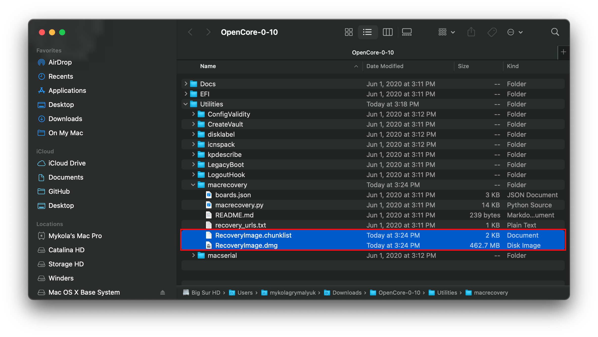

# Making the installer in macOS

* Supported version: 0.6.3

While you don't need a fresh install of macOS to use OpenCore, some users prefer having a fresh slate with their boot manager upgrades.

To start we'll want to grab ourselves a copy of macOS. You can skip this and head to formatting the USB if you're just making a bootable OpenCore stick and not an installer. For everyone else, you can either download macOS from the App Store or with gibMacOS.

## Downloading macOS: Modern OS

* This method allows you to download macOS 10.13 and newer, for 10.12 and older see [Downloading macOS: Legacy OS](#downloading-macos-legacy-os)

From a macOS machine that meets the requirements of the OS version you want to install, go directly to the App Store and download the desired OS release and continue to [**Setting up the installer**](#setting-up-the-installer).

For machines that need a specific OS release or can't download from the App Store, you can use the gibMacOS utility.

Now let's grab [gibMacOS](https://github.com/corpnewt/gibMacOS), then unzip it into a local directory.

Next run the `gibMacOS.command`:


As you can see, we get a nice list of macOS installers. If you need beta versions of macOS, you can select `C. Change Catalog`. For this example we'll choose 1:


* **macOS 11, Big Sur Note**: As this OS is quite new, there's still some issues with certain systems to resolve. For more information, see here: [OpenCore and macOS 11: Big Sur](../extras/big-sur/README.md)
  * For first time users, we recommend macOS 10.15, Catalina
* **Nvidia GPU Note**: Reminder to verify whether your hardware support newer OSes, see [Hardware Limitations](../macos-limits.md)

This is going to take a while as we're downloading the entire 8GB+ macOS installer, so it's highly recommended to read the rest of the guide while you wait.

Once finished, we have to either extract the installer or build it:

* [Extracting the installer](#extracting-the-installer)
  * For macOS 11+
* [Building the installer](#building-the-installer)
  * For 10.15 and older

### Extracting the installer

For macOS 11 and newer, Apple now packages up the installer into the InstallAssistant package. This will be located under `gibMacOS/macOS Downloads/`:


Run the InstallAssistant.pkg and point this to whichever drive you're booting off of, this is where the Install.app will be dropped:


Once done, you should find it located in your Applications folder:


From here, jump to [Setting up the installer](#setting-up-the-installer) to finish your work.

### Building the installer

For macOS 10.15 and older, the installer will be downloaded in pieces and will need to be built. Here we'll want to run the `BuildmacOSInstallApp.command`:


You will be prompted for the macOS installer files which were downloaded to `macOS Downloads` folder in the gibMacOS directory.

From the Finder, drill down to the folder containing the downloaded files and either drag it to the command line or "Cmd+C" and paste it to the terminal.

Once the task is completed, exit the utility. You will find the Install file in the directory.

Move the newly created image to the Applications folder – this will simplify the next section.


From here, jump to [Setting up the installer](#setting-up-the-installer) to finish your work.

## Downloading macOS: Legacy OS

* This method allows you to download much older versions of OS X, currently supporting all Intel versions of OS X(10.4 to current)

::: details Grabbing legacy versions of macOS: Offline method(10.10-10.12 Supported)

### Legacy macOS: Offline method

This method allows us to download full installers from Apple, however is limited to 10.10, Yosemite, so older OSes will need to be grabbed via the "Online Method" mentioned below.

To start, head to one of the following links:

* [How to upgrade to OS X Yosemite](https://support.apple.com/en-ca/HT210717)
* [How to upgrade to OS X El Capitan](https://support.apple.com/en-us/HT206886)
* [How to upgrade to macOS Sierra](https://support.apple.com/en-us/HT208202)

On step 4, you'll see either `InstallOS.dmg` for Sierra or `InstallMacOSX.dmg` for El Capitan and older. Download your desired version and a .pkg file should be provided.

Depending on what OS you're on, you can run this script and head to [Setting up the installer](#setting-up-the-installer) however if you receive this error:



This means we'll need to manually extract the installer.

### Extracting the Installer

To start, grab the InstallMacOSX/InstallOS.dmg and mount it:


Next, let's open up terminal window and make a folder on our desktop to break things. Run one at a time:

```sh
cd ~/Desktop
mkdir MacInstall && cd MacInstall
```

Now we get to the fun part, extracting the installer(Note this may take a few minutes):

* For El Capitan(10.11) and older:

```sh
xar -xf /Volumes/Install\ OS\ X/InstallMacOSX.pkg
```

* For Sierra(10.12):

```sh
xar -xf /Volumes/Install\ macOS/InstallOS.pkg
```

Next, run the following(one at a time):

* Yosemite:

```sh
cd InstallMacOSX.pkg
tar xvzf Payload
mv InstallESD.dmg Install\ OS\ X\ Yosemite.app/Contents/SharedSupport/
mv Install\ OS\ X\ Yosemite.app /Applications
```

* El Capitan:

```sh
cd InstallMacOSX.pkg
tar xvzf Payload
mv InstallESD.dmg Install\ OS\ X\ El\ Capitan.app/Contents/SharedSupport/
mv Install\ OS\ X\ El\ Capitan.app /Applications
```

* Sierra:

```sh
cd InstallOS.pkg
tar xvzf Payload
mv InstallESD.dmg Install\ macOS\ Sierra.app/Contents/SharedSupport/
mv Install\ macOS\ Sierra.app /Applications
```

Once this is done, you can head to [Setting up the installer](#setting-up-the-installer)!

:::

::: details Grabbing legacy versions of macOS: Online method(10.7-10.15 Supported)

### Legacy macOS: Online method

This method allows us to download legacy versions of macOS including 10.7 to current, however these are only recovery installers so require an internet connection inside the installer itself

To start, you'll want to use macrecovery.py instead. This tool is actually already bundled in OpenCorePkg:


Instructions for running are quite simple, choose from one of the below commands depending on which OS you want to download:

```sh
# Lion(10.7):
./macrecovery.py -b Mac-2E6FAB96566FE58C -m 00000000000F25Y00 download
./macrecovery.py -b Mac-C3EC7CD22292981F -m 00000000000F0HM00 download

# Mountain Lion(10.8):
./macrecovery.py -b Mac-7DF2A3B5E5D671ED -m 00000000000F65100 download

# Mavericks(10.9):
./macrecovery.py -b Mac-F60DEB81FF30ACF6 -m 00000000000FNN100 download

# Yosemite(10.10):
./macrecovery.py -b Mac-E43C1C25D4880AD6 -m 00000000000GDVW00 download

# El Capitan(10.11):
./macrecovery.py -b Mac-FFE5EF870D7BA81A -m 00000000000GQRX00 download

# Sierra(10.12):
./macrecovery.py -b Mac-77F17D7DA9285301 -m 00000000000J0DX00 download

# High Sierra(10.13)
./macrecovery.py -b Mac-7BA5B2D9E42DDD94 -m 00000000000J80300 download
./macrecovery.py -b Mac-BE088AF8C5EB4FA2 -m 00000000000J80300 download

# Mojave(10.14)
./macrecovery.py -b Mac-7BA5B2DFE22DDD8C -m 00000000000KXPG00 download

# Catalina(10.15)
./macrecovery.py -b Mac-00BE6ED71E35EB86 -m 00000000000000000 download

# Latest version
# ie. Big Sur(11)
./macrecovery.py -b Mac-E43C1C25D4880AD6 -m 00000000000000000 download
```

From here, run one of those commands in terminal and once finished you'll get an output similar to this:



Once this is done, format your USB as FAT32 with GUID Partition Scheme:


And finally, create folder on the root of this drive called `com.apple.recovery.boot` and place the newly downloaded BaseSystem/RecoveryImage files in:


From here, you can skip to [Setting up OpenCore's EFI environment](#setting-up-opencore-s-efi-environment)

:::

::: details Legacy macOS: Disk Images(10.4-10.6 Supported)

### Legacy macOS: Disk Images

This method instead relies on hosted images either from Apple or Acidanthera, and restoring onto your drive.

#### Acidanthera Images

The below installers were pulled from genuine Mac restore disks with their SMBIOS lock removed, contents of OS X itself have not been modified in any way.

* [OS X 10.4.10(8R4088)](https://mega.nz/folder/D3ASzLzA#7sjYXE2X09f6aGjol_C7dg)

* [OS X 10.5.7(9J3050)](https://mega.nz/folder/inRBTarD#zanf7fUbviwz3WHBU5xpCg)

* [OS X 10.6.7(10J4139)](https://mega.nz/folder/z5YUhYTb#gA_IRY5KMuYpnNCg7kR3ug/file/ioQkTagI)

#### Apple Images

Note that these images require you to have an Apple Developer account to access.

* [OS X 10.5.0 Golden Master(9a581)](https://download.developer.apple.com/Mac_OS_X/mac_os_x_v10.5_leopard_9a581/leopard_9a581_userdvd.dmg)

* [OS X 10.6.0 Golden Master(10a432)](https://download.developer.apple.com/Mac_OS_X/mac_os_x_version_10.6_snow_leopard_build_10a432/mac_os_x_v10.6_build_10a432_user_dvd.dmg)

### Restoring the drive

Now comes the fun part, you'll first want to open the dmg you just downloaded and have it mounted. Now open Disk Utility and format your drive as macOS Extended(HFS+) with a GUID partition map:


Next we have 2 options to follow:

* [ASR Restore](#asr)(Apple Software Restore)
  * Terminal based, works with SIP enabled
* [Disk Utility Restore](#disk-utility)
  * May require SIP disabled in newer OSes
  
#### ASR

Here you'll simply want to open terminal and run the following:

```sh
sudo asr restore -source /Volumes/Mac\ OS\ X\ Install\ DVD  -target /Volumes/MyVolume -erase -noverify
```

* **Note**: This may not align with your setup, please change accordingly:
  * Change `/Volumes/Mac\ OS\ X\ Install\ DVD` to what your mounted Disk Image is called
  * Change `/Volumes/MyVolume` to what your USB is called

This will take some time but once you're finished, you can skip to [Setting up OpenCore's EFI environment](#setting-up-opencore-s-efi-environment)
  
#### Disk Utility

Due to some pesky issues with Disk Utility, many restores can fail if SIP is enabled. If you have issues we recommend either using the [ASR Method](#asr) or disable SIP.

To start, open Disk Utility and you should see both your USB drive and the Disk Image in the sidebar. From here, select restore


This will take some time but once you're finished, you can skip to [Setting up OpenCore's EFI environment](#setting-up-opencore-s-efi-environment)

::: details Troubleshooting

If you get an error such as this one during restore:


This likely means SIP needs to be disabled, however we recommend using [ASR Method](#asr) instead.

:::

## Setting up the installer

Now we'll be formatting the USB to prep for both the macOS installer and OpenCore. We'll want to use macOS Extended (HFS+) with a GUID partition map. This will create two partitions: the main `MyVolume` and a second called `EFI` which is used as a boot partition where your firmware will check for boot files.

* Note: By default, Disk Utility only shows partitions – press Cmd/Win+2 to show all devices (alternatively you can press the View button)
* Note 2: Users following "Legacy macOS: Online method" section can skip to [Setting up OpenCore's EFI environment](#setting-up-opencore-s-efi-environment)


Next run the `createinstallmedia` command provided by [Apple](https://support.apple.com/en-us/HT201372). Note that the command is made for USB's formatted with the name `MyVolume`:

```sh
sudo /Applications/Install\ macOS\ Catalina.app/Contents/Resources/createinstallmedia --volume /Volumes/MyVolume
```

This will take some time so you may want to grab a coffee or continue reading the guide (to be fair you really shouldn't be following this guide step by step without reading the whole thing first).

You can also replace the `createinstallmedia` path with that of where your installer's located (same idea with the drive name).

::: details Legacy createinstallmedia Commands

Pulled from Apple's own site: [How to create a bootable installer for macOS](https://support.apple.com/en-us/HT201372)

```sh
# Mojave
sudo /Applications/Install\ macOS\ Mojave.app/Contents/Resources/createinstallmedia --volume /Volumes/MyVolume

# High Sierra
sudo /Applications/Install\ macOS\ High\ Sierra.app/Contents/Resources/createinstallmedia --volume /Volumes/MyVolume

# Sierra
sudo /Applications/Install\ macOS\ Sierra.app/Contents/Resources/createinstallmedia --volume /Volumes/MyVolume

# El Capitan
sudo /Applications/Install\ OS\ X\ El\ Capitan.app/Contents/Resources/createinstallmedia --volume /Volumes/MyVolume --applicationpath /Applications/Install\ OS\ X\ El\ Capitan.app

# Yosemite
sudo /Applications/Install\ OS\ X\ Yosemite.app/Contents/Resources/createinstallmedia --volume /Volumes/MyVolume --applicationpath /Applications/Install\ OS\ X\ Yosemite.app

# Mavericks
sudo /Applications/Install\ OS\ X\ Mavericks.app/Contents/Resources/createinstallmedia --volume /Volumes/MyVolume --applicationpath /Applications/Install\ OS\ X\ Mavericks.app --nointeraction
```

:::

## Legacy Setup

For systems not supporting UEFI boot, see below:

::: details Setting up Legacy Boot

To start, you need the following:

* BootInstall_IA32.tool or BootInstall_X64.tool
  * This can be found in OpenCorePkg under `/Utilties/LegacyBoot/`
* Install USB(Created above)

Within your OpenCore build folder, navigate to `Utilities/LegacyBoot`. Here you'll find a file called `BootInstall_ARCH.tool`. What this does is install DuetPkg to your desired drive.


Now run this tool in terminal **with sudo**(This tool will likely fail otherwise):

```sh
# Replace X64 with IA32 if you have a 32-Bit CPU
sudo ~/Downloads/OpenCore/Utilities/legacyBoot/BootInstall_X64.tool
```


This will give you a list of available disks, choose yours and you will be prompted to write a new MBR. Choose yes`[y]` and you'll be finished.


This will provide you with an EFI partition with either a **bootia32** or **bootx64** file

:::

## Setting up OpenCore's EFI environment

Setting up OpenCore's EFI environment is simple – all you need to do is mount our EFI system partition. This is automatically made when we format with GUID but is unmounted by default, this is where our friend [MountEFI](https://github.com/corpnewt/MountEFI) comes in:


You'll notice that once we open the EFI partition, it's empty. This is where the fun begins.


## Now with all of this done, head to [Setting up the EFI](./opencore-efi.md) to finish up your work
