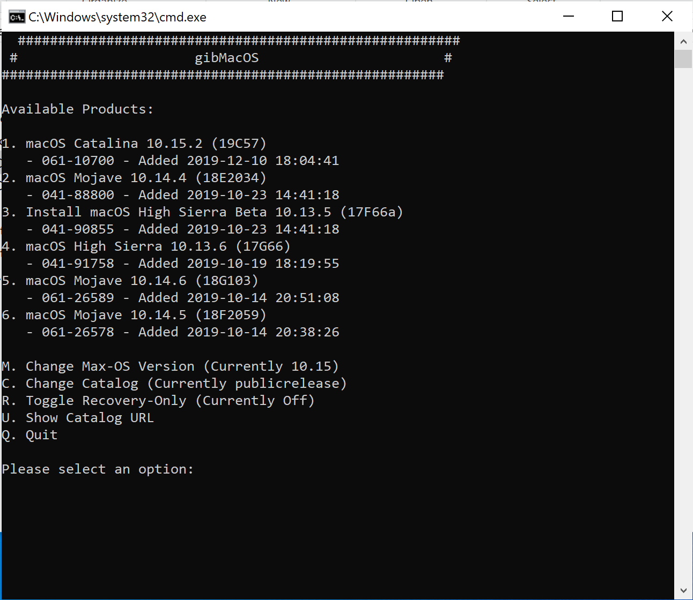
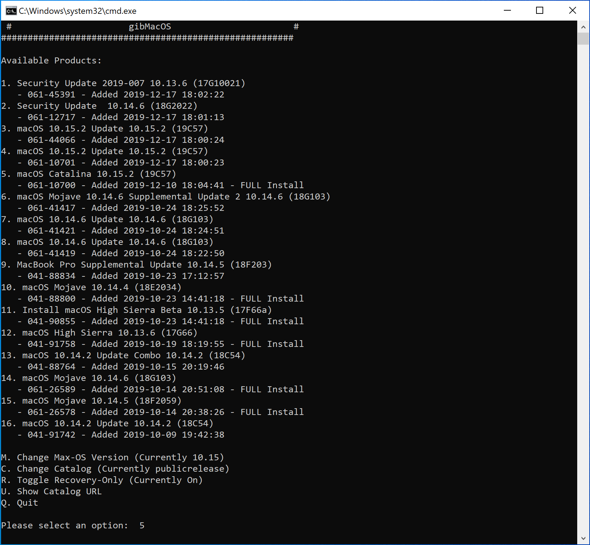
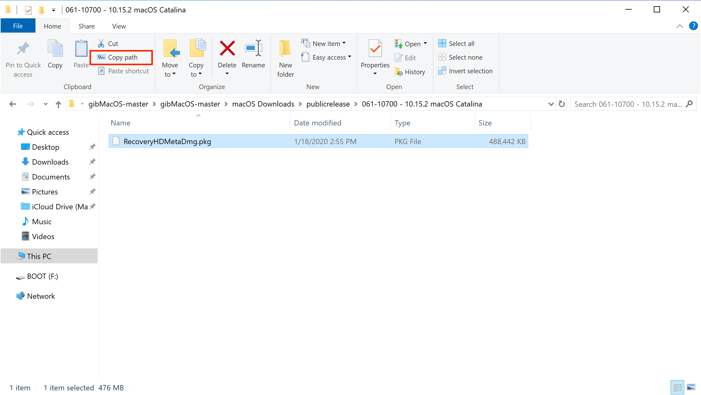
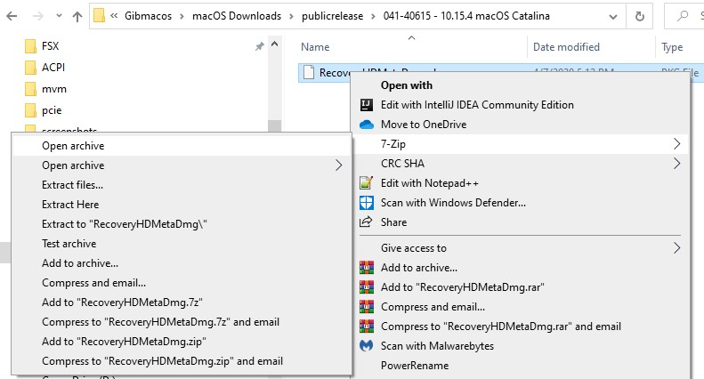

# Making the installer in Windows

* Supported version: 0.6.2

While you don't need a fresh install of macOS to use OpenCore, some users prefer having a fresh slate with their boot manager upgrades.

To start you'll need the following:

* 4GB USB Stick
* [GibMacOS](https://github.com/corpnewt/gibMacOS)

## Downloading macOS: Modern

* This method allows you to download macOS 10.13 and newer, for 10.12 and older see [Downloading macOS: Legacy OS](#downloading-macos-legacy-os)

To start, open gibMacOS.bat as Admin and select `Toggle Recovery-Only`:



Now search through for your desired version of macOS, for this example we'll choose option 5 for macOS Catalina:



This will download the RecoveryHDMetaDmg.pkg to `\gibmacos-master\macOS Downloads\publicrelease\xxx-xxxxx - 10.x.x macOS xxx`


## Making the installer: UEFI

* Note: This is meant for systems supporting UEFI, if your machine is 2011 or older it's unlikely to support UEFI.
  * Please verify either with AIDA64 or your OEM's support page.

Next open `MakeInstall.bat` as Admin and select your drive with option O for OpenCore( ex: 1O).


Once your drive is formatted, it will then ask you for the `RecoveryHDMetaDMG.pkg` that we downloaded earlier. Top left of the file window will let you copy the file path:




MakeInstall will finish up by installing OpenCore to your USB's EFI System Partition, you can find this partition labeled as `BOOT`:


## Making the installer: Legacy

* Note: This is meant for systems that do not support, if your machine is 2011 or older it's unlikely to support UEFI.
  * Please verify either with AIDA64 or your OEM's support page.

::: details Legacy Setup

To start, you'll need the following:

* [7-Zip](https://www.7-zip.org)
* [BOOTICE](https://www.majorgeeks.com/files/details/bootice_64_bit.html)
* [OpenCorePkg](https://github.com/acidanthera/OpenCorePkg/releases)

Press Windows + R and enter `diskpart`.

Now run the following:

```sh
# List available disks
list disk
# Select your disk(ie. disk 1)
select disk 1
# Format the drive
clean
# Convert to GPT
# Due to an odd bug with BOOTICE and DuetPkg, MBR disks will fail to boot
convert gpt
# Create a new partition
create partition primary
# Select your partition
# Running clean ensures we only have 1 partition so it will be "partition 1"
select partition 1
# Format the drive as FAT32
format fs=fat32 quick
# Assign a drive letter(ie. Drive E, ensure it's not currently in use)
ASSIGN LETTER=E
```

Next, open File Explorer and head to this newly formatted drive and create a folder called `com.apple.recovery.boot` on the root of the drive.

Again in File Explorer, find the .pkg downloaded by gibMacOS under macOS Downloads in the gibMacOS folder. Open the .pkg by right clicking and going under 7-Zip -> Open Archive:



Open RecoveryHDMeta.dmg (or similar named dmg) then open the folder contained, You should see BaseSystem.dmg and BaseSystem.chunklist. Drag/copy these to the com.apple.recovery.boot folder on your USB:


Now grab OpenCorePkg you downloaded earlier and open it:


Here we see both IA32(32 Bit CPUs) and X64(64 Bit CPUs) folders, choose the one that's most appropriate to your hardware and open it. Next grab the EFI folder inside and place this on the root of the USB drive along side com.apple.recovery.boot. Once done it should look like this:


Now finally, open up BOOTICE and ensure you've selected the right drive.


Next, enter "Process MBR" then select "Restore MBR" and select the **boot0** file from `Utilities/LegacyBoot/` in OpenCorePkg:

| Restore MBR | Restore boot0 file |
| :--- | :--- |
|  |  |

Then head back to the main screen and select "Process PBR" then "Restore PBR". From here, choose the **Boot1f32** file from `Utilities/LegacyBoot/` in OpenCorePkg:

| Restore PBR | Restore boot1f32 file |
| :--- | :--- |
|  |  |

Once this is done, head back to your USB and do 1 final thing. Grab either the **bootx64**(64 Bit CPUs) or **bootia32**(32 Bit CPUs) file from `Utilities/LegacyBoot/` and place it on the root of your drive:


:::

## Downloading macOS: Legacy OS

* This method allows you to download much older versions of OS X, currently supporting OS X 10.7 to current

::: details Legacy macOS setup

To grab legacy installers is super easy, first grab a copy of [OpenCorePkg](https://github.com/acidanthera/OpenCorePkg/releases) and head to `/Utilities/macrecovery/`. Next copy the folder path:


From here, you'll want to open up a CMD Prompt and cd into the macrecovery folder that we copied earlier:

```sh
cd Paste_Folder_Path
```

Now run one of the following depending on what version of macOS you want(Note these scripts rely on [Python](https://www.python.org/downloads/) support, please install if you haven't already):

```sh
# Lion(10.7):
./macrecovery.py -b Mac-2E6FAB96566FE58C -m 00000000000F25Y00 download
./macrecovery.py -b Mac-C3EC7CD22292981F -m 00000000000F0HM00 download

# Mountain Lion(10.8):
./macrecovery.py -b Mac-7DF2A3B5E5D671ED -m 00000000000F65100 download

# Mavericks(10.9):
./macrecovery.py -b Mac-F60DEB81FF30ACF6 -m 00000000000FNN100 download

# Yosemite(10.10):
./macrecovery.py -b Mac-E43C1C25D4880AD6 -m 00000000000GDVW00 download

# El Capitan(10.11):
./macrecovery.py -b Mac-FFE5EF870D7BA81A -m 00000000000GQRX00 download

# Sierra(10.12):
./macrecovery.py -b Mac-77F17D7DA9285301 -m 00000000000J0DX00 download

# High Sierra(10.13)
./macrecovery.py -b Mac-7BA5B2D9E42DDD94 -m 00000000000J80300 download
./macrecovery.py -b Mac-BE088AF8C5EB4FA2 -m 00000000000J80300 download

# Mojave(10.14)
./macrecovery.py -b Mac-7BA5B2DFE22DDD8C -m 00000000000KXPG00 download

# Latest version
# ie. Catalina(10.15)
./macrecovery.py -b Mac-E43C1C25D4880AD6 -m 00000000000000000 download
```

This will take some time, however once you're finished you should get either BaseSystem or RecoveryImage files:


Now with our installer downloaded, we'll next want to format out USB.

Press Windows + R and enter `diskpart`.

Now run the following:

```sh
# List available disks
list disk
# Select your disk(ie. disk 1)
select disk 1
# Format the drive
clean
# Convert to GPT
# Due to an odd bug with BOOTICE and DuetPkg, MBR disks will fail to boot
convert gpt
# Create a new partition
create partition primary
# Select your partition
# Running clean ensures we only have 1 partition so it will be "partition 1"
select partition 1
# Format the drive as FAT32
format fs=fat32 quick
# Assign a drive letter(ie. Drive E, ensure it's not currently in use)
ASSIGN LETTER=E
```

Next, go to the root of this USB drive and create a folder called `com.apple.recovery.boot`. Then move the downloaded BaseSystem or RecoveryImage files. Please ensure you copy over both the .dmg and .chunklist files to this folder:


Now grab OpenCorePkg you downloaded earlier and open it:


Here we see both IA32(32 Bit CPUs) and X64(64 Bit CPUs) folders, choose the one that's most appropriate to your hardware and open it. Next grab the EFI folder inside and place this on the root of the USB drive along side com.apple.recovery.boot. Once done it should look like this:


::: details Legacy Install Setup

If your firmware does not support UEFI, see below instructions:

To start, you'll need the following:

* [7-Zip](https://www.7-zip.org)
* [BOOTICE](https://www.majorgeeks.com/files/details/bootice_64_bit.html)
* [OpenCorePkg](https://github.com/acidanthera/OpenCorePkg/releases)

Next, open up BOOTICE and ensure you've selected the right drive.


Next, enter "Process MBR" then select "Restore MBR" and select the **boot0** file from `Utilities/LegacyBoot/` in OpenCorePkg:

| Restore MBR | Restore boot0 file |
| :--- | :--- |
|  |  |

Then head back to the main screen and select "Process PBR" then "Restore PBR". From here, choose the **Boot1f32** file from `Utilities/LegacyBoot/` in OpenCorePkg:

| Restore PBR | Restore boot1f32 file |
| :--- | :--- |
|  |  |

Once this is done, head back to your USB and do 1 final thing. Grab either the **bootx64**(64 Bit CPUs) or **bootia32**(32 Bit CPUs) file from `Utilities/LegacyBoot/` and place it on the root of your drive:


:::

## Now with all this done, head to [Setting up the EFI](../installer-guide/opencore-efi.md) to finish up your work
