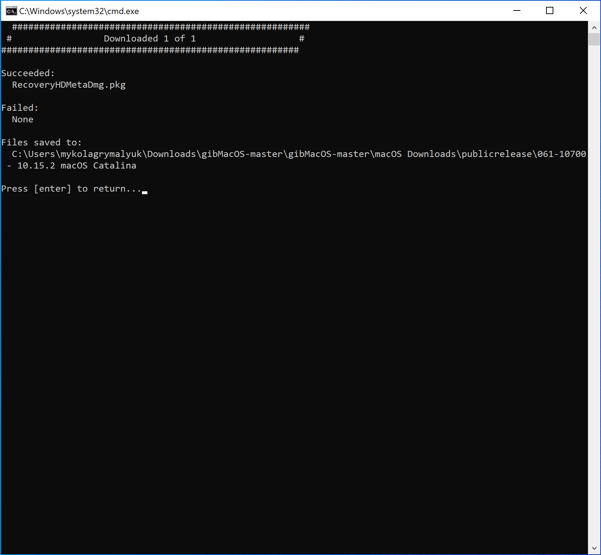
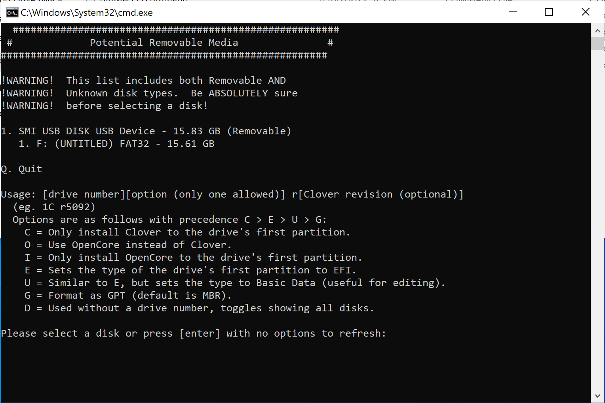
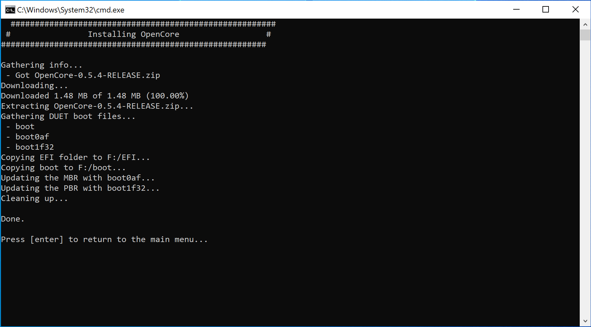
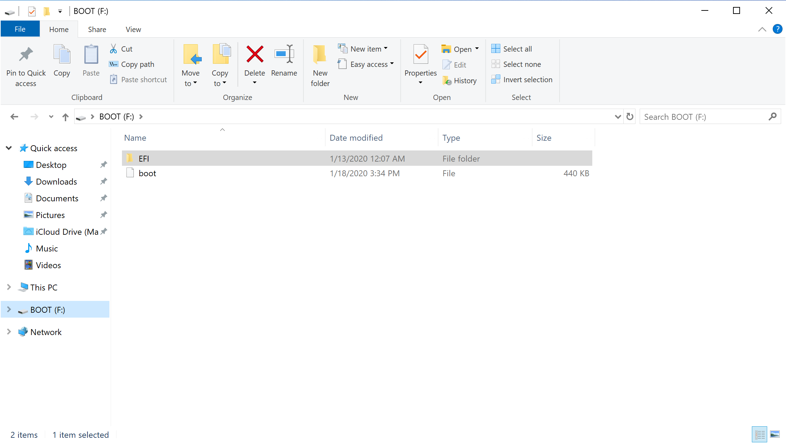

# Making the installer in Windows

* Supported version: 0.6.2

While you don't need a fresh install of macOS to use OpenCore, some users prefer having a fresh slate with their boot manager upgrades.

To start you'll need the following:

* 4GB USB Stick
* [GibMacOS](https://github.com/corpnewt/gibMacOS)

## Downloading macOS: Modern

* This method allows you to download macOS 10.13 and newer, for 10.12 and older see [Downloading macOS: Legacy OS](#downloading-macos-legacy-os)

To start, open gibMacOS.bat as Admin and select `Toggle Recovery-Only`:


Now search through for your desired version of macOS, for this example we'll choose option 5 for macOS Catalina:


This will download the RecoveryHDMetaDmg.pkg to `\gibmacos-master\macOS Downloads\publicrelease\xxx-xxxxx - 10.x.x macOS xxx`



## Making the installer

Next open `MakeInstall.bat` as Admin and select your drive with option O for OpenCore( ex: 1O).



Once your drive is formatted, it will then ask you for the `RecoveryHDMetaDMG.pkg` that we downloaded earlier. Top left of the file window will let you copy the file path:


MakeInstall will finish up by installing OpenCore to your USB's EFI System Partition, you can find this partition labeled as `BOOT`:





## Downloading macOS: Legacy OS

* This method allows you to download much older versions of OS X, currently supporting OS X 10.7 to current

::: details Legacy macOS setup

To grab legacy installers is super easy, first grab a copy of [OpenCorePkg](https://github.com/acidanthera/OpenCorePkg/releases) and head to `/Utilities/macrecovery/`. Next copy the folder path:


From here, you'll want to open up a CMD Prompt and cd into the macrecovery folder that we copied earlier:

```sh
cd Paste_Folder_Path
```

Now run one of the following depending on what version of macOS you want(Note these scripts rely on [Python](https://www.python.org/downloads/) support, please install if you haven't already):

```sh
# Lion(10.7):
./macrecovery.py -b Mac-2E6FAB96566FE58C -m 00000000000F25Y00 download
./macrecovery.py -b Mac-C3EC7CD22292981F -m 00000000000F0HM00 download

# Mountain Lion(10.8):
./macrecovery.py -b Mac-7DF2A3B5E5D671ED -m 00000000000F65100 download

# Mavericks(10.9):
./macrecovery.py -b Mac-F60DEB81FF30ACF6 -m 00000000000FNN100 download

# Yosemite(10.10):
./macrecovery.py -b Mac-E43C1C25D4880AD6 -m 00000000000GDVW00 download

# El Capitan(10.11):
./macrecovery.py -b Mac-FFE5EF870D7BA81A -m 00000000000GQRX00 download

# Sierra(10.12):
./macrecovery.py -b Mac-77F17D7DA9285301 -m 00000000000J0DX00 download

# High Sierra(10.13)
./macrecovery.py -b Mac-7BA5B2D9E42DDD94 -m 00000000000J80300 download
./macrecovery.py -b Mac-BE088AF8C5EB4FA2 -m 00000000000J80300 download

# Mojave(10.14)
./macrecovery.py -b Mac-7BA5B2DFE22DDD8C -m 00000000000KXPG00 download

# Latest version
# ie. Catalina(10.15)
./macrecovery.py -b Mac-E43C1C25D4880AD6 -m 00000000000000000 download
```

This will take some time, however once you're finished you should get either BaseSystem or RecoveryImage files:


Now with our installer downloaded, we'll next want to format out USB.

Open Disk Management and format your USB drive as FAT32:


Next, go to the root of this USB drive and create a folder called `com.apple.recovery.boot`. Then move the downloaded BaseSystem or RecoveryImage files. Please ensure you copy over both the .dmg and .chunklist files to this folder:


:::

## Now with all this done, head to [Setting up the EFI](../installer-guide/opencore-efi.md) to finish up your work
