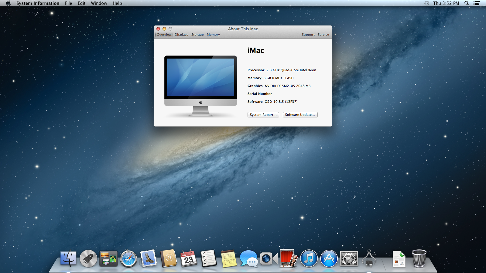
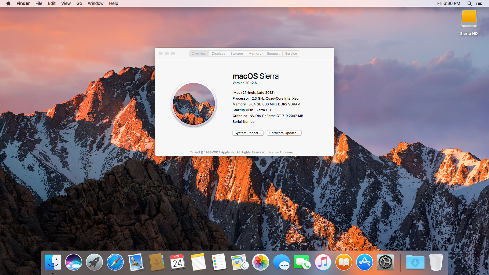
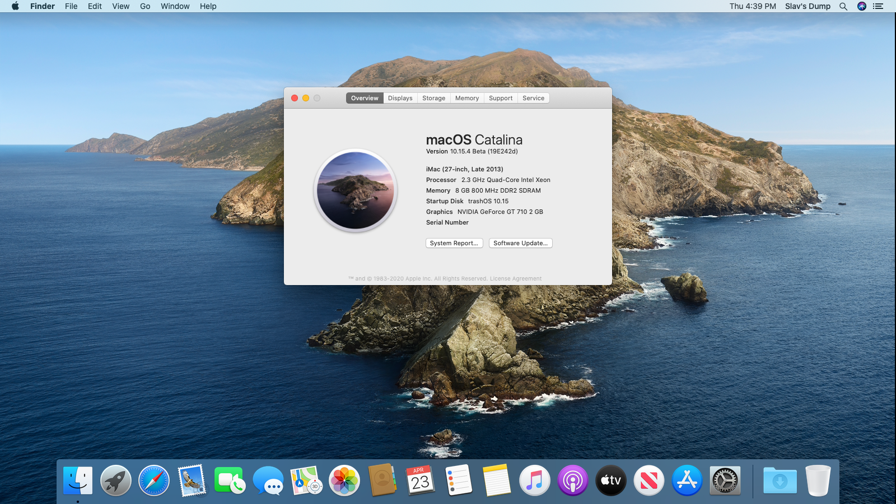

# Getting started with OpenCore

Before we can jump head first into making an OpenCore based system, we need to go over a few things.

## Prerequisites
  
1. _**[CRUCIAL]**_ Time and patience.
   * Don't start working on this if you have deadlines or important work. Hackintoshes are not something you should be relying on as a work machine.
2. _**[CRUCIAL]**_ **KNOW YOUR HARDWARE**
   * Your CPU name and generation
   * Your GPUs
   * Your storage devices (HDD/SSD, NVMe/AHCI/RAID/IDE configuration)
   * Your laptop/desktop model if from an OEM
   * Your **Ethernet chipset**
   * Your WLAN/Bluetooth chipset
3. _**[CRUCIAL]**_ **A BASIC KNOWLEDGE OF COMMAND LINES AND HOW TO USE A TERMINAL/COMMAND PROMPT**
   * This is not just [CRUCIAL], this is the basis of this whole guide. We can't help you if you don't know how to `cd` to a directory or delete a file.
4. _**[CRUCIAL]**_ A machine that is compatible as seen in the _**Compatibility**_ section.
   * [Hardware Limitations page](macos-limits.md)
5. _**[CRUCIAL]**_ A minimum of:
   * 12GB USB if you're going to use macOS to create the USB
   * 4GB USB if you're going to use Windows or Linux for USB creation
6. _**[CRUCIAL]**_ An **Ethernet connection** (no WiFi dongles, Ethernet USB adapter may work depending on macOS support) and you must know your LAN card's model
   * You must either have a physical Ethernet port, or a compatible macOS Ethernet dongle/adapter. In case you have a [compatible WiFi card](https://dortania.github.io/Wireless-Buyers-Guide/), you can also use that.
     * Note the majority of Wifi cards are not supported by macOS
   * For people who can't use ethernet but have an Android phone, you can connect your Android phone to WiFi and then tether it using USB with [HoRNDIS](https://joshuawise.com/horndis#available_versions).
7. _**[CRUCIAL]**_ **Proper OS Installation:**
   * Be it:
     * macOS (a fairly recent one would be better)
     * Windows (Windows 10, 1703 or newer)
     * Linux (with Python 2.7 or later), make sure it's clean and properly functioning.
   * For Windows or Linux users, **15GB** of free space on the drive you're working on. On Windows, your OS disk (C:) must have 15GB free at least.
   * For macOS users, **30GB** of free space on the system's drive.
   * Most tools used in this guide will also require [Python installed](https://www.python.org/downloads/)

## Common Myths

This section is to disprove a few myths in the community around OpenCore and macOS running on PC hardware. If this is your first time hearing OpenCore or Hackintosh, you can simply skip this.

### Is OpenCore unstable as it's a beta

OpenCore's version number does not represent the quality of the project. Instead, it's more of a way to see the stepping stones of the project. Acidanthera still has much they'd like to do with the project including overall refinement and more feature support.

Version 0.6.1 was originally designed to be the official release of OpenCore as it would have proper UEFI/Apple Secure Boot, and would be the 1 year anniversary of OpenCore's release as a public tool. However, due to circumstances around macOS Big Sur and the rewriting of OpenCore's prelinker to support it, it was decided to push of 1.0.0 for another year.

Current road map:

* 2019: Year of the beta
* 2020: Year of Secure Boot
* 2021: Year of refinement

So please do not see the version number as a hindrance, instead as something to look forward to.

### Does OpenCore always inject SMBIOS and ACPI data into other OSes

By default, OpenCore will assume that all OSes should be treated equally in regards to ACPI and SMBIOS information. The reason for this thinking is 3 parts:

* This allows for proper multiboot support like with [BootCamp](https://dortania.github.io/OpenCore-Post-Install/multiboot/bootcamp.html)
* Avoids poorly made DSDTs and encourages proper ACPI practices
* Avoids edge cases where info is injected several times, commonly seen with Clover

However, there are quirks in OpenCore that allow for SMBIOS injection to be macOS limited by patching where macOS reads SMBIOS info from. The `CustomSMIOSGuid` quirk with `CustomSMBIOSMode` set to `Custom` can break in the future and so we only recommend this option in the event of certain software breaking in other OSes. For best stability, please disable these quirks.

### Does OpenCore require a fresh install

Not at all in the event you have a "Vanilla" installation, what this refers to is whether the OS has tampered in any way such as installing 3rd party kexts into the system volume or other unsupported modifications by Apple. When your system has been heavily tampered either by you or 3rd party utilities like Hackintool, we recommend a fresh install to avoid any potential issues

Special note for Clover users, please reset your NVRAM when installing with OpenCore. Many of Clover variables can conflict with OpenCore and macOS.

### Does OpenCore only support limited versions of macOS

As of OpenCore 0.6.2, you can now boot every Intel version of macOS going all the way back to OS X 10.4! Proper support however will depend on your hardware, so please verify yourself: [Hardware Limitations](macos-limits.md)

::: details macOS Install Gallery

We've tested many versions here at Acidanthera, and I myself have run many versions of OS X on my old HP DC 7900. Here's just a small gallery of what I've tested:

:::

### Does OpenCore support older hardware

As of right now, the majority of Intel hardware is supported so long as the OS itself does! However please refer to the [Hardware Limitations](macos-limits.md) for more info on what hardware is supported in what versions of OS X/macOS.

Currently, Intel's Yonah and newer series CPUs have been tested properly with OpenCore.

### Does OpenCore support Windows/Linux booting

OpenCore works in the same fashion as any other boot loader and so respects other OSes the same way. For any OSes where their bootloader has an irregular path or name, you can simply add it to the BlessOverride section.

### Legality of Hackintoshing

Where hackintoshing sits is in a legal grey area, mainly that while this is not illegal we are in fact breaking the EULA. The reason this is not illegal:

* We are downloading macOS from [Apple's servers directly](https://github.com/corpnewt/gibMacOS/blob/master/gibMacOS.command#L84)
* We are doing this as a non-profit origination for teaching and personal use
  * People who plan to use their hackintosh for work or want to resell them should refer to the [Psystar case](https://en.wikipedia.org/wiki/Psystar_Corporation) and their region laws

While the EULA states that macOS should only be installed on real Macs([section 2B-i](https://www.apple.com/legal/sla/docs/macOSCatalina.pdf)) or virtual machines running on genuine Macs([section 2B-iii](https://www.apple.com/legal/sla/docs/macOSCatalina.pdf)), there is no enforceable law that outright bans this. However, sites that repackage and modify macOS installers do potentially risk the issue of [DMCA Takedowns](https://en.wikipedia.org/wiki/Digital_Millennium_Copyright_Act) and such.

* **Note**: We are not official legal advisors, so please make the proper assessments yourself and discuss with your lawyers if you have any concerns.

### macOS does not support Nvidia GPUs

Due to issues revolving around Nvidia support in newer versions of macOS, many users have somehow come to the conclusion that macOS never supported Nvidia GPUs and don't at this point. However, Apple actually still maintains and supports Macs with Nvidia GPUs in their latest OS, like the 2013 MacBook Pro models with Kepler GPUs.

The main issue is around any newer Nvidia GPUs, as Apple stopped ship machines with them and thus never had official OS support from Apple instead users had to rely on Nvidia for 3rd party drivers. Due to issues with Apple's newly introduced Secure Boot, they could no longer support the Web Drivers and thus Nvidia couldn't publish them for newer platforms limiting them to mac OS 10.13, High Sierra.

For more info on OS support, see here: [GPU Buyers Guide](https://dortania.github.io/GPU-Buyers-Guide/)
