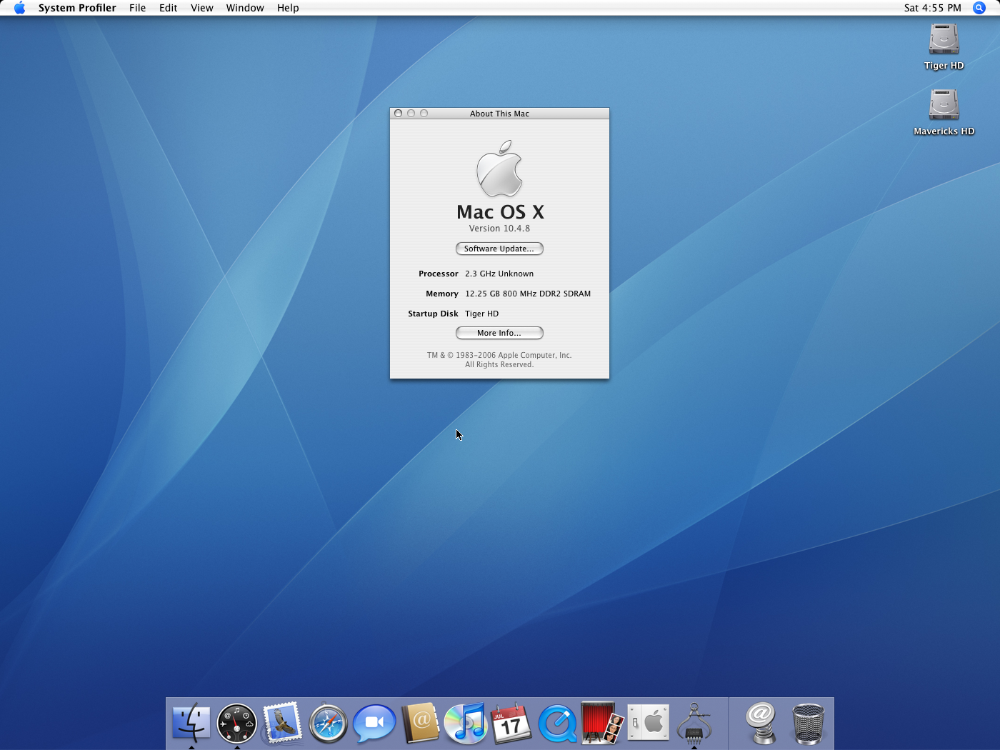
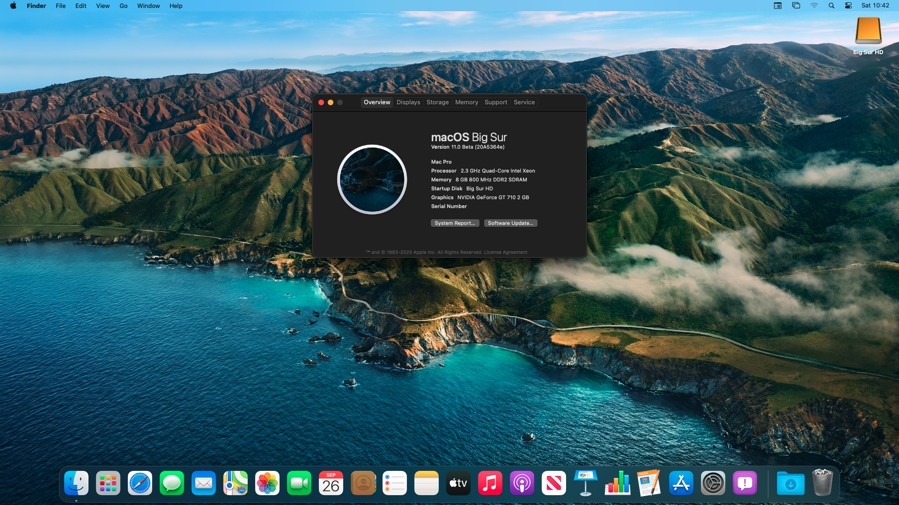

# Perché OpenCore invece di Clover e di altri

* Versione supportata: 0.6.8

Questa sezione contiene un briefing riguardo al perché la comunità si sta trasferendo su OpenCore, e di smentire alcuni miti comuni nella comunità. Quelli che vogliono solo una macchina con macOS, possono saltare questa pagina.

* [Perché OpenCore invece di Clover e di altri](#perche-opencore-invece-di-clover-e-di-altri)
  * Funzionalità di OpenCore
  * Supporto di programmi
  * Iniezione dei Kext
* [Brevi obiettivi di OpenCore](#brevi-obiettivi-di-opencore)
* [Miti comuni](#miti-comuni)
  * OpenCore non è stabile perché è una beta
  * OpenCore inietta sempre il SMBIOS e i dati ACPI negli altri sistemi
  * OpenCore richiede un'installazione pulita
  * OpenCore supporta solo alcune versioni di macOS

## Funzionalità di OpenCore

* Supporto di più sistemi!
  * OpenCore ora supporta nativamente più versioni di OS X e macOS senza penosi hack alla Clover o alla Chameleon da implementare
  * Questo include sistemi fino alla 10.4, Tiger, e fino all'ultima compilazione della 11, Big Sur!
* Nella media, i sistemi con OpenCore avviano più veloci rispetto a Clover, dato che vengono fatte meno patch
* In generale più stabilità dato che le patch sono più precise:
  * [macOS 10.15.4 update (EN)](https://www.reddit.com/r/hackintosh/comments/fo9bfv/macos_10154_update/)
  * Le patch AMD OSX non hanno bisogno di aggiornarsi nei piccoli aggiornamenti di sicurezza
* Più sicurezza in molte forme:
  * Non necessario di disabilitare il System Integrity Protection (SIP)
  * Il supporto per FileVault 2 integrato
  * [Vault](https://dortania.github.io/OpenCore-Post-Install/universal/security.html#Vault), che permette di creare delle immagini della EFI per evitare modifiche non volute
  * Vero supporto al secure-boot
    * Sia UEFI che Apple
* Cambio dal BootCamp e selezione del dispositivo da una lettura delle variabili NVRAM impostate dal Disco di Avvio, come un vero Mac.
* Supporto delle combinazioni di avvio del `boot.efi` - tenere `Option` o `ESC` all'avvio per scegliere il dispositivo di avvio, `Cmd+R` per entrare in Recovery o `Cmd+Opt+P+R` per fare un reset NVRAM.

## Supporto dei programmi

La più grande ragione è che qualcuno che sta confrontando OpenCore con altri, è il supporto di molti programmi:

* I kext non più testati su Clover:
  * Hai un bug con un kext? Molti sviluppatori inclusa l'organizzazione [Acidanthera](https://github.com/acidanthera) (fautrice di tutti i tuoi kext preferiti) non provvederà supporto se non usi OpenCore
* Molti driver del firmware sono stati integrati in OpenCore:
  * [Supporto APFS](https://github.com/acidanthera/AppleSupportPkg)
  * [Supporto FileVault](https://github.com/acidanthera/AppleSupportPkg)
  * [Patch del Firmware](https://github.com/acidanthera/AptioFixPkg)
* [Patch di AMD OSX](https://github.com/AMD-OSX/AMD_Vanilla/tree/opencore):
  * Hai l'hardware basato su AMD? Le patch del kernel sono necessarie per avviare macOS e non supportano più Clover – ora supportano solo OpenCore.

## Iniezione dei Kext

Per capire il metodo di iniezione dei kext di OpenCore, dobbiamo vedere come lavora Clover:

1. Modifica il SIP per disabilitarlo
2. Abilita il "XNU's zombie code" per iniettare i kext
3. Modifica le condizioni per cui i kext sono iniettati
4. Iniezione dei kext
5. Riattivazione del SIP

Cose da ricordare col metodo Clover:

* Notiamo che il "XNU's zombie code" non viene usato ufficialmente dalla versione 10.7, è impressionante notare che Apple non ha ancora rimosso il codice
  * Gli aggiornamenti del sistema di solito rompono questa patch, come recentemente 10.14.4 e 10.15
* Disabilita SIP poi tenta di riabilitarlo, non so che cosa serva aggiungere
* Sembra che disattivi gli aggiornamenti con macOS 11.0 (Big Sur)
* Supporta gli OS X fino al 10.5

Ora osserivamo il metodo OpenCore:

1. Prende il kernel collegato pre-esistente e i kext pronti ad essere iniettati
2. Ricostruisce la cache della EFI con i nuovi kext
3. Aggiunge questa nuova cache dentro il sistema

Cose da ricordare col metodo OpenCore:

* Questo sistema è comodo dato che il kernel collegato pre-esistente è lo stesso dalla 10.6 (v2), diventa difficile toglierne il supporto.
  * OpenCore tuttavia supporta anche lui un kernel pre-collegato (v1, trovato nella 10.4 e 10.5), cacheless, Mkext e KernelCollections, significa che supporta ogni versione con architettura intel di OS X/macOS
* Migliore stabilità dato che ci sono meno patch da fare

# Brevi obiettivi di OpenCore

La maggior parte delle funzionalità di Clover attualmente sono supportate in OpenCore in qualche tipo di quirk, tuttavia mentre transizioni dovresti stare attento alle funzionalità che sono mancanti da OpenCore o che vorresti avere:

* Non supporta l'avvio dei sistemi basati su MBR
  * Per aggirare è entrare in rEFInd da OpenCore
* Non supporta i patch dei VBIOS basati su UEFI
  * Questo tuttavia è supportato su macOS
* Non supporta l'iniezione automatica dei DeviceProperty per le GPU vecchie
  * come InjectIntel, InjectNvidia o InjectAti
  * Tuttavia può essere fatto manualmente: [GPU patching](https://dortania.github.io/OpenCore-Post-Install/gpu-patching/)
* Non supporta il patch dei conflitti IRQ
  * Risolvibile con [SSDTTime](https://github.com/corpnewt/SSDTTime)
* Non supporta gli attributi P e C nelle CPU più vecchie
* Non supporta le patch ACPI del Target Bridge
* Non supporta l'iniezione dell'Hardware UUID
* Non supporta il riconoscimento automatico per molti bootloader Linux
  * Risolvibile aggiungendo un `BlessOverride`
* Non supporta molte patch XCPM di Clover
  * per esempio le patch XCPM per Ivy Bridge
* Non supporta il nascondere specifici dischi
* Non supporta cambiare le impostazioni dal menù di OpenCore
* Non supporta le patch del valore PCIRoot UID
* Non supporta iniezione/patch degli ACPI solo per macOS

# Miti comuni

## OpenCore non è stabile perché è una beta

Risposta breve: No

Risposta lunga: No

Il numero che accompagna OpenCore non rappresenta la qualità del progetto. Infatti, è più difficile visualizzare i punti chiave del progetto. Acidanthera continua, come piace a noi, ad aggiungere rifinimenti e nuove funzionalità.

Ad esempio, OpenCore passa attraverso adeguati controlli di sicurezza per assicurarsi che sia conforme a UEFI Secure Boot ed è l'unico bootloader di Hackintosh a sottoporsi a queste rigorose revisioni e ad avere tale supporto.

La versione 0.6.1 è stata originariamente pensata per essere la prima versione ufficiale di OpenCore dato che ha proprio aggiunto UEFI/Apple Secure Boot, e sarebbe stato l'anno in cui OpenCore avrebbe festeggiato il primo rilascio come tool pubblico. Tuttavia, a causa di alcune circostanze legate a macOS Big Sur e la riscrittura del prelinker di OpenCore per supportarlo, è stato deciso di attendere un'altro anno per applicare la 1.0.0.

Il piano corrente:

* 2019: Anno della Beta
* 2020: Anno del Secure Boot
* 2021: Anno dei ritocchi Refinement

Quindi, per favore, non vedere il numero di versione come un ostacolo, piuttosto come qualcosa su cui riflettere.

## OpenCore inietta sempre il SMBIOS e i dati ACPI negli altri sistemi

Di default, OpenCore assumerà che tutti i sistemi dovrebbero essere trattati in maniera uniforme rispetto agli ACPI e alle informazioni SMBIOS. La ragione per questo pensiero consiste in tre parti:

* Questo permette per un corretto supporto al multiboot, come con [BootCamp](https://dortania.github.io/OpenCore-Post-Install/multiboot/bootcamp.html)
* Evitare i DSDT scarsi e incoraggiare le pratiche ACPI corrette
* Evitare casi limite quando le informazioni sono iniettate diverse volte, comunemente successo con Clover
  * Per esempio, come inietteresti i dati SMBIOS e ACPI una volta avviato boot.efi, ma dopo rischidando di essere buttato fuori? Le modifiche sono già nella memoria, rimuoverle può essere pericoloso. Questo è perché Clover è sconsigliato.

Tuttavia, ci sono quirk in OpenCore che permettono di inettare il SMBIOS solo per macOS modificando da dove macOS legge le informazioni SMBIOS. Il quirk `CustomSMIOSGuid` con `CustomSMBIOSMode` impostato su `Custom` può causare break a lungo andare e perciò raccomandiamo questa opzione solo nel caso che certi sistemi non supportino il SMBIOS di macOS. Per maggiore stabilità, disabilita quei quirk.

## OpenCore richiede un'installazione pulita

Nel caso in cui tu non abbia una installazione "Vanilla" – che si riferisce al lasciare il sistema immutato, senza installare strumenti/kext di terze parti nel volume di sistema o altre modifiche non supportate da Apple. Quando il tuo sistema viene pesantemente modificato, anche con utility di terze parti come Hackintool, raccomandiamo una installazione pulita per evitare potenziali errori.

Nota speciale per gli utenti Clover: per favore esegui un reset NVRAM quando installi OpenCore. Molte variabili di Clover possono entrare in conflitto con OpenCore o macOS.

* Nota: I laptop Thinkpad sono famosi per essere semi-bricked dopo un reset NVRAM da OpenCore, raccomandiamo di aggiornare il BIOS in queste macchine, che prevede nel mezzo anche un NVRAM reset.

## OpenCore supporta solo alcune versioni di macOS

Da OpenCore 0.6.2, puoi avviare ogni versione Intel di macOS tornando indietro fino a OS X 10.4! Un supporto completo dipende dal tuo hardware, perciò verificalo da solo: [Limitazioni Hardware](macos-limits.md)

::: details Galleria Installazioni macOS

Acidanthera ha provato molte versione, e io stesso ho avviato molte versioni di OS X nel mio vecchio HP DC 7900 (Core2 Quad Q8300). Qua c'è una piccola galleria di cosa ho testato:

:::

## OpenCore supporta hardware più vecchi

Ora come ora, la maggior parte degli hardware Intel è supportata dato che il sistema operativo stesso li supporta! Tuttavia per favore guarda la sezione [Limitazioni Hardware](macos-limits.md) per maggiori informazioni su quale hardware è supportato in quale versione di OS X/macOS.

Correntemente, le serie Intel Yonah o più recenti sono stati testati correttamente con OpenCore.

## OpenCore supporta l'avvio di Linux/Windows

OpenCore funziona alla stessa maniera di ogni altro boot loader, perciò rispetta anche gli altri sistemi. Per ogni sistema con bootloader con nomi o percorsi irregolari, puoi semplicemente aggiungerlo nella sezione BlessOverride.

## Legalità dell'Hackintoshing

Mentre l'argomento hackintoshing respira aria grigia dal punto di vista legale, molti notano che questo allo stesso tempo non è illegale perché non stiamo infrangendo l'EULA. Le ragioni per cui non è illegale:

* Scarichiamo macOS dai [server Apple direttamente](https://github.com/acidanthera/OpenCorePkg/blob/0.6.8/Utilities/macrecovery/macrecovery.py#L125)
* Lo facciamo in qualità di organizzazione non-profit per uso personale e informativo
  * Chi pianifica di usare il proprio Hackintosh per lavoro o vuole rivenderli dovrebbero riferirsi al [caso Psystar](https://en.wikipedia.org/wiki/Psystar_Corporation) e alle loro leggi regionali

Mentre l'EULA dichiara che macOS dovrebbe essere installato solo in Mac reali ([section 2B-i](https://www.apple.com/legal/sla/docs/macOSCatalina.pdf)) o macchine virtuali usate su veri Mac ([section 2B-iii](https://www.apple.com/legal/sla/docs/macOSCatalina.pdf)), non ci sono leggi che bandiscono questo. Tuttavia, i siti che reimpacchettano o modificano gli installer di macOS potrebbero potenzialmente rischiare di [DMCA takedowns](https://it.wikipedia.org/wiki/Digital_Millennium_Copyright_Act) and such.

* **Nota**: Non siamo consulenti legali, perciò fai le tue considerazioni da solo e discutendo col tuo avvocato se hai qualsiasi dubbio.

## macOS supporta le GPU Nvdia

A causa di un problema riguardo al supporto Nvidia nelle nuove versioni di macOS, molti utenti hanno preso la notizia come se macOS non supporta e non supporterà mai le GPU Nvidia. Tuttavia, Apple attualmente mantiene e supporta alcuni Mac con GPU Nvidia nel loro sistema più vecchio, come i MacBook Pro del 2013 che hanno una GPU Kepler.

Questo problema è con ogni GPU Nvidia più nuova, dato che Apple ha smesso di vendere macchine con queste GPU e non avranno presto nessun supporto ufficiale da Apple. Invece, gli utenti hanno bisogno di affidarsi a driver di terze parti di Nvidia. A causa del Secure Boot introdotto da poco, non potevano più supportare questi Web Drivers e Nvidia non poteva più pubblicarli per piattaforme più nuove, limitandosi a macOS 10.13, High Sierra.

Per maggiori informazioni riguardo al supporto del sistema operativo, vedi qui: [GPU Buyers Guide (EN)](https://dortania.github.io/GPU-Buyers-Guide/)
